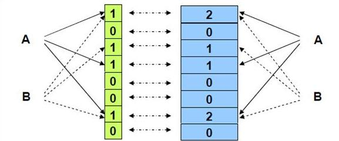

## 浅谈布隆过滤器Bloom Filter

先从一道面试题开始：

> 给A,B两个文件，各存放50亿条URL，每条URL占用64字节，内存限制是4G，让你找出A,B文件共同的URL。

问题的本质是判断一个元素是否在一个集合中。哈希表可以以O(1)的时间复杂度来查找某个元素，但哈希表的问题在于空间。哈希表的空间利用率平均有50%，在上面的大数据集合问题中，就算有100%的空间利用率，也至少需要50亿*64Byte的空间来放下整个哈希表，4G肯定是远远不够的。

当然我们可能想到使用位图，每个URL取整数哈希值，置于位图相应的位置上。4G大概有320亿个bit，看上去是可行的。但是位图适合对海量的、**取值分布很均匀**的集合进行去重。位图的空间复杂度是随集合内最大元素增大而线性增大的。要设计冲突率很低的哈希函数，势必要增加哈希值的取值范围，假如哈希值最大取到了2<sup>64</sup>，位图需要大概需要23亿G的空间。4G空间的位图最大值320亿左右，为50亿条URL设计冲突率很低、最大值为320亿的哈希函数比较困难。

题目的一个解决思路是将文件切割成可以放入4G空间的小文件，重点在于A与B两个文件切割后的小文件要一一对应。

分别切割A与B文件，根据`hash(URL) % k`值将URL划分到不同的k个文件中，如A1，A2，...，Ak和B1，B2，...，Bk，也可以保存hash值避免重复运算。这样Bn文件与A文件共同的URL肯定会分到对应的An文件中。读取An到一个哈希表中，再遍历Bn，判断是否有重复的URL。

另一个解决思路就是使用Bloom Filter布隆过滤器了。

### Bloom Filter简介

布隆过滤器(Bloom-Filter)是1970年由Bloom提出的。它可以用于检索一个元素是否在一个集合中。

布隆过滤器其实是位图的一种扩展，不同的是要使用多个哈希函数。它包括一个很长的二进制向量(位图)和一系列随机映射函数。

首先建立一个m位的位图，然后对于每一个加入的元素，使用k个哈希函数求k个哈希值映射到位图的k个位置，然后将这k个位置的bit全设置为1。k=3的布隆过滤器：


检索时，我们只要检索这些k个位是不是都是1就可以了：如果这些位有任何一个0，则被检元素一定不在；如果都是1，则被检元素很可能在。

可以看出布隆过滤器在时间和空间上的效率比较高，但也有缺点：

- 存在误判。布隆过滤器可以100%确定一个元素不在集合之中，但不能100%确定一个元素在集合之中。当k个位都为1时，也有可能是其它的元素将这些位置为1的。
- 删除困难。一个放入容器的元素映射到位图的k个位置上是1，删除的时候不能简单的直接置为0，可能会影响其他元素的判断。

### Bloom Filter实现

对于一个布隆过滤器，预估要存的数据量为n，期望的误判率为P，然后计算我们需要的位图的大小m，以及哈希函数的个数k，并选择哈希函数。

求位图大小m公式：


求哈希函数数目k公式：


Python中已经有实现布隆过滤器的包：[pybloom](https://github.com/jaybaird/python-bloomfilter "pybloom")

安装
```
pip install pybloom
```

简单的看了下实现：

```python
class BloomFilter(object):
    FILE_FMT = b'<dQQQQ'

    def __init__(self, capacity, error_rate=0.001):
        """Implements a space-efficient probabilistic data structure
        capacity
            this BloomFilter must be able to store at least *capacity* elements
            while maintaining no more than *error_rate* chance of false
            positives
        error_rate
            the error_rate of the filter returning false positives. This
            determines the filters capacity. Inserting more than capacity
            elements greatly increases the chance of false positives.
        >>> b = BloomFilter(capacity=100000, error_rate=0.001)
        >>> b.add("test")
        False
        >>> "test" in b
        True
        """
        if not (0 < error_rate < 1):
            raise ValueError("Error_Rate must be between 0 and 1.")
        if not capacity > 0:
            raise ValueError("Capacity must be > 0")
        # given M = num_bits, k = num_slices, P = error_rate, n = capacity
        #       k = log2(1/P)
        # solving for m = bits_per_slice
        # n ~= M * ((ln(2) ** 2) / abs(ln(P)))
        # n ~= (k * m) * ((ln(2) ** 2) / abs(ln(P)))
        # m ~= n * abs(ln(P)) / (k * (ln(2) ** 2))
        num_slices = int(math.ceil(math.log(1.0 / error_rate, 2)))
        bits_per_slice = int(math.ceil(
            (capacity * abs(math.log(error_rate))) /
            (num_slices * (math.log(2) ** 2))))
        self._setup(error_rate, num_slices, bits_per_slice, capacity, 0)
        self.bitarray = bitarray.bitarray(self.num_bits, endian='little')
        self.bitarray.setall(False)

    def _setup(self, error_rate, num_slices, bits_per_slice, capacity, count):
        self.error_rate = error_rate
        self.num_slices = num_slices
        self.bits_per_slice = bits_per_slice
        self.capacity = capacity
        self.num_bits = num_slices * bits_per_slice
        self.count = count
        self.make_hashes = make_hashfuncs(self.num_slices, self.bits_per_slice)

    def __contains__(self, key):
        """Tests a key's membership in this bloom filter.
        >>> b = BloomFilter(capacity=100)
        >>> b.add("hello")
        False
        >>> "hello" in b
        True
        """
        bits_per_slice = self.bits_per_slice
        bitarray = self.bitarray
        hashes = self.make_hashes(key)
        offset = 0
        for k in hashes:
            if not bitarray[offset + k]:
                return False
            offset += bits_per_slice
        return True
```

计算公式基本一致。

算法将位图分成了k段(代码中的`num_slices`，也就是哈希函数的数量k)，每段长度为代码中的`bits_per_slice`，每个哈希函数只负责将对应的段中的bit置为1：

```python
        for k in hashes:
            if not skip_check and found_all_bits and not bitarray[offset + k]:
                found_all_bits = False
            self.bitarray[offset + k] = True
            offset += bits_per_slice
```

当期望误判率为0.001时，m与n的比率大概是14：

```python
>>> import math
>>> abs(math.log(0.001))/(math.log(2)**2)
14.37758756605116
```

当期望误判率为0.05时，m与n的比率大概是6：

```python
>>> import math
>>> abs(math.log(0.05))/(math.log(2)**2)
6.235224229572683
```

上述题目中，m最大为320亿，n为50亿，误判率大概为0.04，在可以接受的范围：
```python
>>> math.e**-((320/50.0)*(math.log(2)**2))
0.04619428041606246
```

### 应用

布隆过滤器一般用于在大数据量的集合中判定某元素是否存在：

1.key-value 加快查询

       一般Bloom-Filter可以与一些key-value的数据库一起使用，来加快查询。

       一般key-value存储系统的values存在硬盘，查询就是件费时的事。将Storage的数据都插入Filter，在Filter中查询都不存在时，那就不需要去Storage查询了。当False Position出现时，只是会导致一次多余的Storage查询。

       由于Bloom-Filter所用的空间非常小，所有BF可以常驻内存。这样子的话，对于大部分不存在的元素，我们只需要访问内存中的Bloom-Filter就可以判断出来了，只有一小部分，我们需要访问在硬盘上的key-value数据库。从而大大地提高了效率。如图：

2 .Google的BigTable

        Google的BigTable也使用了Bloom Filter，以减少不存在的行或列在磁盘上的查询，大大提高了数据库的查询操作的性能。

3. Proxy-Cache

      在Internet Cache Protocol中的Proxy-Cache很多都是使用Bloom Filter存储URLs，除了高效的查询外，还能很方便得传输交换Cache信息。

4.网络应用
      1）P2P网络中查找资源操作，可以对每条网络通路保存Bloom Filter，当命中时，则选择该通路访问。

      2）广播消息时，可以检测某个IP是否已发包。

      3）检测广播消息包的环路，将Bloom Filter保存在包里，每个节点将自己添加入Bloom Filter。

     4）信息队列管理，使用Counter Bloom Filter管理信息流量。

5. 垃圾邮件地址过滤
        像网易，QQ这样的公众电子邮件（email）提供商，总是需要过滤来自发送垃圾邮件的人（spamer）的垃圾邮件。

一个办法就是记录下那些发垃圾邮件的 email地址。由于那些发送者不停地在注册新的地址，全世界少说也有几十亿个发垃圾邮件的地址，将他们都存起来则需要大量的网络服务器。

如果用哈希表，每存储一亿个 email地址，就需要 1.6GB的内存（用哈希表实现的具体办法是将每一个 email地址对应成一个八字节的信息指纹，然后将这些信息指纹存入哈希表，由于哈希表的存储效率一般只有 50%，因此一个email地址需要占用十六个字节。一亿个地址大约要 1.6GB，即十六亿字节的内存）。因此存贮几十亿个邮件地址可能需要上百 GB的内存。

而Bloom Filter只需要哈希表 1/8到 1/4 的大小就能解决同样的问题。

BloomFilter决不会漏掉任何一个在黑名单中的可疑地址。而至于误判问题，常见的补救办法是在建立一个小的白名单，存储那些可能别误判的邮件地址。

布隆过滤器可以用在缓存服务器中，判断一条URL是否已存在缓存中。可以用在爬虫中，判断一条URL是否已爬取过。也可以用于垃圾邮件过滤等。

可以通过增加位图的大小来降低布隆过滤器的误判率。如果布隆过滤器中存储的是邮件黑名单，还可以通过建立一个白名单来存储可能会误判的清白邮件地址。

要实现删除元素，可以采用Counting Bloom Filter。它将标准布隆过滤器位图的每一位扩展为一个小的计数器(Counter)，在插入元素时给对应的k个Counter的值分别加1，删除元素时则分别减1:



代价就是多了几倍的存储空间。