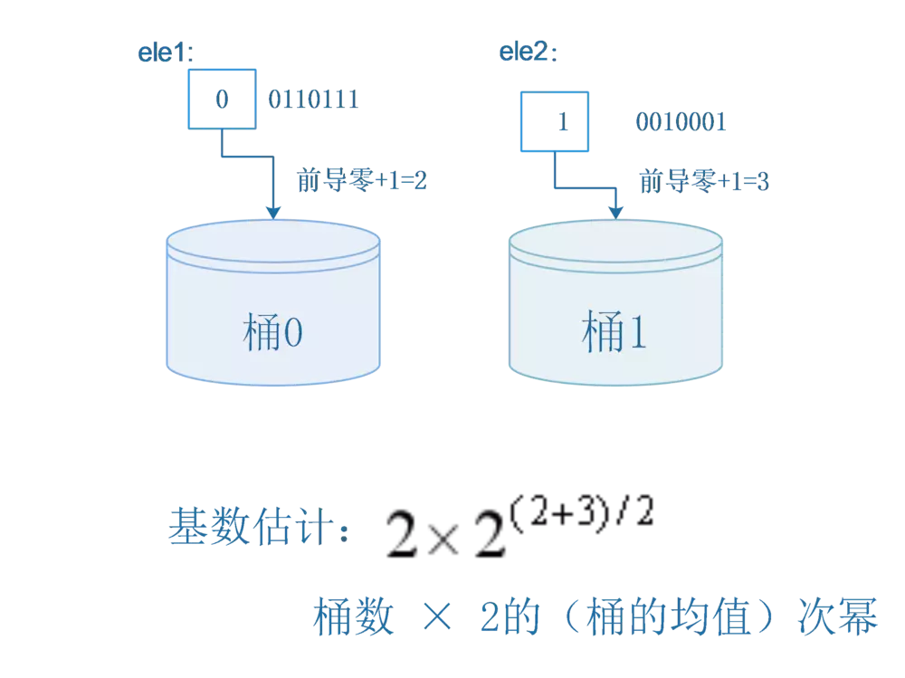
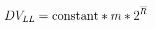
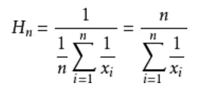
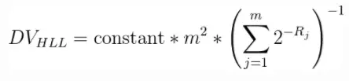
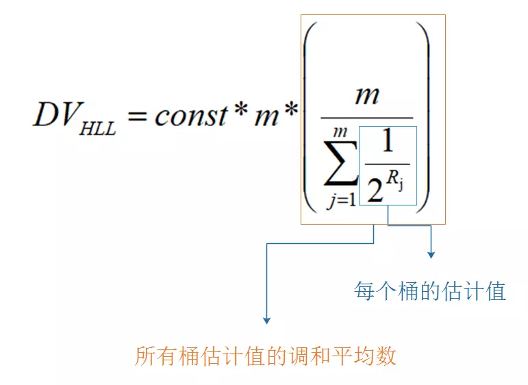
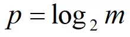

## 浅谈HyperLogLog

先思考一个常见的业务问题：如果你负责开发维护一个大型的网站，有一天老板找产品经理要网站每个网页每天的 UV 数据，然后让你来开发这个统计模块，你会如何实现？

如果统计 PV 那非常好办，给每个网页一个独立的 Redis 计数器就可以了，这个计数器的 key 后缀加上当天的日期。这样来一个请求，incrby 一次，最终就可以统计出所有的 PV 数据。

但是 UV 不一样，它要去重，同一个用户一天之内的多次访问请求只能计数一次。这就要求每一个网页请求都需要带上用户的 ID，无论是登陆用户还是未登陆用户都需要一个唯一 ID 来标识。

你也许已经想到了一个简单的方案，那就是为每一个页面一个独立的 set 集合来存储所有当天访问过此页面的用户 ID。当一个请求过来时，我们使用 sadd 将用户 ID 塞进去就可以了。通过 scard 可以取出这个集合的大小，这个数字就是这个页面的 UV 数据。没错，这是一个非常简单的方案。

但是，如果你的页面访问量非常大，比如一个爆款页面几千万的 UV，你需要一个很大的 set 集合来统计，这就非常浪费空间。如果这样的页面很多，那所需要的存储空间是惊人的。为这样一个去重功能就耗费这样多的存储空间，值得么？其实老板需要的数据又不需要太精确，105w 和 106w 这两个数字对于老板们来说并没有多大区别，So，有没有更好的解决方案呢？

这就是本节要引入的一个解决方案，Redis 提供了 HyperLogLog 数据结构就是用来解决这种统计问题的。HyperLogLog 提供不精确的去重计数方案，虽然不精确但是也不是非常不精确，标准误差是 0.81%，这样的精确度已经可以满足上面的 UV 统计需求了。

### 介绍

HyperLogLog算法经常在数据库中被用来统计某一字段的Distinct Value。HyperLogLog算法来源于论文《[HyperLogLog the analysis of a near-optimal cardinality estimation algorithm](http://algo.inria.fr/flajolet/Publications/FlFuGaMe07.pdf)》。

基数就是指一个集合中不同值的数目，比如[a,b,c,d]的基数就是4，[a,b,c,d,a]的基数还是4，因为a重复了一个，不算。基数也可以称之为Distinct Value，简称DV。下文中可能有时候称呼为基数，有时候称之为DV，但都是同一个意思。HyperLogLog算法就是用来计算基数的。

HyperLogLog本质上来源于生活中一个小的发现，假设你抛了很多次硬币，你告诉在这次抛硬币的过程中最多只有两次扔出连续的反面，让我猜你总共抛了多少次硬币，我敢打赌你抛硬币的总次数不会太多，相反，如果你和我说最多出现了100次连续的反面，那么我敢肯定扔硬盘的总次数非常的多，甚至我还可以给出一个估计，这个估计要怎么给呢？其实是一个很简单的概率问题，假设1代表抛出正面，0代表反面：

```
1110100110
```

抛硬币序列`1110100110`为例，其中最长的反面序列是`00`，我们顺手把后面那个1也给带上，也就是`001`，因为它包括了序列中最长的一串0，所以在序列中肯定只出现过一次，而它在任意序列出现出现且仅出现一次的概率显然是三个二分之一相乘，也就是八分之一，所以我可以给出一个估计值，你大概总共抛了8次硬币。

很显然，上面这种做法虽然能够估计抛硬币的总数，但是显然误差是比较大的，很容易受到突发事件（比如突然连续抛出好多0）的影响，HyperLogLog算法研究的就是如何减小这个误差。

之前说过，HyperLogLog算法是用来计算基数的，这个抛硬币的序列和基数有什么关系呢？比如在数据库中，我只要在每次插入一条新的记录时，计算这条记录的hash，并且转换成二进制，就可以将其看成一个硬币序列了，如下(0b前缀表示二进制数)：

```
hash(record) = 0b1110100110
```

### 最简单的想法

根据上面抛硬币的启发我可以想到如下的估计基数的算法：

```
输入：一个集合
输出：集合的基数
算法：
     max = 0
     对于集合中的每个元素：
               hashCode = hash(元素)
               num = hashCode二进制表示中最前面连续的0的数量
               if num > max:
                   max = num
     最后的结果是2的(max + 1)次幂  
```

举个例子，对于集合`{ele1, ele2}`，先求`hash(ele1)=0b00110111`，它最前面的连续的0的数量为2（又称为前导0），然后求`hash(ele2)=0b10010000111`，它的前导0数量为0，我们始终只保存前导零数量的最大值，所以最后max是2，我们估计的基数就是2的(2+1)次幂，即8。

为什么最后的max要加1呢？这是一个数学细节，具体要看论文，简单的理解的话，可以像之前抛硬币的例子那样理解，把最长的一串零的后面的一个1或者前面的一个1"顺手"带上进行概率估计。

显然这个算法是非常不准确的，但是这个想法还是很有启发性的，从这个简单的想法跟随下文一步一步优化即可得到最终的比较高精度HyperLogLog算法。

### 分桶

最简单的一种优化方法显然就是把数据分成m个均等的部分，分别估计其总数求平均后再乘以m，称之为分桶。对应到前面抛硬币的例子，其实就是把硬币序列分成m个均等的部分，分别用之前提到的那个方法估计总数求平均后再乘以m，这样就能一定程度上避免单一突发事件造成的误差。

具体要怎么分桶呢？我们可以将每个元素的hash值的二进制表示的前几位用来指示数据属于哪个桶，然后把剩下的部分再按照之前最简单的想法处理。

还是以刚刚的那个集合{ele1,ele2}为例，假设我要分2个桶，那么我只要去ele1的hash值的第一位来确定其分桶即可，之后用剩下的部分进行前导零的计算，如下图：

假设ele1和ele2的hash值二进制表示如下：
```
hash(ele1) = 00110111
hash(ele2) = 10010001
```




到这里，你大概已经理解了LogLog算法的基本思想，LogLog算法是在HyperLogLog算法之前提出的一个基数估计算法，HyperLogLog算法其实就是LogLog算法的一个改进版。

LogLog算法完整的基数计算公式如下：



其中m代表分桶数，R头上一道横杠的记号就代表每个桶的结果（其实就是桶中数据的最长前导零+1）的均值，相比我之前举的简单的例子，LogLog算法还乘了一个常数constant进行修正，这个constant具体是多少等我讲到Java实现的时候再说。

### 调和平均数

前面的LogLog算法中我们是使用的是平均数来将每个桶的结果汇总起来，但是平均数有一个广为人知的缺点，就是容易受到大的数值的影响，一个常见的例子是，假如我的工资是1000元一个月，我老板的工资是100000元一个月，那么我和老板的平均工资就是(100000 + 1000)/2，即50500元，显然这离我的工资相差甚远，我肯定不服这个平均工资。

用调和平均数就可以解决这一问题，调和平均数的结果会倾向于集合中比较小的数，x1到xn的调和平均数的公式如下：



再用这个公式算一下我和老板的平均工资：
```
>>> 2/(1/1000 + 1/100000)
1980.1980
```

最后的结果是1980元，这和我的工资水平还比较接近，这样的平均工资水平我才比较信服。

再回到前面的LogLog算法，从前面的举的例子可以看出，影响LogLog算法精度的一个重要因素就是，hash值的前导零的数量显然是有很大的偶然性的，经常会出现一两数据前导零的数目比较多的情况，所以HyperLogLog算法相比LogLog算法一个重要的改进就是使用调和平均数而不是平均数来聚合每个桶中的结果，HyperLogLog算法的公式如下：



其中constant常数和m的含义和之前的LogLog算法公式中的含义一致，Rj代表(第j个桶中的数据的最大前导零数目+1)，为了方便理解，我将公式再拆解一下：



其实从算术平均数改成调和平均数这个优化是很容易想到的，但是为什么LogLog算法没有直接使用调和平均数吗？网上看到一篇英文文章里说大概是因为使用算术平均数的话证明比较容易一些，毕竟科学家们出论文每一步都是要证明的，不像我们这里简单理解一下，猜一猜就可以了。

### 细节微调

关于HyperLogLog算法的大体思想到这里你就已经全部理解了。

不过算法中还有一些细微的校正，在数据总量比较小的时候，很容易就预测偏大，所以我们做如下校正：

DV代表估计的基数值，m代表桶的数量，V代表结果为0的桶的数目，log表示自然对数

```
if DV < (5 / 2) * m:
    DV = m * log(m/V)
```

我再详细解释一下V的含义，假设我分配了64个桶（即m=64），当数据量很小时（比方说只有两三个），那肯定有大量桶中没有数据，也就说他们的估计值是0，V就代表这样的桶的数目。

事实证明，这个校正的效果是非常好，在数据量小的时，估计得非常准确，有兴趣可以去玩一下外国大佬制作的一个HyperLogLog算法的仿真：
[http://content.research.neustar.biz/blog/hll.html](http://content.research.neustar.biz/blog/hll.html)

### constant常数的选择

constant常数的选择与分桶的数目有关，具体的数学证明请看论文，这里就直接给出结论：

假设：m为分桶数，p是m的以2为底的对数



则按如下的规则计算constant

```
switch (p) {
   case 4:
       constant = 0.673 * m * m;
   case 5:
       constant = 0.697 * m * m;
   case 6:
       constant = 0.709 * m * m;
   default:
       constant = (0.7213 / (1 + 1.079 / m)) * m * m;
}
```

### 分桶数m的选择

如果理解了之前的分桶算法，那么很显然分桶数只能是2的整数次幂。

如果分桶越多，那么估计的精度就会越高，统计学上用来衡量估计精度的一个指标是“相对标准误差”(relative standard deviation，简称RSD)，RSD的计算公式这里就不给出了，百科上一搜就可以知道，从直观上理解，RSD的值其实就是（(每次估计的值）在（估计均值）上下的波动）占（估计均值）的比例（这句话加那么多括号是为了方便大家断句）。RSD的值与分桶数m存在如下的计算关系：


有了这个公式，你可以先确定你想要达到的RSD的值，然后再推出分桶的数目m。

### Redis HyperLogLog

HyperLogLog 数据结构是 Redis 的高级数据结构，它非常有用。

HyperLogLog 提供了两个指令 pfadd 和 pfcount，根据字面意义很好理解，一个是增加计数，一个是获取计数。pfadd 用法和 set 集合的 sadd 是一样的，来一个用户 ID，就将用户 ID 塞进去就是。pfcount 和 scard 用法是一样的，直接获取计数值。

#### PFADD key element [element …]

时间复杂度： 每添加一个元素的复杂度为 O(1) 。

将任意数量的元素添加到指定的 HyperLogLog 里面。

作为这个命令的副作用， HyperLogLog 内部可能会被更新， 以便反映一个不同的唯一元素估计数量（也即是集合的基数）。

如果 HyperLogLog 估计的近似基数（approximated cardinality）在命令执行之后出现了变化， 那么命令返回 1 ， 否则返回 0 。 如果命令执行时给定的键不存在， 那么程序将先创建一个空的 HyperLogLog 结构， 然后再执行命令。

调用 PFADD key element [element …] 命令时可以只给定键名而不给定元素：

- 如果给定键已经是一个 HyperLogLog ， 那么这种调用不会产生任何效果；

- 但如果给定的键不存在， 那么命令会创建一个空的 HyperLogLog ， 并向客户端返回 1 。

返回值

整数回复： 如果 HyperLogLog 的内部储存被修改了， 那么返回 1 ， 否则返回 0 。

#### PFCOUNT key [key …]

时间复杂度： 当命令作用于单个 HyperLogLog 时， 复杂度为 O(1) ， 并且具有非常低的平均常数时间。 当命令作用于 N 个 HyperLogLog 时， 复杂度为 O(N) ， 常数时间也比处理单个 HyperLogLog 时要大得多。

当 PFCOUNT key [key …] 命令作用于单个键时， 返回储存在给定键的 HyperLogLog 的近似基数， 如果键不存在， 那么返回 0 。

当 PFCOUNT key [key …] 命令作用于多个键时， 返回所有给定 HyperLogLog 的并集的近似基数， 这个近似基数是通过将所有给定 HyperLogLog 合并至一个临时 HyperLogLog 来计算得出的。

通过 HyperLogLog 数据结构， 用户可以使用少量固定大小的内存， 来储存集合中的唯一元素 （每个 HyperLogLog 只需使用 12k 字节内存，以及几个字节的内存来储存键本身）。

命令返回的可见集合（observed set）基数并不是精确值， 而是一个带有 0.81% 标准错误（standard error）的近似值。

返回值

整数回复： 给定 HyperLogLog 包含的唯一元素的近似数量。

代码示例：

```
redis> PFADD  databases  "Redis"  "MongoDB"  "MySQL"
(integer) 1

redis> PFCOUNT  databases
(integer) 3

redis> PFADD  databases  "Redis"    # Redis 已经存在，不必对估计数量进行更新
(integer) 0

redis> PFCOUNT  databases    # 元素估计数量没有变化
(integer) 3

redis> PFADD  databases  "PostgreSQL"    # 添加一个不存在的元素
(integer) 1

redis> PFCOUNT  databases    # 估计数量增一
4
```

HyperLogLog 除了上面的 pfadd 和 pfcount 之外，还提供了第三个指令 pfmerge，用于将多个 pf 计数值累加在一起形成一个新的 pf 值。

比如在网站中我们有两个内容差不多的页面，运营说需要这两个页面的数据进行合并。其中页面的 UV 访问量也需要合并，那这个时候 pfmerge 就可以派上用场了。

#### PFMERGE destkey sourcekey [sourcekey …]

时间复杂度： O(N) ， 其中 N 为被合并的 HyperLogLog 数量， 不过这个命令的常数复杂度比较高。
将多个 HyperLogLog 合并（merge）为一个 HyperLogLog ， 合并后的 HyperLogLog 的基数接近于所有输入 HyperLogLog 的可见集合（observed set）的并集。

合并得出的 HyperLogLog 会被储存在 destkey 键里面， 如果该键并不存在， 那么命令在执行之前， 会先为该键创建一个空的 HyperLogLog 。

返回值

字符串回复：返回 OK 。

```
redis> PFADD  nosql  "Redis"  "MongoDB"  "Memcached"
(integer) 1

redis> PFADD  RDBMS  "MySQL" "MSSQL" "PostgreSQL"
(integer) 1

redis> PFMERGE  databases  nosql  RDBMS
OK

redis> PFCOUNT  databases
(integer) 6
```

HyperLogLog 这个数据结构不是免费的，不是说使用这个数据结构要花钱，它需要占据一定 12k 的存储空间，所以它不适合统计单个用户相关的数据。如果你的用户上亿，可以算算，这个空间成本是非常惊人的。但是相比 set 存储方案，HyperLogLog 所使用的空间那真是可以使用千斤对比四两来形容了。

不过你也不必过于担心，因为 Redis 对 HyperLogLog 的存储进行了优化，在计数比较小时，它的存储空间采用稀疏矩阵存储，空间占用很小，仅仅在计数慢慢变大，稀疏矩阵占用空间渐渐超过了阈值时才会一次性转变成稠密矩阵，才会占用 12k 的空间。

pf 的内存占用为什么是 12k？

我们在上面的算法中使用了 1024 个桶进行独立计数，不过在 Redis 的 HyperLogLog 实现中用到的是 16384 个桶，也就是 2^14，每个桶的 maxbits 需要 6 个 bits 来存储，最大可以表示 maxbits=63，于是总共占用内存就是2^14 * 6 / 8 = 12k字节。

## 参考

- [四两拨千斤——Redis HyperLogLog](https://baijiahao.baidu.com/s?id=1611726471431642966&wfr=spider&for=pc)
- [探索HyperLogLog算法](https://www.jianshu.com/p/55defda6dcd2)