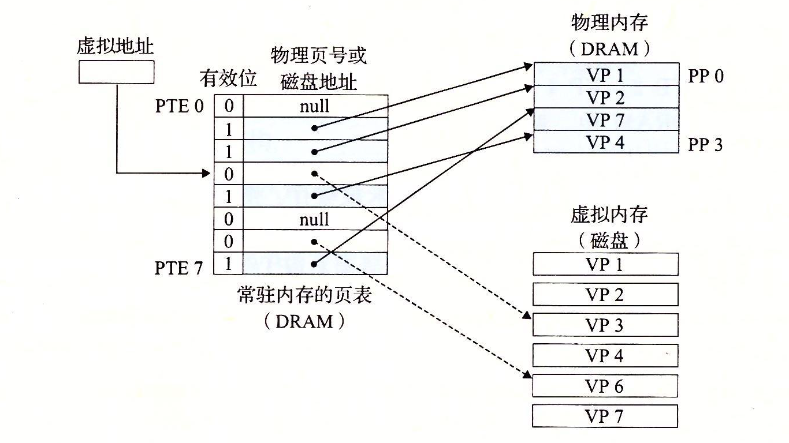
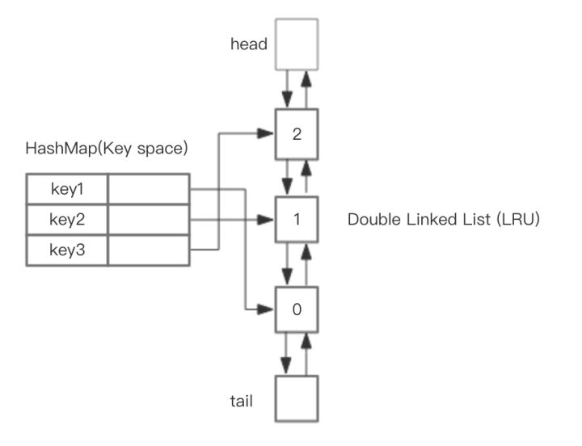

# LRU算法解析

**LRU**是`Least Recently Used`的缩写，即最近最少使用，常用于页面置换算法，是为虚拟页式存储管理服务的。

现代操作系统提供了一种对主存的抽象概念`虚拟内存`，来对主存进行更好地管理。他将主存看成是一个存储在磁盘上的地址空间的高速缓存，在主存中只保存活动区域，并根据需要在主存和磁盘之间来回传送数据。`虚拟内存`被组织为存放在磁盘上的N个连续的字节组成的数组，每个字节都有唯一的虚拟地址，作为到数组的索引。`虚拟内存`被分割为大小固定的数据块`虚拟页(Virtual Page,VP)`，这些数据块作为主存和磁盘之间的传输单元。类似地，物理内存被分割为`物理页(Physical Page,PP)`。

`虚拟内存`使用`页表`来记录和判断一个`虚拟页`是否缓存在物理内存中：



如上图所示，当CPU访问`虚拟页VP3`时，发现VP3并未缓存在物理内存之中，这称之为`缺页`，现在需要将VP3从磁盘复制到物理内存中，但在此之前，同时为了保持原有空间的大小，还要把一个物理内存中的页面调出至磁盘，需要在物理内存中选择一个`牺牲页`，将其复制到磁盘中，这称之为`交换`或者`页面调度`，图中的`牺牲页`为VP4。把哪个页面调出去可以达到调动尽量少的目的？我们需要一个算法。其实，达到这样一种情形的算法是最理想的了——每次调换出的页面是所有内存页面中最迟将被使用的——这可以最大限度的推迟页面调换，这种算法，被称为理想页面置换算法，这种算法很难完美达到。

为了尽量减少与理想算法的差距，产生了各种精妙的算法，`LRU`算法便是其中一个。

## LRU原理
> LRU 算法的设计原则是：如果一个数据在最近一段时间没有被访问到，那么在将来它被访问的可能性也很小。也就是说，当限定的空间已存满数据时，应当把最久没有被访问到的数据淘汰。

根据[LRU原理和Redis实现](https://zhuanlan.zhihu.com/p/34133067)所示，假定系统为某进程分配了3个物理块，进程运行时的页面走向为 7 0 1 2 0 3 0 4，开始时3个物理块均为空，那么`LRU`算法是如下工作的：


## 基于哈希表和双向链表的LRU算法实现

如果要自己实现一个`LRU`算法，可以用哈希表加双向链表实现：



设计思路是，使用哈希表存储 key，值为链表中的节点，节点中存储值，双向链表来记录节点的顺序，头部为最近访问节点。

`LRU`算法中有两种基本操作：

- `get(key)`：查询key对应的节点，如果key存在，将节点移动至链表头部。
- `set(key, value)`： 设置key对应的节点的值。如果key不存在，则新建节点，置于链表开头。如果链表长度超标，则将处于尾部的最后一个节点去掉。如果节点存在，更新节点的值，同时将节点置于链表头部。

## LRU缓存机制

`leetcode`上有一道关于[`LRU缓存机制`](https://leetcode-cn.com/problems/lru-cache/)的题目：
>运用你所掌握的数据结构，设计和实现一个  LRU (最近最少使用) 缓存机制。它应该支持以下操作： 获取数据 get 和 写入数据 put 。

>获取数据 get(key) - 如果密钥 (key) 存在于缓存中，则获取密钥的值（总是正数），否则返回 -1。
写入数据 put(key, value) - 如果密钥不存在，则写入其数据值。当缓存容量达到上限时，它应该在写入新数据之前删除最近最少使用的数据值，从而为新的数据值留出空间。

>**进阶:**

>你是否可以在 O(1) 时间复杂度内完成这两种操作？

>**示例:**
>```
>LRUCache cache = new LRUCache( 2 /* 缓存容量 */ );
>
>cache.put(1, 1);
>cache.put(2, 2);
>cache.get(1);       // 返回  1
>cache.put(3, 3);    // 该操作会使得密钥 2 作废
>cache.get(2);       // 返回 -1 (未找到)
>cache.put(4, 4);    // 该操作会使得密钥 1 作废
>cache.get(1);       // 返回 -1 (未找到)
>cache.get(3);       // 返回  3
>cache.get(4);       // 返回  4
>```

我们可以自己实现双向链表，也可以使用现成的数据结构，`python`中的数据结构`OrderedDict`是一个有序哈希表，可以记住加入哈希表的键的顺序，相当于同时实现了哈希表与双向链表。`OrderedDict`是将最新数据放置于末尾的:

```python
In [35]: from collections import OrderedDict

In [36]: lru = OrderedDict()

In [37]: lru[1] = 1

In [38]: lru[2] = 2

In [39]: lru
Out[39]: OrderedDict([(1, 1), (2, 2)])

In [40]: lru.popitem()
Out[40]: (2, 2)
```

`OrderedDict`有两个重要方法：
- `popitem(last=True)`: 返回一个键值对，当last=True时，按照`LIFO`的顺序，否则按照`FIFO`的顺序。
- `move_to_end(key, last=True)`: 将现有 key 移动到有序字典的任一端。 如果 last 为真值（默认）则将元素移至末尾；如果 last 为假值则将元素移至开头。

删除数据时，可以使用`popitem(last=False)`将开头最近未访问的键值对删除。访问或者设置数据时，使用`move_to_end(key, last=True)`将键值对移动至末尾。

代码实现：
```python
from collections import OrderedDict


class LRUCache:
    def __init__(self, capacity: int):
        self.lru = OrderedDict()
        self.capacity = capacity
        
    def get(self, key: int) -> int:
        self._update(key)
        return self.lru.get(key, -1)
        

    def put(self, key: int, value: int) -> None:
        self._update(key)
        self.lru[key] = value
        if len(self.lru) > self.capacity:
            self.lru.popitem(False)
         
    def _update(self, key: int):
        if key in self.lru:
            self.lru.move_to_end(key)
```