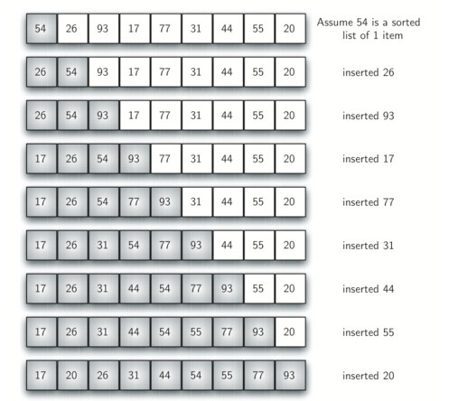
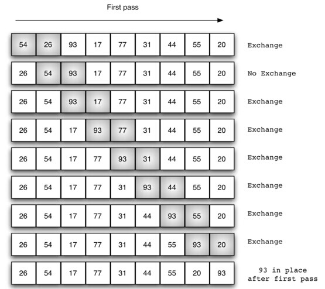
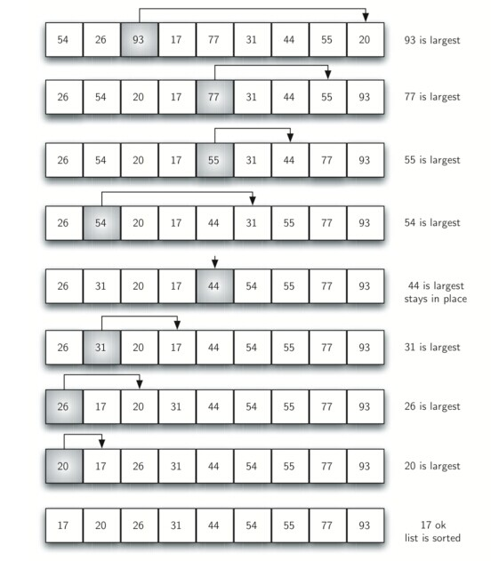
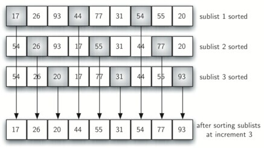
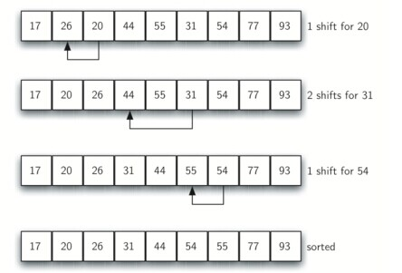
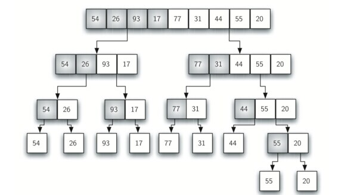
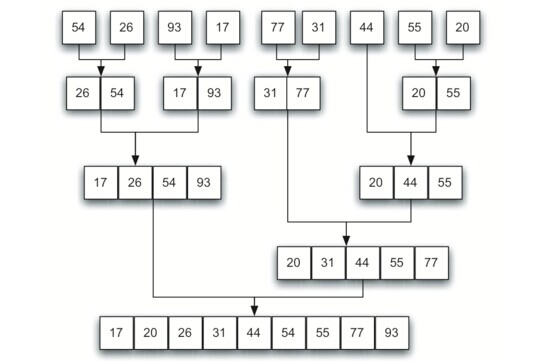
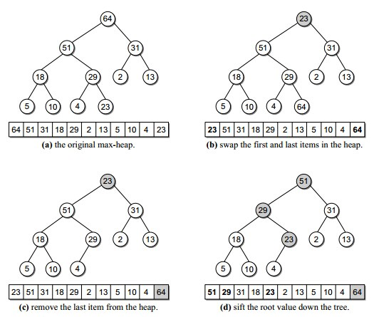
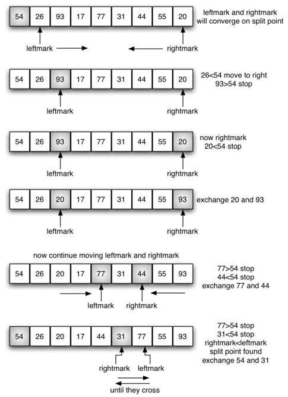
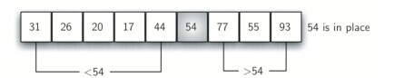

# 基于比较的排序
排序是算法学习中最基本的问题。

## 平均时间复杂度均为O(N<sup>2</sup>)的排序

### 插入排序

插入排序对少量元素的排序非常有效。工作机制就像打牌一样，为了将牌插入到已排好序的牌中，需要将牌与手中的牌从右向左进行比较。



```python
def insertionSort(alist):
    n = len(alist)
    for i in xrange(1, n):
        key = alist[i]
        j = i - 1
        while j >= 0 and alist[j] >= key:
            alist[j+1] = alist[j]
            j -= 1
        alist[j+1] = key
    return alist
```

### 冒泡排序

冒泡排序通过重复的交换相邻的两个反序元素来将最大元素置于数组末尾。



```python
def bubbleSort(alist):
    n=len(alist)
    for i in xrange(n-2,0,-1):
        for j in xrange(i+1):
            if alist[j]>alist[j+1]:
                alist[j],alist[j+1]=alist[j+1],alist[j]
    return alist
```

### 选择排序

首先找出序列中的最大元素，与最后一个元素交换位置，然后找出次大元素，与倒数第二个元素交换位置，以此类推。



```python
def selectionSort(alist):
    n=len(alist)
    for i in xrange(n-1,0,-1):
        posofMax=0
        for j in xrange(1,i+1):
            if alist[j]>=alist[posofMax]:
                posofMax=j
        a[posofMax],a[i]=a[i],a[posofMax]
    return alist
```

### 希尔排序

SHELL排序通过比较相距一定间隔的元素来工作。各趟排序随着算法的进行而减小，直到只比较相邻元素的最后一趟为止。

使用希尔增量(h<sub>t</sub>=N/2,h<sub>k</sub>=h<sub>k+1</sub>/2)时希尔排序的最坏运行时间为Θ(N<sup>2</sup>)，使用Hibbard增量(1,3,7,...,2<sup>k</sup>-1)的希尔排序的最坏运行时间为Θ(N<sup>3/2</sup>)。





```python
def shellSort(alist):
    n=len(alist)/2
    while n>0:
        gapinsertionSort(alist,n)
        n=n/2
    return alist
def gapinsertionSort(alist,gap):
    n=len(alist)
    for i in xrange(gap):
        for j in xrange(i+gap,n,gap):
            key=alist[j]
            x=j-gap
            while x>=0 and a[x]>=key:
                a[x+gap]=a[x]
                x-=gap
            a[x+gap]=key
```

## 平均时间复杂度均为O(NlogN)的排序

### 合并排序

合并排序基本的操作是合并两个已排序的表。它是递归算法的一个很好的实例。合并排序需要花费将数据拷贝到临时数组再拷贝回来这样一些附加的工作。



```python
def mergeSort(alist):
    if len(alist)>1:
        q=len(alist)/2
        left=alist[:q]
        right=alist[q:]
        mergeSort(left)
        mergeSort(right)
        i=0
        j=0
        k=0
        while i<len(left) and j<len(right):
            if left[i]<right[j]:
                alist[k]=left[i]
                i+=1
            else:
                alist[k]=right[j]
                j+=1
            k+=1
        while i<len(left):
            alist[k]=left[i]
            i+=1
            k+=1
        while j<len(right):
            alist[k]=right[j]
            j+=1
            k+=1
    return alist
```

合并排序的另一种非递归实现:



```python
def mergeSort(alist):
    n=len(alist)
    i=1
    while i<n:
        start=0
        t=start+i-1
        end=start+2*i-1
        while end<n:
            merge(alist,start,t,end)
            start=end+1
            t=start+i-1
            end=start+2*i-1
        if t<n-1:
            merge(alist,start,t,n-1)
        i=i*2
    return alist    
           
           
def merge(alist,start,t,end):
    left=alist[start:t+1]
    right=alist[t+1:end+1]
    i=0
    j=0
    k=start
    while i<len(left) and j<len(right):
        if left[i]<right[j]:
            alist[k]=left[i]
            i+=1
        else:
            alist[k]=right[j]
            j+=1
        k+=1
    while i<len(left):
        alist[k]=left[i]
        i+=1
        k+=1
    while j<len(right):
        alist[k]=right[j]
        j+=1
        k+=1
```

### 堆排序

建立最大堆后将最大元素与堆最后的单元互换，堆大小缩小一，然后执行根的下滤操作找出第二大的元素。



```python
def heapSort(alist):
    n=len(alist)
    buildMaxHeap(alist)
    for i in xrange(n-1,0,-1):
        alist[i],alist[0]=alist[0],alist[i]
        perDown(alist,0,i-1)
    return alist
def buildMaxHeap(alist):
    n=len(alist)
    for i in xrange(n/2-1,-1,-1):
        perDown(alist,i,n-1)
def perDown(alist,start,end):
    left=start*2+1
    right=left+1
    large=start
    if left<=end and alist[left]>alist[start]:
        large=left
    if right<=end and alist[right]>alist[large]:
        large=right
    if large!=start:
        alist[large],alist[start]=alist[start],alist[large]
        perDown(alist,large,end)
```

### 快速排序

快速排序是在实践中最快的已知排序算法，像合并排序一样也是一种分治的递归算法。

1.如果元素个数为0或1，则返回。

2.取数组中任一元素v，称之为枢纽元。

3.将数组分为2个不相交的部分，一部分元素小于v，另一部分大于v。

4.对两部分分别递归的使用快速排序。

下图取第一个元素为枢纽元v，leftmark从第二个元素开始，rightmark从倒数第一个元素开始。

当leftmark在rightmark左边时，将leftmark右移，移过小于v的元素，将rightmark左移，移过大于v的元素，当leftmark，rightmark停止时，将leftmark和rightmark元素互换，直到leftmark到rightmark右边为止。




```python
def quickSort(alist):
    n=len(alist)
    _quickSort(alist,0,n-1)
    return alist
def _quickSort(alist,s,e):
    if s<e:
        v=alist[s]
        i=s+1
        j=e
        while True:
            while i<=j and alist[i]<v:      #如果i和j遇到等于枢纽元的关键字，都停止
                i+=1
            while j>=i and alist[j]>v:
                j-=1
            if i<j:
                alist[i],alist[j]=alist[j],alist[i]
                i+=1
                j-=1
            else:
                break
        alist[s],alist[j]=alist[j],alist[s]
        _quickSort(alist,s,j-1)
        _quickSort(alist,i,e)
```
另一种写法:
```python
def quickSort(alist):
    n=len(alist)
    _quickSort(alist,0,n-1)
    return alist
def _quickSort(alist,s,e):
    if s<e:
        v=alist[e]
        i=s    #用i将数组分为两部分
        for j in xrange(s,e):
            if alist[j]<=v:
                alist[j],alist[i]=alist[i],alist[j]
                i+=1
        alist[e],alist[i]=alist[i],alist[e]
        _quickSort(alist,s,i-1)
        _quickSort(alist,i+1,e)
```