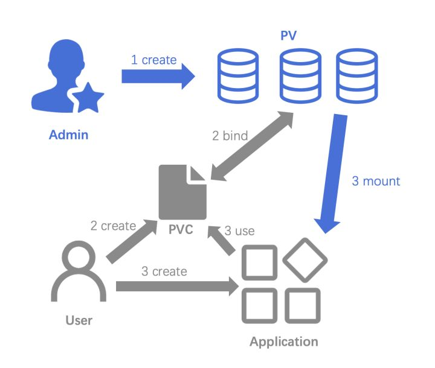
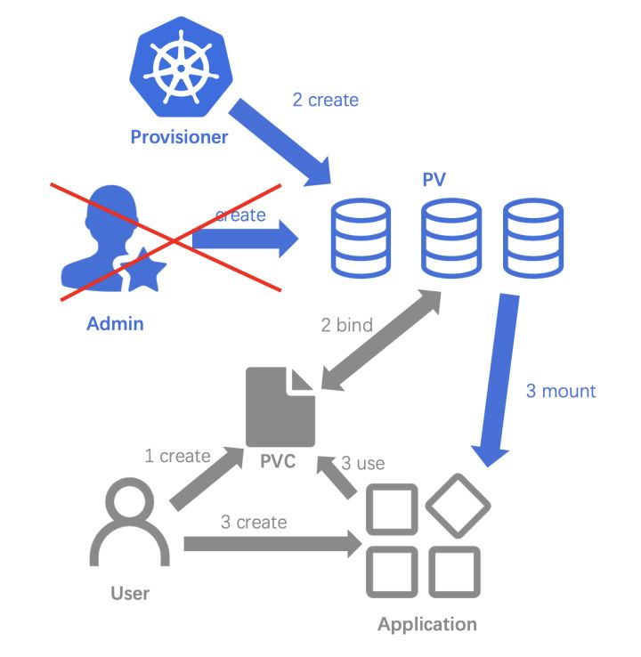
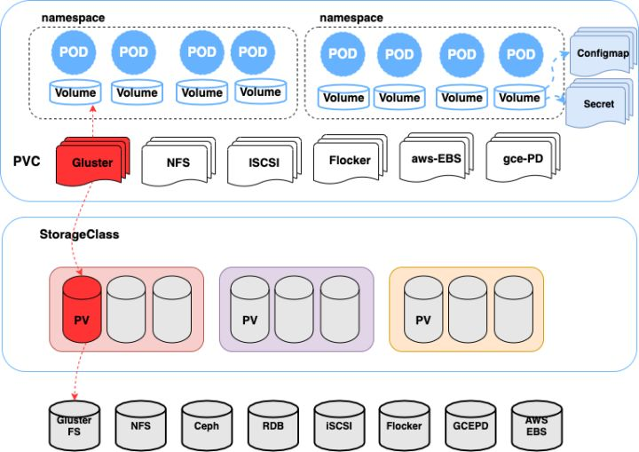
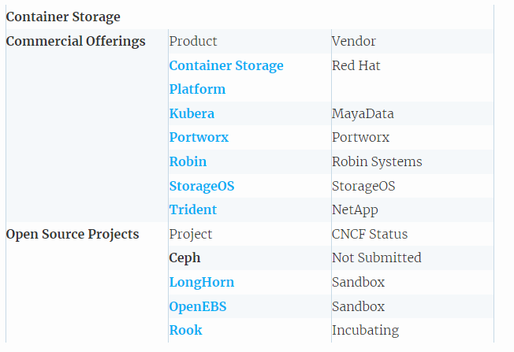
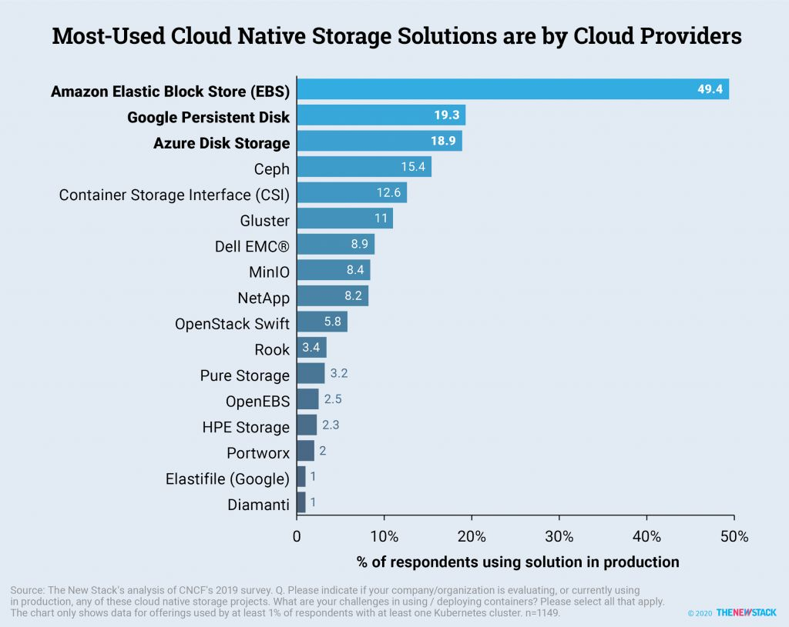
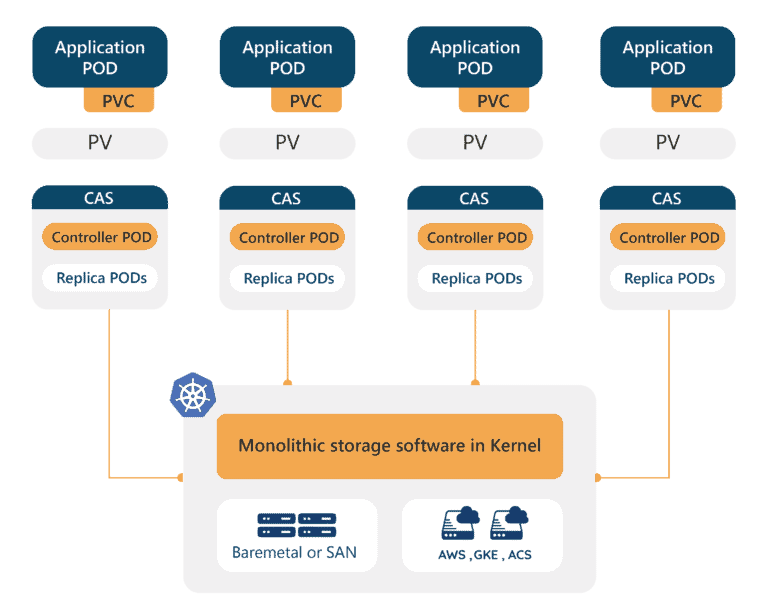
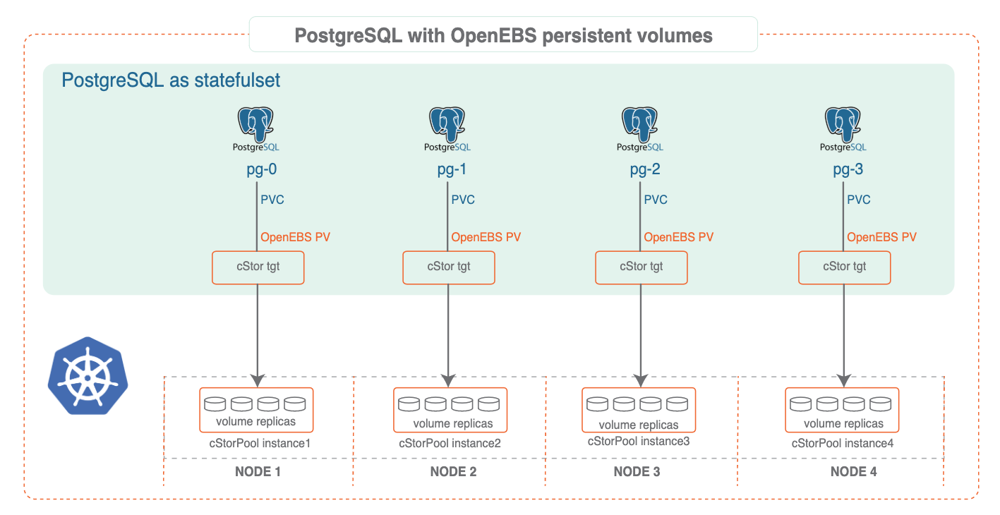
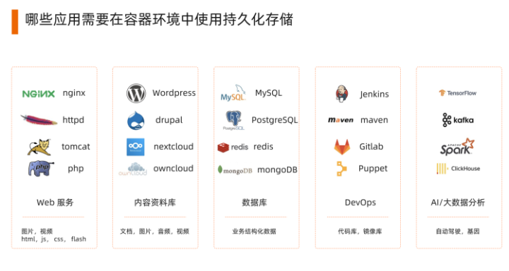
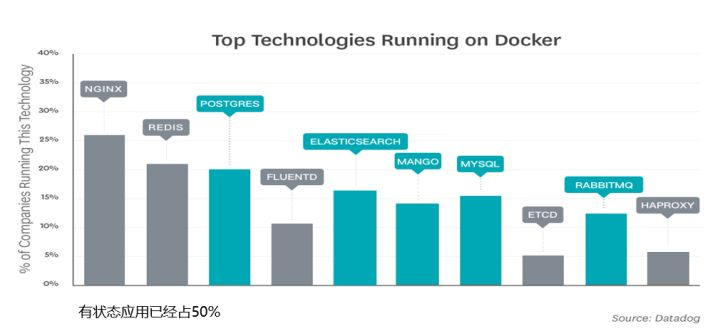
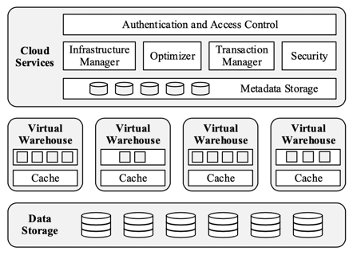

## 云原生潮流下一些关于存储发展的思考

### 云计算发展史

2022年奥莱利(Tim O'Reilly)拜访了贝索斯，希望跟亚马逊谈个合作。合作没谈成，但此次会面让贝索斯意识到亚马逊的数据是有价值的，可以开放出来让第三方程序员来使用的 - 如果亚马逊不这么做的话，O'Reilly这样的牛人可以直接写个爬虫程序把很多公开数据从网页上扒下来。很快亚马逊组织了第一届亚马逊开发者大会，开始发布自己的API。大会很成功，然后有了一个名字：Amazon Web Services。

亚马逊的核心业务电子商务有太强的季节性，如何有效地配置具备足够扩展性而且可以持续上线的基础系统的成为了一个迫在眉睫的问题。受到一本书(Creation: Life and How to Make it)的启发(作者作为一个游戏设计师，在书中强调一套智能系统可以由无数小设备像积木一样从底层搭建起来)，亚马逊发现了一条解决配置IT资源的路径：把IT基础设施分化到最小的原子单元，并决心将IT基础设施当做互联网的水电进行出售。2004年，亚马逊研制出最早版本的最早版本的EC2和S3。2006年，AWS云计算服务正式上线。

后续谷歌和微软分别推出了自己的云服务(Google Cloud与Azure)。

目前中国云计算的领头羊是阿里云。


云计算的服务类型分为四类，即基础设施即服务(IaaS)、平台即服务(PaaS)和软件即服务(SaaS)、DaaS（数据即服务）

### 云原生发展史

为了解决PaaS中最为棘手最亟待解决的一个问题(如何给应用打包)，dotCloud公司推出了基于LXC(Linux容器项目)的Docker容器项目。与虚拟机通过操作系统实现隔离不同，容器技术只隔离应用程序的运行时环境，但容器之间可以共享同一个操作系统。所以Docker比虚拟机更加轻量级，直接打包了应用以及应用所有的依赖，从而保证了本地环境和云端环境的高度一致，做到了`build once, run everywhere`。


 Docker成为了容器生态事实上的标准，并推出了Docker容器编排平台Swarm。

 在云计算中落后于亚马逊的谷歌，开始入局容器之上的平台层(PaaS)。

一般公司一个一个组分开买机器：


允许叠加软件的公司


Google需要大量的MapReduce工作去优化它的搜索引擎和准备数据给机器学期训练，所以把把MapReduce的工作叠加到所有的机器上面


谷歌内部使用Borg系统作为大型集群管理系统，处理MapReduce所需要的调度scheduling的工作。

为了迅速占领docker容器化编排管理市场， 谷歌基于Borg的设计理念使用Go语言开发新的组件系统 Kubernetes(2014年6月推出)。Kubernetes 项目让人耳目一新的设计理念和号召力，凭借着Google在容器化基础设施领域多年实践经验的沉淀和升华，很快就构建出了一个与众不同的容器编排与管理的生态，在GitHub上的各项指标开始一骑绝尘，将Swarm 项目远远地甩在了身后。

2015年6月，由Docker公司牵头，CoreOS、Google、RedHat 等公司共同宣布，Docker公司将 Libcontainer捐出，并改名为RunC项目，交由一个完全中立的基金会管理，然后以RunC为依据，大家共同制定一套容器和镜像的标准和规范(OCI)。

2015年12月，Google、RedHat 等开源基础设施领域玩家们，共同牵头发起了一个名为`CNCF(Cloud Native Computing Foundation)`的`云原生计算基金会`。这个基金会的目的其实很容易理解：它希望，以Kubernetes项目为基础，建立一个由开源基础设施领域厂商主导的、按照独立基金会方式运营的平台级社区，来对抗以Docker公司为核心的容器商业生态。

2016 年 12 月，Kubernetes发布CRI(Container Runtime Interface， 容器运行时接口)，凡是支持CRI的容器运行时，皆可直接作为Kubernetes的底层容器运行时

2017年，Docker公司将Docker项目的容器运行时部分(Containerd)捐赠给CNCF。11月，K8s支持Containerd。


2020 K8s宣布开始进入废弃dockershim支持的倒计时。至此k8s取得了容器编排领域的全面胜利。


#### CNCF Landscape路线图


- 容器化。目前最流行的容器化技术是Docker、Podman。

- CI/CD。持续集成和持续发布

- 应用编排。Kubernetes是目前市场上应用编排领域被最广泛应用的工具

- 监控和分析。平台监控、日志以及跟踪等，例如将Prometheus用于监控、Fluentd用于日志、Jaeger用于整个应用调用链的跟踪。

- 服务代理、发现和治理。CoreDNS、Envoy和LInkerd可以分别用于服务发现和服务治理，提供服务的健康检查、请求路由、和负载均衡等功能。

- 网络。Calico、Flannel以及Weave Net等软件用于提供更灵活的网络功能。

- 分布式数据库和存储。分布式数据库可以提供更好的弹性和伸缩性能，但同时需要专业的容器存储予以支持。

- 流和消息处理。当应用需要比JSON-REST这个模式更高的性能时，可以考虑使用gRPC或者NATS。gRPC是一个通用的RPC（远程调用）框架（类似各种框架中的RPC调用），NATS是一个发布/订阅和负载均衡的消息队列系统。

- 容器镜像库和运行环境。Harbor是目前最受欢迎的容器镜像库，同时，你也可以选择使用不同的容器运行环境用于运行容器程序

- 软件发布

#### [CNCF Landscape全景图](https://landscape.cncf.io/ "CNCF Landscape")


从总体来看，它将云原生生态分为以下几层：

- Special

    图中最底层是Cloud（公有云，包括AWS、Google、Azure、Ali、Baidu、Tencent等）以及Kubernetes认证的服务提供商（主要是私有云）。

- Provisioning

    有了物理机或虚拟机后，在运行容器化服务之前，需要为容器准备标准化的基础环境，这就是Provisioning这一层的作用。在Provisioning这一层中，分为以下几个功能组成模块：

    Automation & Configuration：用于自动化部署和配置容器运行平台和环境。

    容器镜像库：容器镜像库是整个CNCF云原生中的核心部件之一，因为基于容器的运行环境中，所有的应用都需要借助容器镜像库来进行安装和部署。容器镜像库又分为公有和私有，公有的容器镜像库包括docker官方的registry，AWS的Elastic Container Registry，Google的Container Registry等。在私有镜像库中，VMware中国团队主导的Harbor得到了广泛的应用，大量的容器平台目前都基于Harbor构建其镜像仓库。

    Security & Compliance：Notary和TUF（The Upgrade Framework）是这个领域两个主要的项目，其中TUF是一个开源的安全标准，Notary是其中一个实现。Notary软件除了确保软件的出处外，它还能保证在未经容器镜像提供者批准的情况下，不会在镜像供应链的任何地方修改镜像内的内容，从而确保从开发到运营的过程中，安全都被无缝统一地嵌入到整个工作流中。

    Key Management：主要用于在整个容器平台中进行秘钥管理。

- Runtime：

    Runtime这一层可以理解为容器的整个运行环境，是云原生中最核心的部分，它包括了计算、存储、网络三大块：

    Container Runtime：Docker是最广为人知的容器运行环境，但生产环境下也有一些其他的容器环境在运行。

    Cloud-Native Storage：起初，容器为无状态的运行单元，容器最上一层文件系统无法保存其在运行时写入的文件或数据，容器重建或重启后，这些写入的数据将丢失。但随着数据库、消息队列等中间件逐步在容器环境中得到应用，如今用户对容器持久化存储的理解和需求也更加深入和迫切。

    Cloud-Native Network：网络历来是虚拟化技术中最灵活多变的部分

- Orchestration Management：

    这一层主要负责容器平台的编排和调度，包括服务的发现和治理，远程调用，服务代理，微服务治理等组件，包括：

    Scheduling & Orchestration：在这个领域，Kubernetes是当仁不让的头号玩家。

    Coordination & Service Discovery：分布式计算中很重要的一点就是各个服务之间的协同以及服务发现（或节点发现的问题），老牌的Zookeeper可以用于分布式服务的发现和配置，Kubernetes默认使用的则是CoreOS旗下的Etcd。

    Remote Procedure Call：微服务间进行通信，通常有两种方式，其一为HTTP REST-JSON的方式，另一种为RPC 方式，相比起来RPC方式效率更高。常用的包括 Google 开源的 GRPC 、apache 旗下的 thrift 框架

    Service Proxy、API网关以及微服务治理：这几个部分都用于对容器平台中运行的诸多API服务进行管理、路由、监控以及弹性伸缩的功能。

- App Definition and Development

    这一层就是容器平台上运行的具体应用和工具了，可以理解为容器平台的应用商店。根据应用的不同作用的使用场景，可以大致分为以下几种类型：数据库（例如MySQL、MariaDB、mongoDB、PostgreSQL、Cassandra、TiDB等）、流处理和消息队列（例如Spark、Storm、RocketMQ、Kafka、RabbitMQ等）、应用和镜像制作（用于将应用封装成标准镜像，使应用能在标准的容器平台上运行，例如Helm、Docker Composer、Packer等）、CI/CD（最常见的Jenkins、Atlassian公司开发的Bamboo等）。

### K8S介绍


一个 Kubernetes 集群是由一组被称作节点（node）的机器组成， 这些节点上会运行由 Kubernetes 所管理的容器化应用。 且每个集群至少有一个工作节点。节点可以是一个虚拟机或者物理机器。

工作节点会托管所谓的 Pods，而 Pod 就是作为应用负载的组件。 控制平面管理集群中的工作节点和 Pods。 为集群提供故障转移和高可用性， 这些控制平面一般跨多主机运行，而集群也会跨多个节点运行。

Pod 是可以在 Kubernetes 中创建和管理的、最小的可部署的计算单元。

Pod是一组（一个或多个）容器； 这些容器共享存储、网络、以及怎样运行这些容器的声明。 Pod 中的内容总是并置（colocated）的并且一同调度，在共享的上下文中运行。


```yaml
apiVersion: v1
kind: Pod
metadata:
  name: nginx
spec:
  containers:
  - name: nginx
    image: nginx:1.14.2
    ports:
    - containerPort: 80
```

一个 Pod 可以设置一组共享的存储卷。 Pod 中的所有容器都可以访问该共享卷，从而允许这些容器共享数据。 卷还允许 Pod 中的持久数据保留下来，即使其中的容器需要重新启动。

静态制备：


动态制备：


总体架构：



### 卷各种声明方式的优劣

早期Pod使用Volume的写法:

1.Pod声明与底层存储耦合在一起，每次声明volume都需要配置存储类型以及该存储插件的一堆配置，如果是第三方存储，配置会非常复杂

2.开发人员的需求可能只是需要一个20GB的卷，这种方式却不得不强制要求开发人员了解底层存储类型和配置

PV(Persistent Volume)，PV其实就是把Volume的配置声明部分从Pod中分离出来

有了PV，在Pod中就可以不用再定义volume的配置了，直接引用即可，volume定义和Pod松耦合了

存储系统通常由运维人员管理，开发人员并不知道底层存储配置，也就很难去定义好PV。为了解决这个问题，引入了PVC(Persistent Volume Claim)，声明与消费分离，开发与运维责任分离。

运维人员负责存储管理，可以事先根据存储配置定义好PV，而开发人员无需了解底层存储配置，只需要通过PVC声明需要的存储类型、大小、访问模式等需求即可，然后就可以在Pod中引用PVC，完全不用关心底层存储细节。

通过PV以及PVC，开发人员的问题是解决了，但没有解决运维人员的问题。运维人员需要维护一堆PV列表和配置，如果PV不够用需要手动创建新的PV，PV空闲了还需要手动去回收，管理效率太低了。于是又引入了StorageClass，StorageClass类似声明了一个非常大的存储池，其中一个最重要的参数是provisioner，这个provisioner声明了谁来提供存储源。

有了StorageClass后，Kubernetes会根据开发人员定义的PVC中声明的StorageClassName以及大小等需求自动创建PV，即Dynamic Provisioning。而运维人员只需要声明好StorageClass以及Quota配额，无需维护PV。通过PV、PVC以及StorageClass，开发和运维的工作彻底解放了。

### Kubernetes存储发展历程

我们知道Kubernetes存储最开始是通过Volume Plugin实现集成外部存储系统，即不同的存储系统对应不同的volume plugin。Volume Plugin实现代码全都放在了Kubernetes主干代码中（in-tree)，也就是说这些插件与核心Kubernetes二进制文件一起链接、编译、构建和发布。

这种方案至少存在如下几个问题：
- 在Kubernetes中添加新存储系统支持需要在核心Kubernetes增加插件代码，随着存储插件越来越多，Kubernetes代码也会变得越来越庞大。
- Kubernetes与具体的存储plugin耦合在一起，一旦存储接口发生任何变化都需要重新修改plugin代码，也就是说不得不修改Kubernetes代码，这会导致Kubernetes代码维护越来越困难
- 如果plugin有bug或者存储系统故障导致crash，可能导致整个Kubernetes集群整体crash。
- 这些插件运行时无法做权限管控，具有Kubernetes所有组件的所有权限，存在一定的安全风险
- 插件的实现必须通过Golang语言编写并与Kubernetes一起开源，可能对一些厂商不利。

因此从1.8开始，Kubernetes停止往Kubernetes代码中增加新的存储支持， 并推出了一种新的插件形式支持外部存储系统，即FlexVolume，不过FlexVolume其实在1.2就提出了。FlexVolume类似于CNI插件，通过外部脚本集成外部存储接口，这些脚本默认放在/usr/libexec/kubernetes/kubelet-plugins/volume/exec/，需要安装到所有Node节点上。这样每个存储插件只需要通过外部脚本(out-of-tree)实现attach、detach、mount、umount等接口即可集成第三方存储，不需要动Kubernetes源码，可以参考官方的一个LVM FlexVolume Demo[1]。但是这种方法也有问题：脚本文件放在host主机上，因此驱动不得不通过访问宿主机的根文件系统去运行脚本。这些插件如果还有第三方程序依赖或者OS兼容性要求，还需要在所有的Node节点安装这些依赖并解决兼容问题。因此这种方式虽然解决了in-tree的问题，但显然这种方式用起来不太优雅，不太原生。

因此Kubernetes从1.9开始又引入了Container Storage Interface (CSI)容器存储接口，并于1.13版本正式GA。CSI的实现方案和CRI类似通过gRPC与volume driver进行通信，存储厂商需要实现三个服务接口Identity Service、Controller Service、Node Service

通过CSI基本解决了如上in-tree以及FlexVolume的大多数问题，未来Kubernetes会把in-tree的存储插件都迁移到CSI

### 为什么需要云原生分布式存储
通过CSI接口解决了Kubernetes集成外部存储的问题，目前Kubernetes已经能够支持非常多的外部存储系统了，如NFS、GlusterFS、Ceph、OpenStack Cinder等，这些存储系统目前主流的部署方式还是运行在Kubernetes集群之外单独部署和维护，这不符合All In Kubernetes的原则。

如果已经有分布式存储系统还好，可以直接对接。但如果没有现成分布式存储，则不得不单独部署一套分布式存储。

很多分布式存储部署相对还是比较复杂的，比如Ceph。而Kubernetes天生就具有快速部署和编排应用的能力，如果能把分布式存储的部署也通过Kubernetes编排管理起来，则显然能够大大降低分布式存储的部署和维护成本，甚至可以使用一条apply命令就可以轻松部署一个Ceph集群。

这主要有两种实现思路：

- 第一种思路就是重新针对云原生平台设计一个分布式存储，这个分布式存储系统组件是微服务化的，能够复用Kubernetes的调度、故障恢复和编排等能力，如后面要介绍的Longhorn、OpenEBS。

- 另一种思路就是设计微服务组件把已有的分布式存储系统包装管理起来，使原来的分布式存储可以适配运行在Kubernetes平台上，实现通过Kubernetes管理原有的分布式存储系统，如后面要介绍的Rook。

目前比较流行的云原生存储解决方案：



见[THE MOST POPULAR CLOUD NATIVE STORAGE SOLUTIONS](https://thenewstack.io/the-most-popular-cloud-native-storage-solutions/ "THE MOST POPULAR CLOUD NATIVE STORAGE SOLUTIONS")

开发者调查：



### Container Attached Storage

我们知道组成云计算的三大基石为计算、存储和网络，Kubernetes计算(Runtime)、存储（PV/PVC)和网络(Subnet/DNS/Service/Ingress)的设计都是开放的，可以集成不同的方案，比如网络通过CNI接口支持集成Flannel、Calico等网络方案，运行时(Runtime)通过CRI支持Docker、Rkt、Kata等运行时方案，存储通过volume plugin支持集成如AWS EBS、Ceph、OpenStack Cinder等存储系统。

但是我们发现目前主流的方案中存储与计算、网络稍有不同，计算和网络都是以微服务的形式通过Kubernetes统一编排管理的，即Kubernetes既是计算和网络的消费者，同时也是计算和网络的编排者和管理者。

而存储则不一样，虽然Kubernetes已经设计了PV/PVC机制来管理外部存储，但只是弄了一个标准接口集成，存储本身还是通过独立的存储系统来管理，Kubernetes根本不知道底层存储是如何编排和调度的。

于是社区提出了Container Attached Storage(CAS)理念，这个理念的目标就是利用Kubernetes来编排存储，从而实现我Kubernetes编排一切，这里的一切包括计算、存储、网络，当然更高一层的还包括应用、服务、软件等。

这个方案如何实现呢？CAS提出如下方案：

- 每个volume都由一个轻量级的Controller来管理，这个Controller可以是一个单独的Pod。
- 这个Controller与使用该volume的应用Pod在同一个Node（sidecar模式）。
- 不同的Volume的数据使用多个独立的Controller Pod进行管理。




更多内容见[Container Attached Storage: A primer](https://www.cncf.io/blog/2018/04/19/container-attached-storage-a-primer/ "CAS")

OpenEBS目前是最流行的开源CAS方案， 2019年进入CNCF，目前处于Sandbox阶段。

OpenEBS支持如下三种存储类型，分别为cStor、Jiva以及LocalPV。

这是OpenEBS最推荐的存储类型，测试最完备，经过了生产部署考验，支持多副本、快照、克隆、精简配置(thin provisioning)、数据强一致性等高级特性。

和Jiva不一样的是，cStor使用了类似ZFS或者LVM的Pool的概念，blockdevices就相当于LVM的PV，而Pool则类似LVM的VG概念，volume类似LVM的LV，其中blockdevice对应物理上的一块磁盘或者一个分区，多个blockdevices组成Pool，这些blockdevices如何存储落盘取决于Pool策略，cStor支持的Pool策略包括striped、mirrored、raidz、raidz2

Pool是一个单Node节点层面的概念而不是分布式的，创建一个cStor Pool实际上会在每个Node节点创建相同策略的Pool实例，因此即使使用striped策略，数据打散后也只是存储在本地的多块磁盘，不会跨节点存储，当然volume副本是跨节点的。

OpenEBS通过ISCSI接口实现volume的挂载，每当创建一个cStor Volume，OpenEBS就会创建一个新的cStor target Pod，cStor target会创建对应的LUN设备。

cStor target除了负责LUN设备管理，还负责副本之间的数据同步，每当用户有数据写入时，cStor target会把数据拷贝到其他所有副本中去。

比如假设创建了一个三副本的cStor PV，当用户写入数据时，cStor target会同时往三个副本写入数据，只有等三个副本都写成功后，才会响应用户，因此显然OpenEBS是一个强一致性分布式存储系统。




### Rook简介
Rook[9]也是目前开源中比较流行的云原生存储编排系统，它和之前介绍的LongHorn和OpenEBS不一样，它的目标并不是重新造轮子实现一个全新的存储系统，最开始Rook项目仅仅专注于如何实现把Ceph运行在Kubernetes平台上。

Rook 的目标并不是重新造轮子实现一个全新的存储系统，最开始 Rook 项目仅仅专注于如何实现把 Ceph 运行在 Kubernetes 平台上，Rook Ceph 则同时提供了块存储、共享文件系统存储以及对象存储接口。

随着项目的发展，格局也慢慢变大，仅仅把Ceph搞定是不够的，项目当前的目标是将外部已有的分布式存储系统在云原生平台托管运行起来，借助云原生平台具有的自动化调度、故障恢复、弹性扩展等能力实现外部存储系统的自动管理、自动弹性扩展以及自动故障修复。

按照官方的说法，Rook要把原来需要对分布式存储系统手动做的一些运维工作借助云原生平台能力(如Kubernetes)实现自动化，这些运维工作包括部署、初始化、配置、扩展、升级、迁移、灾难恢复、监控以及资源管理等，这种自动化甚至不需要人去手动触发，而是云原生平台自动触发的，因此叫做self-managing，真正实现NoOpts。

比如集群增加一块磁盘，Rook能自动初始化为一个OSD，并自动加入到合适的故障域中，这个OSD在Kubernetes中是以Pod的形式运行的。

目前除了能支持编排管理Ceph集群，还支持：

EdgeFS
CockroachDB
Cassandra
NFS
Yugabyte DB


### 有状态应用越来越多





### 云原生

所谓云原生，就是在上云的过程中，充分发挥云平台的弹性计算、弹性存储的优势，尽量把应用设计成适合云计算的架构，把部署设计成简单易用的流程，这样才能实现业务快速上线，快速迭代。

Cloud+Native。Cloud表示应用程序位于云中，而不是传统的数据中心；Native表示应用程序从设计之初即考虑到云的环境，原生为云而设计，在云上以最佳姿势运行，充分利用和发挥云平台的弹性+分布式优势

### 存储计算分离

为什么需要存算分离异构的工作负载: 

- 得益于现在云原生的环境，用户可以自由配置每台云服务器的cpu型号，内存，磁盘，带宽。但是存在的问题是适合高 I/O 带宽、轻计算的系统配置不适合复杂查询,而适合复杂查询的系统配置却不能满足高吞吐的要求。简单的理解为需要在计算和IO之间做平衡。
- 扩缩容: 由于计算和存储的耦合，当扩缩容的时候势必需要在节点之间移动数据，而节点同时需要对外提供计算服务，因此此时的性能可能会收到很大影响。如果存储分离，那么计算层和存储层可以独立增加减少节点而互不干扰。


### Snowflake的启示
结合前面公有云的优势，我们来看一下Snowflake。

Snowflake是一家做分析型数据库/数据仓库OLAP的云计算公司。

不同于传统的三类云服务，Snowflake提出了data-warehouse-as-a-service（DaaS）的概念

架构：



- 存储层（Storage）

    Snowflake的数据存储组件是构建在Amazone S3存储服务之上的。
    nowflake自2014年起在亚马逊S3上运行，自2018年起在微软Azure上运行，自2019年起在谷歌云平台上运行。

- 计算层（Compute）

    计算层由诸多virtual warehouse组成，实质上是由EC2实例组成的集群

- 服务层（Services）

    服务层解决了数据仓库易用性的问题，帮用户处理非常多的非功能性任务

Snowflake其实是建立在公有云的存储上面，出售数据的计算与分析。面向产品经理和BI数据分析师。

公司信赖私有云， 有可能会搭建自己的OLAP系统

### 云原生分布式数据库TiDB

HTAP(混合事务分析处理) 一词描述新型的应用程序框架，是OLTP 和 OLAP 的处理场景的结合体，既可以应用于事务型数据库场景，也可以应用于分析型数据库场景。

TiDB 是 PingCAP 公司自主设计、研发的开源分布式关系型数据库，是一款同时支持在线事务处理与在线分析处理 (Hybrid Transactional and Analytical Processing, HTAP) 的融合型分布式数据库产品，具备水平扩容或者缩容、金融级高可用、实时 HTAP、云原生的分布式数据库、兼容 MySQL 5.7 协议和 MySQL 生态等重要特性

TiDB基于TiKV。

TiKV是提供分布式事务的 key-value 行式存储引擎，已从CNCF毕业。
