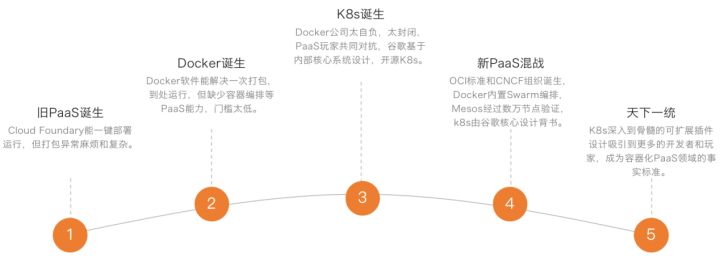

## 云原生潮流下一些关于存储发展的思考

### 云计算发展史

2022年奥莱利(Tim O'Reilly)拜访了贝索斯，希望跟亚马逊谈个合作。合作没谈成，但此次会面让贝索斯意识到亚马逊的数据是有价值的，可以开放出来让第三方程序员来使用的 - 如果亚马逊不这么做的话，O'Reilly这样的牛人可以直接写个爬虫程序把很多公开数据从网页上扒下来。很快亚马逊组织了第一届亚马逊开发者大会，开始发布自己的API。大会很成功，然后有了一个名字：Amazon Web Services。

亚马逊的核心业务电子商务有太强的季节性，如何有效地配置具备足够扩展性而且可以持续上线的基础系统的成为了一个迫在眉睫的问题。受到一本书(Creation: Life and How to Make it)的启发，亚马逊发现了一条解决配置IT资源的路径：把IT基础设施分化到最小的原子单元，并决心将IT基础设施当做互联网的水电进行出售。2004年，亚马逊研制出最早版本的最早版本的EC2和S3。2006年，AWS云计算服务正式上线。

后续谷歌和微软分别推出了自己的云服务(Google Cloud与Azure)。

目前中国云计算的领头羊是阿里云。

云计算的服务类型分为三类，即基础设施即服务(IaaS)、平台即服务(PaaS)和软件即服务(SaaS)

### 云原生发展史

为了解决PaaS中最为棘手最亟待解决的一个问题(如何给应用打包)，dotCloud公司推出了基于LXC(Linux容器项目)的Docker容器项目。与虚拟机通过操作系统实现隔离不同，容器技术只隔离应用程序的运行时环境，但容器之间可以共享同一个操作系统。所以Docker比虚拟机更加轻量级，直接打包了应用以及应用所有的依赖，从而保证了本地环境和云端环境的高度一致，做到了`build once, run everywhere`。

 Docker成为了容器生态事实上的标准，并推出了Docker容器编排平台Swarm。

 在云计算中落后于亚马逊的谷歌，开始入局容器之上的平台层(PaaS)。

一般公司一个一个组分开买机器：

允许叠加软件的公司

Google需要大量的MapReduce工作去优化它的搜索引擎和准备数据给机器学期训练，所以把把MapReduce的工作叠加到所有的机器上面

谷歌内部使用Borg系统作为大型集群管理系统，处理MapReduce所需要的调度scheduling的工作。

为了迅速占领docker容器化编排管理市场， 谷歌基于Borg的设计理念使用Go语言开发新的组件系统 Kubernetes(2014年6月推出)。Kubernetes 项目让人耳目一新的设计理念和号召力，凭借着Google在容器化基础设施领域多年实践经验的沉淀和升华，很快就构建出了一个与众不同的容器编排与管理的生态，在GitHub上的各项指标开始一骑绝尘，将Swarm 项目远远地甩在了身后。

2015年6月，由Docker公司牵头，CoreOS、Google、RedHat 等公司共同宣布，Docker公司将 Libcontainer捐出，并改名为RunC项目，交由一个完全中立的基金会管理，然后以RunC为依据，大家共同制定一套容器和镜像的标准和规范(OCI)。

2015年12月，Google、RedHat 等开源基础设施领域玩家们，共同牵头发起了一个名为`CNCF(Cloud Native Computing Foundation)`的`云原生计算基金会`。这个基金会的目的其实很容易理解：它希望，以Kubernetes项目为基础，建立一个由开源基础设施领域厂商主导的、按照独立基金会方式运营的平台级社区，来对抗以Docker公司为核心的容器商业生态。

2016 年 12 月，Kubernetes发布CRI(Container Runtime Interface， 容器运行时接口)，凡是支持CRI的容器运行时，皆可直接作为Kubernetes的底层容器运行时

2017年，Docker公司将Docker项目的容器运行时部分(Containerd)捐赠给CNCF。11月，K8s支持Containerd。

2020 K8s宣布开始进入废弃dockershim支持的倒计时。至此k8s取得了容器编排领域的全面胜利。

#### CNCF Landscape路线图

- 容器化。目前最流行的容器化技术是Docker、Podman。

- CI/CD。持续集成和持续发布

- 应用编排。Kubernetes是目前市场上应用编排领域被最广泛应用的工具

- 监控和分析。平台监控、日志以及跟踪等，例如将Prometheus用于监控、Fluentd用于日志、Jaeger用于整个应用调用链的跟踪。

- 服务代理、发现和治理。CoreDNS、Envoy和LInkerd可以分别用于服务发现和服务治理，提供服务的健康检查、请求路由、和负载均衡等功能。

- 网络。Calico、Flannel以及Weave Net等软件用于提供更灵活的网络功能。

- 分布式数据库和存储。分布式数据库可以提供更好的弹性和伸缩性能，但同时需要专业的容器存储予以支持。

- 流和消息处理。当应用需要比JSON-REST这个模式更高的性能时，可以考虑使用gRPC或者NATS。gRPC是一个通用的RPC（远程调用）框架（类似各种框架中的RPC调用），NATS是一个发布/订阅和负载均衡的消息队列系统。

- 容器镜像库和运行环境。Harbor是目前最受欢迎的容器镜像库，同时，你也可以选择使用不同的容器运行环境用于运行容器程序

- 软件发布

#### [CNCF Landscape全景图](https://landscape.cncf.io/ "CNCF Landscape")

从总体来看，它将云原生生态分为以下几层：

- Special

    图中最底层是Cloud（公有云，包括AWS、Google、Azure、Ali、Baidu、Tencent等）以及Kubernetes认证的服务提供商（主要是私有云）。

- Provisioning

    有了物理机或虚拟机后，在运行容器化服务之前，需要为容器准备标准化的基础环境，这就是Provisioning这一层的作用。在Provisioning这一层中，分为以下几个功能组成模块：

    Automation & Configuration：用于自动化部署和配置容器运行平台和环境。

    容器镜像库：容器镜像库是整个CNCF云原生中的核心部件之一，因为基于容器的运行环境中，所有的应用都需要借助容器镜像库来进行安装和部署。容器镜像库又分为公有和私有，公有的容器镜像库包括docker官方的registry，AWS的Elastic Container Registry，Google的Container Registry等。在私有镜像库中，VMware中国团队主导的Harbor得到了广泛的应用，大量的容器平台目前都基于Harbor构建其镜像仓库。

    Security & Compliance：Notary和TUF（The Upgrade Framework）是这个领域两个主要的项目，其中TUF是一个开源的安全标准，Notary是其中一个实现。Notary软件除了确保软件的出处外，它还能保证在未经容器镜像提供者批准的情况下，不会在镜像供应链的任何地方修改镜像内的内容，从而确保从开发到运营的过程中，安全都被无缝统一地嵌入到整个工作流中。

    Key Management：主要用于在整个容器平台中进行秘钥管理。

- Runtime：

    Runtime这一层可以理解为容器的整个运行环境，是云原生中最核心的部分，它包括了计算、存储、网络三大块：

    Container Runtime：Docker是最广为人知的容器运行环境，但生产环境下也有一些其他的容器环境在运行。

    Cloud-Native Storage：起初，容器为无状态的运行单元，容器最上一层文件系统无法保存其在运行时写入的文件或数据，容器重建或重启后，这些写入的数据将丢失。但随着数据库、消息队列等中间件逐步在容器环境中得到应用，如今用户对容器持久化存储的理解和需求也更加深入和迫切。

    Cloud-Native Network：网络历来是虚拟化技术中最灵活多变的部分

- Orchestration Management：

    这一层主要负责容器平台的编排和调度，包括服务的发现和治理，远程调用，服务代理，微服务治理等组件，包括：

    Scheduling & Orchestration：在这个领域，Kubernetes是当仁不让的头号玩家。

    Coordination & Service Discovery：分布式计算中很重要的一点就是各个服务之间的协同以及服务发现（或节点发现的问题），老牌的Zookeeper可以用于分布式服务的发现和配置，Kubernetes默认使用的则是CoreOS旗下的Etcd。

    Remote Procedure Call：微服务间进行通信，通常有两种方式，其一为HTTP REST-JSON的方式，另一种为RPC 方式，相比起来RPC方式效率更高。常用的包括 Google 开源的 GRPC 、apache 旗下的 thrift 框架

    Service Proxy、API网关以及微服务治理：这几个部分都用于对容器平台中运行的诸多API服务进行管理、路由、监控以及弹性伸缩的功能。

- App Definition and Development

    这一层就是容器平台上运行的具体应用和工具了，可以理解为容器平台的应用商店。根据应用的不同作用的使用场景，可以大致分为以下几种类型：数据库（例如MySQL、MariaDB、mongoDB、PostgreSQL、Cassandra、TiDB等）、流处理和消息队列（例如Spark、Storm、RocketMQ、Kafka、RabbitMQ等）、应用和镜像制作（用于将应用封装成标准镜像，使应用能在标准的容器平台上运行，例如Helm、Docker Composer、Packer等）、CI/CD（最常见的Jenkins、Atlassian公司开发的Bamboo等）。

### K8S介绍

一个 Kubernetes 集群是由一组被称作节点（node）的机器组成， 这些节点上会运行由 Kubernetes 所管理的容器化应用。 且每个集群至少有一个工作节点。节点可以是一个虚拟机或者物理机器。

工作节点会托管所谓的 Pods，而 Pod 就是作为应用负载的组件。 控制平面管理集群中的工作节点和 Pods。 为集群提供故障转移和高可用性， 这些控制平面一般跨多主机运行，而集群也会跨多个节点运行。

Pod 是可以在 Kubernetes 中创建和管理的、最小的可部署的计算单元。

Pod是一组（一个或多个）容器； 这些容器共享存储、网络、以及怎样运行这些容器的声明。 Pod 中的内容总是并置（colocated）的并且一同调度，在共享的上下文中运行。

