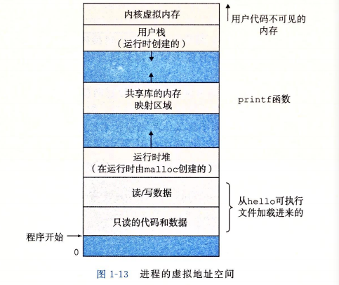

## 计算机系统漫游

计算机系统由硬件和系统软件组成。

### 信息就是位 + 上下文

系统中所有的信息，包括磁盘文件、内存中的程序、内存中的用户数据及网络上传送的数据，都是由一串比特表示的。区分不同数据对象的唯一方法是这些数据对象的上下文。在不同的上下文中，一个同样的字节系列可能表示一个整数、浮点数、字符串或者机器指令。

### 系统的硬件组成

**总线**

贯穿整个系统的是一组电子管道，称作总线，它携带信息字节并负责在各个部件间传递。通常总线被设计成传送定长的字节块，也就是字(word)。字中的字节数(字长，word size)是一个基本的系统参数。32位即4字长，64位即8字长。

**I/O设备**

I/O设备是系统与外部世界的联系通道，示例包括四个I/O设备：用户输入的键盘鼠标，用户输出的显示器，长期存储数据与程序的磁盘。网络也可以作为一种I/O设备。

每个I/O设备都通过一个控制器或者适配器与I/O总线相连。

**主存**

主存是一个临时存储设备，在执行程序期间，用来存放程序和程序处理的数据。物理上来说，主存是由一组动态随机存取存储器(DRAM)芯片组成的。逻辑上来说，主存是一个线性的字节数组，每个字节都有其唯一的地址(数组索引)。

**处理器**

中央处理单元(CPU)，简称处理器，是解释和执行存储在主存中指令的引擎。处理器的核心是一个大小为一个字的存储设备(或寄存器)，称之为程序计数器(PC)。PC指向内存中的某条机器语言指令(含有该指令的地址)。

CPU一直在不断的执行PC指向的指令。再更新PC，使其指向下一条指令。这个模型由指令集架构决定。

执行的简单操作围绕着主存，寄存器文件和算数逻辑单元(ALU)。寄存器文件是一个小的存储设备，由一些一个字长的寄存器组成，每个寄存器都有唯一的名字。ALU计算新的数据和地址值。

- 加载：从主存复制一个字节或者一个字到寄存器，以覆盖寄存器原先的内容。
- 存储：从寄存器复制一个字节或者一个字到主存的某个位置，覆盖
- 操作：把两个寄存器的内容复制到ALU,做算术运算，并将结果存放到一个寄存器中，覆盖
- 跳转：从指令本身中抽取一个字，并将这个字复制到PC,覆盖

### 程序运行

1.键盘上输入'./hello'后，shell程序将字符逐一读入寄存器，再把它存放到内存中

2.敲回车，shell程序知道已经结束了命令输入，执行一系列指令加载可执行的hello文件，这些指令将hello文件中代码和数据从磁盘复制到内存。
利用直接存储器存取(DMA)技术，数据可以不通过处理器而直接从磁盘到达主存。

3.加载到主存后，处理器开始执行hello程序中的机器语言指令，这些指令将字符串中的字节从主存复制到寄存器文件，再从寄存器文件中复制到显示设备。

### 高速缓存

系统花费了大量时间把信息从一个地方挪到另一个地方。处理器中从寄存器读取数据要比从主存中读取几乎快100倍。系统设计者采用了更小更快的存储设备，称为高速缓存存储器(cache)，作为暂时的集结区域，存放处理器近期可能会需要的信息。

L1和L2高速缓存采用一种叫静态随机访问存储器(SRAM)的硬件技术。

每个计算机中的存储设备都被组织成一个存储器层级结构，从上至下，设备的访问速度越来越慢，容量越来越大。

存储器层级结构的主要思想是上一层的存储器作为低一层存储器的高速缓存。

### 操作系统

操作系统可以看做是应用程序与硬件之间插入的一层软件。程序访问键盘、显示器、磁盘或者主存都需要经过操作系统。

操作系统有两个基本功能：1)防止硬件被失控的程序滥用，2)向应用程序提供简单一致的机制来控制复杂而又大不相同的低级硬件设备。

操作系统通过几个基本的抽象概念(进程、虚拟内存和文件)来实现这两个功能：

**进程**

进程是对处理器、内存和I/O设备的抽象表示。进程使得程序看上去独占的使用处理器、主存和I/O设备。进程是计算机科学中最重要和最成功的的概念之一。

进程是操作系统对一个正在运行的程序的一种抽象，在一个系统中可以同时运行多个进程，而每个进程都好像在独占地使用硬件。并发运行，是说一个进程的指令和另一个进程的指令交错执行。这通过处理器在进程间切换来实现，称之为上下文切换。操作系统保持跟踪程序运行所需的所有状态信息，这种状态就是上下文，包括PC和寄存器文件当前值，主存的内容。上下文切换，即保存当前进程的上下文，恢复新进程的上下文，然后将控制权传递到新进程。新进程就从它上次停止的地方开始。

上下文切换由操作系统内核(kernel)管理的。**内核**是操作系统代码常驻内存的部分。程序需要操作系统的某些操作时，比如读写文件，它就执行一条特殊的系统调用指令，将控制权传递给内核。然后内核执行被请求的操作并返回应用程序。内核不是一个独立的进程，它是系统管理全部进程所用的代码和数据结构的集合。

**线程**

进程实际上可以由多个称之为线程的执行单元组成，每个线程都运行在进程的上下文中，并共享同样的代码和全局数据。

**虚拟内存**

虚拟内存是对主存和磁盘的抽象。它为每个进程提供了一个假象，即每个进程都在独占地使用主存。每个进程看到的内存都是一致的，称之为虚拟地址空间。Linux的虚拟地址空间：

地址从下往上增大：

- 程序代码和数据：对所有的进程来说，代码从同一固定地址开始，紧接着的是和C全局变量对应的数据位置。这些根据可执行目标文件的内容初始化。
- 堆：紧随着是运行时堆，当调用malloc和free这样的C标准库函数时，堆可以运行时动态地扩展和收缩。
- 共享库：中间部分是一块存放像C标准库和数学库这样的共享库代码和数据的区域。
- 栈：用户虚拟地址空间顶部的是用户栈，编译器用它来实现函数调用。和堆一样，可以动态的扩展和收缩，每调用一个函数，栈就会增长，从一个函数返回，栈就会收缩。
- 内核虚拟内存：地址空间顶部的区域为内核保留。不允许应用程序读写这个区域的内容或直接调用内核代码定义的函数。相反，它们必须调用内核来执行这些操作。

虚拟内存运作的基本思想是把一个进程虚拟内存的内容存储在磁盘上，然后用主存作为磁盘的高速缓存。

**文件**

文件是对I/O设备的抽象。文件就是字节序列，每个I/O设备、包括磁盘、键盘、显示器，甚至网络都可以看做文件。

**虚拟机**

虚拟机提供对整个计算机的抽象，包括操作系统、处理器和程序。

### 并发与并行

并发(concurrency)指一个同时具有多个活动的系统，而并行(parallelism)指用并发来使一个系统运行的更快。

三个层次的并发：

**线程级并发**

单处理器系统中的并发是模拟出来的，通过在各个进程之间快速切换。

多核处理器是将多个CPU(核)集成到一个集成电路芯片上。每个核都有自己的L1和L2高速缓存，L1分为两个部分，一个保存最近取到的指令，一个存放数据。这些核共享更高层次的高速缓存(L3)以及主存的接口。

超线程，有时候称为同时多线程(simultaneous multi-threading)，是一项允许一个CPU执行多个控制流的技术。CPU某些硬件(程序计数器和寄存器文件)有多个备份，其它的硬件部分只有一份，比如执行浮点算术运算的单元。常规的处理器需要大约20000个时钟周期做不同线程的转换，而超线程的处理器可以在单个周期的基础上决定要执行哪个线程。假设一个线程必需等到某些数据被装载到高速缓存中，那CPU就可以去执行另一个线程。

**指令级并行**

现代处理器可以同时执行多条指令的属性称之为指令级并行。

**单指令、多数据并行**

最低层次上，许多现代处理器有特殊的硬件，允许一条指令产生多个可以并行执行的操作，即SIMD并行。

