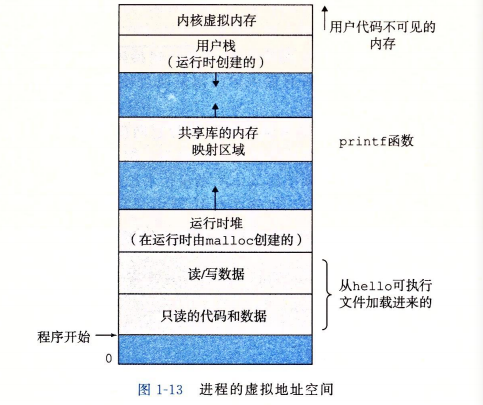
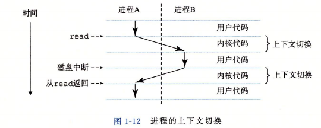
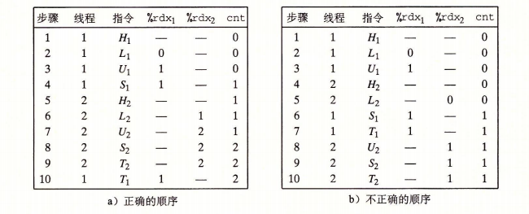
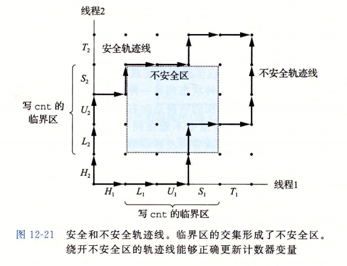
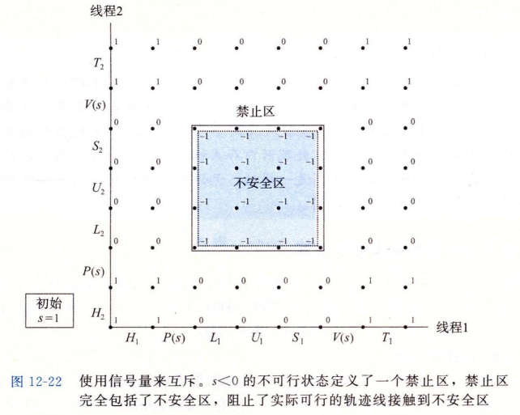
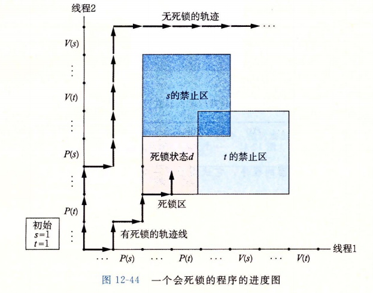
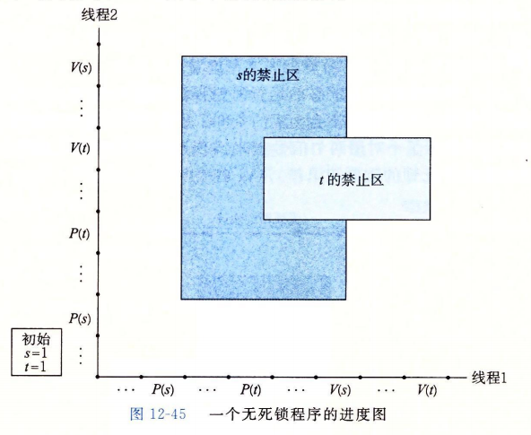

## 进程与线程

### 进程

异常是允许操作系统内核提供进程概念的基本构造块，进程是计算机科学中最重要和最成功的的概念之一。

进程的经典定义就是一个执行中的程序的实例。系统中的每个程序都运行在某个进程的`上下文(context)`中。上下文是由程序正确运行所需的状态组成。这个状态包括存放在内存中的程序的代码和数据，它的栈、通用目的寄存器的内容、程序计数器、环境变量以及打开文件描述符的集合。

进程使得程序看上去独占的使用处理器、主存和I/O设备。处理器就好像是无间断地一条一条地执行程序中的指令。

进程提供给了应用程序两个关键抽象：一个独立的逻辑控制流、一个私有的地址空间。

### 逻辑控制流

逻辑控制流提供一个假象，好像程序独占地使用处理器。如果用调试器单步执行程序，我们会看到一系列的程序计数器的值，这些值唯一地对应于包含在程序可执行文件中的指令，或是包含在运行时动态链接到程序的共享对象中的指令。这个PC值的序列叫做逻辑控制流。

进程是轮流使用处理器的，逻辑流交错执行，每个进程执行它的流的一部分，然后被抢占(preempted)(暂时挂起)，然后轮到其他进程。

**并发流**

一个逻辑流的执行在时间上与另一个流重叠，称之为**并发流**(concurrent flow)。多个流并发地执行的一般现象称之为并发(concurrency)。一个进程和其他进程轮流运行的概念称之为**多任务**(multitasking)。一个进程执行它的控制流的一部分的每一时间段叫做**时间片**(time slice)。因此，多任务也叫做**时间分片**(time slicing)。

并发流的思想与流运行的处理器核数无关。并行流是并发流的一个真子集。如果两个流并发地运行在不同的处理器或计算机上，称之为**并行流**(parallel flow)。

### 私有地址空间

私有地址空间为程序提供一个假象，好像它独占地使用系统地址空间。和这个空间中的某个地址相关联的那个内存字节是不能被其他进程读或者写的。每个私有地址空间内容一般是不同的，但都有相同的通用结构。



### 用户模式和内核模式

应用程序是不能访问内核虚拟内存的。处理器通常使用某个控制寄存器描述进程当前享有的特权，寄存器中可以设置一个模式位(mode bit)，设置后，进程就运行在**内核模式**中(有时候叫超级用户模式)。一个运行在内核模式的进程可以执行指令集中的任何指令，可以访问系统中的任何内存位置。

没有设置模式位时，进程就运行在用户模式中。用户模式中的进程不允许执行特权指令(privileged instruction)，比如停止处理器、改变模式位，或者发起一个I/O操作。也不允许用户模式中的进程直接引用地址空间中内核区的代码和数据。必须通过系统接口调用。

进程从用户模式变为内核模式的唯一方法是通过诸如中断、故障或者**陷入系统调用**这样的异常。处理程序运行在内核模式中，当它返回到应用程序代码时，处理器就把模式从内核模式改回到用户模式。

Linux提供了`/proc`的机制，允许用户模式进程访问内核数据结构的内容。

### 上下文切换

操作系统内核使用一种称之为`上下文切换(context switch)`的较高层形式的异常控制流来实现多任务。

内核为每个进程维持一个上下文，上下文就是内核重新启动一个被抢占的进程所需要的状态。它由一些对象的值组成，这些对象包括通用目的寄存器、浮点寄存器、程序计数器、用户栈、状态寄存器、内核栈和各种内核数据结构，比如描述地址空间的页表、包含当前有关进程信息的进程表，以及包含进程已打开文件的信息的文件表。

在进程执行的某些时刻，内核可以决定抢占当前进程，并重新开始一个先前被抢占了的进程。这种决策叫做**调度**(scheduling)，由内核中的称为**调度器**(scheduler)的代码处理。上下文切换 1)保存当前进程的上下文，2)恢复某个先前被抢占的进程被保存的上下文，3)将控制传递给这个新恢复的进程。

当内核代表用户执行系统调用时，可能会发生上下文切换。如果**系统调用**因为等待某个事件发生而阻塞，那么内核可以让当前进程休眠，切换到另一个进程。比如**read**系统调用需要访问磁盘，另一个示例是**sleep**系统调用，显式地请求让调用进程休眠。当然，即使系统调用没有阻塞，内核也可以决定执行上下文切换。

中断也可以引起上下文切换。比如所有的系统都有某种产生周期性**定时器中断**的机制，通常为每1ms或者每10ms。定时器中断时，内核判断当前进程已经运行了足够长事件，并切换到另一个进程。



切换前，内核代表进程A在用户模式下执行指令，切换的第一部分中，内核代表进程A在内核模式下执行指令，在某一时刻，它开始代表进程B执行指令。切换之后，核代表进程B在用户模式下执行指令。

磁盘发出中断信号，表示数据已经由磁盘传动到了内存，内核执行从B到A的上下文切换。以此类推，直至下一次异常。

### 进程ID

每一个进程都有一个唯一的正数非零ID,`PID`。`getpid`函数返回调用进程的PID。

### 创建和终止

进程总处于三种状态之一：

- **运行**：进程要么在CPU上执行，要么等待被执行且最终会被内核调度。
- **停止**：进程的执行被挂起(suspended)，且不会被调度。当收到SIGSTOP、SIGTSTP、SIGTTIN或者SIGTTOU信号时，进程就停止，直到收到一个SIGCONT信号并再次运行。
- **终止**：进程永远地停止了。三种原因：1)收到一个终止进程的信号，2)从主程序返回，3)调用exit函数。exit函数以status退出状态来终止进程。

父进程通过调用**fork**函数来创建一个新的运行的子进程。

子进程与父进程几乎但不完全相同。子进程得到与父进程用户级虚拟地址空间相同的(但独立的)一份副本，包括代码和数据段，堆、共享库和用户栈。子进程还获取了父进程中任何打开的文件描述法院的副本(**文件共享**)，这意味着子进程可以读写父进程中打开的任何文件。子进程和父进程最大的区别是有不同的PID。

fork函数最有趣的是，**调用一次，返回两次**：父进程中，返回子进程的PID,子进程中，返回0。

父进程和子进程**并发执行**。

相同但是独立的地址空间，是说地址空间都是独立的，但具有相同的用户栈、本地变量值、堆、全局变量值及代码。但所作的改变都是独立的，不会反映在另一个进程之中。

### 回收子进程

当一个进程终止时，内核并不是立即把它从系统中清除，相反进程被保持在一种已终止的状态中，直到它被它的父进程回收(reaped)。当父进程回收已终止的子进程时，内核将子进程的退出状态传递给父进程，然后抛弃已终止的进程。从此时开始，该进程就不存在了。一个终止了但还没被回收的进程称之为`僵尸进程(zombie)`。

如果一个父进程终止了，内核会安排init进程成为它的`孤儿进程`的养父。init进程PID为1，在系统启动时创建，不会终止，是所有进程的祖先。
如果父进程没有回收它的僵死子进程，内核会安排init进程回收它们。

### 进程休眠

sleep函数可以让进程挂起一段时间。

### 工具

ps与top

## 线程

线程(thread)是运行在进程上下文中的逻辑流。现代系统允许编写同一个进程里同时运行多个线程的程序。线程由内核自动调用。每个线程都有自己的**线程上下文**(thread context)，包括一个唯一的整数线程ID，TID、栈、栈指针、程序计数器、通用目的寄存器和条件码。同一进程的线程共享进程的整个虚拟地址空间，包括代码、数据、堆、共享库和打开的文件。

基本上，线程是CPU的基本调度单位。

每个进程开始生命周期时都是单一线程，称为主线程(main thread)。某一时刻，主线程创造一个对等线程(peer thread)，从这个时间点开始，两个线程并发运行。主线程执行一个慢速系统调用，例如read或者sleep，或是被系统的间隔计时器中断，控制就会通过上下文切换传递到对等线程。

一个线程的上下文要比进程小得多，切换也快的多。

线程不像进程那样按父子层次组织，和一个进程相关的线程组成一个对等线程池。主线程和其它线程的区别仅在于它是第一个运行的线程。一个线程可以杀死它的任何对等线程，或者等待它的任意对等线程终止。

### Posix线程

POSIX表示可移植操作系统接口（Portable Operating System Interface of UNIX，缩写为 POSIX ），POSIX标准定义了操作系统应该为应用程序提供的接口标准，是IEEE为要在各种UNIX操作系统上运行的软件而定义的一系列API标准的总称，其正式称呼为IEEE 1003，而国际标准名称为ISO/IEC 9945。

POSIX标准意在期望获得源代码级别的软件可移植性。

线程的代码和本地数据被封装在一个**线程例程**(thread rountine)中。

### 创建线程

线程使用pthread_create函数创建线程

### 线程终止

- 当顶层的线程例程返回时，线程会隐式地终止。
- 调用pthread_exit函数，线程显式地终止。如果主线程调用此函数，它会等待所有其他对等线程终止，然后再终止主线程和整个进程。
- 某个对等线程调用Linux的exit函数，该函数终止进程及相关的所有线程。
- 另一个对等线程通过以当前线程ID作为参数调用pthread_cancel函数来终止当前线程

### 线程回收

线程通过pthread_join函数等待其它线程tid终止。pthread_join函数会阻塞，直到线程tid终止，然后回收已终止线程占用的所有存储器资源。

### 分离线程

线程是**可结合的**(joinable)或者**分离的**(detached)。一个可结合的线程能够被其它线程收回和杀死(join函数)。在被回收之前，内存资源(栈)是不会释放的。相反，分离的线程不能被其他线程回收或者杀死，内存资源在终止时由系统自动释放。

默认情况下，线程被创建成可结合的。为了避免内存泄漏，每个可结合线程要么被其它线程显式回收，要么通过调用pthread_detach函数被分离。

高性能Web服务器，会创建新的线程处理请求，没必要显式的等待每个对等线程终止，应该在处理请求前分离它自身。

### 线程内存模型

寄存器是从不共享的。线程可以访问共享虚拟内存的任意位置，但线程是有自己的栈的。各自独立的线程栈的内存模型不那么整齐清除。这些栈被保存在虚拟地址空间的栈区域中，通常被相应的线程独立地访问。但线程不对其它线程设防，一个线程以某种方式得到了一个指向其它线程栈的指针，就可以读写。

- 全局变量：定义在函数之外的变量，在虚拟内存中只有一个实例，任何线程都可以引用，是共享的。
- 本地自动变量：定义在函数内部但没有static属性的变量，每个线程的栈都包含它自己的所有本地自动变量的实例。
- 本地静态变量：定义在函数内部并有static属性的变量。只有一个实例，与全局变量相同。

### 共享变量与同步错误

当且仅当变量的一个实例被1个以上的线程引用，变量是共享的。共享变量非常方便，但也引入了**同步错误**(synchronization error)的可能性。

比如两个线程同时对一个变量进行加循环1操作，一个线程的代码可以分解为：

- H：在循环头部的指令块
- L：加载共享变量到累加寄存器的指令
- U：更新累加寄存器的指令
- S：将更新值存回到共享变量
- T：循环尾部的指令块

多线程是交错进行的，一些顺序就会产生错误的结果：



线程2在第5步加载cnt，是在第2步线程1加载cnt之后，而在第6步线程1存储它之前，这样每个线程都存储了一个同样的值。

### 信号量

Edsger Dijkstra并发编程领域的先锋人物，提出了一种经典的解决同步不同执行线程问题的方法，基于**信号量**(semaphore)。信号量是具有非负整数值得全局变量，有两种特殊操作，**P**和**V**

- P(s)：如果s非零，将s减1，并且立刻返回。如果s为0，挂起这个线程，直到s变为非0，一个V操作会重启这个线程。重启之后，P操作将s减1，并将控制返回调用者
- V(s)：将s加1。如果有任何线程阻塞在P操作等待s编程非0，V操作会重启这些线程中的一个，然后该线程将s减1，完成P操作。

P和V的操作都是不可分割的。

当有多个线程在等待同一个信号量时，不能预测V操作要重启哪个线程。

P和V的定义保证了正在运行的程序不可能进入信号量为负的状态，这个属性称之为信号量不变性(semaphore invariant)。

### 进度图

进度图将指令执行模型化为从一种状态到另一种状态的转换，合法的转换是向右或者向上，不能在同一时刻完成，对角线是不行的。程序绝对不允许反向运行，向下或者向左的转换也是不合法的。

对于某个线程，操作共享变量的指令构成了一个**临界区**，这个临界区不应该与其他进程的临界区交替执行，称为互斥。两个临界区的交集称为**不安全区**。不安全区不包括与临界区的交界。绕开不安全区的轨迹线称之为**安全轨迹线**，反之为**不安全轨迹线**。



### 信号量互斥或者锁

可以将每个共享变量与一个信号量s(初始为1)联系起来，然后用P与V操作将相应的临界区包围起来，就提供了一种确保对共享变量的互斥访问。

这种保护共享变量的信号量叫做二元信号量(binary semaphore)，值总是0或者1。常常也称为**互斥锁**(mutex)。在一个互斥锁上执行P操作称为对互斥锁加锁，V操作称之为对互斥锁解锁。

P和V操作的结合创造了一组状态，叫做**禁止区**，其中s<0。因为信号量的不变性，没有实际可行的轨迹线能够包含禁止区中的状态，禁止区完全包括了不安全区，所以没有实际可行的轨迹线能够接触不安全区的任何部分。禁止区使得在任何时间点上，在被包围的临界区中，不可能有多个线程在执行指令。



### 互斥锁与二元信号量的区别

参考：[https://stackoverflow.com/questions/62814/difference-between-binary-semaphore-and-mutex?page=1&tab=votes#tab-top](https://stackoverflow.com/questions/62814/difference-between-binary-semaphore-and-mutex?page=1&tab=votes#tab-top)

二者的目的不同。

**Mutual Exclusion Semaphores**

互斥锁用来保护某些共享资源(数据结构、文件等)

一个互斥锁是被某个获取了锁的task拥有的，另一个task尝试获取锁的话，会返回error并且fail。

```
  Thread A                     Thread B
   Take Mutex
     access data
     ...                        Take Mutex  <== Will block
     ...
   Give Mutex                     access data  <== Unblocks
                                  ...
                                Give Mutex
```

**Binary Semaphore**

二元信号量处理完全不同的问题：

- Task B挂起等待某个信号
- 信号到达
- Task B对信号采取正确的行动，然后继续waiting

```
   Task A                      Task B
   ...                         Take BinSemaphore   <== wait for something
   Do Something Noteworthy
   Give BinSemaphore           do something    <== unblocks
```

二元信号量中，A可以继续释放信号，B也可以继续等待信号。释放信号与获取信号是分离的。

### 线程安全

一个函数被称为线程安全(thread-safe)，当且仅当被多个并发线程反复地调用时，会一直产生正确的结果。

四种线程不安全函数：

- 不保护全局变量：变为线程安全较为容易，信号量保护共享变量。
- 保持跨越多个调用的状态的函数：当前调用的结果依赖于前次调用的中间结果。方式是不要再使用任何static数据。，二是依靠调用者在参数中传递状态信息。
- 返回指向静态变量的指针的函数：正在被一个线程使用的结果可能会被另一个线程悄悄地覆盖了。可以采用加锁-复制(lock-and-copy)技术，在每一个调用位置加锁，调用线程不安全函数，将函数返回的结果复制到一个私有的内存位置，然后解锁。
- 调用线程不安全的函数

### 可重入性

一类重要的线程安全函数，被多个线程调用时，不会引用任何共享数据。

### 死锁

死锁(deadlock)指的是一组线程被阻塞了，等待一个永远也不会为真的条件。



- 程序员使用P和V操作顺序不当，使得两个信号量的禁止区域重叠。重叠的禁止区域阻塞了死锁状态d下每个合法方向上的进展。每个线程都在等待其他线程执行一个根本不可能发生的V操作。
- 轨迹线可以进入死锁区域，但是不可能离开

**互斥锁加锁顺序规则**

给定所有互斥操作一个全序，每个线程都是以一种顺序获得互斥锁并以相反的顺序释放，就是无死锁的。



## 进程与线程

抛开各种技术细节，从应用程序角度讲：

1、在单核计算机里，CPU是无法被多个程序并行使用的，没有操作系统的情况下，一个程序一直独占着CPU。

如果要有两个任务来共享同一个CPU，程序员就需要仔细地为程序安排好运行计划--某时刻CPU由由程序A来独享，下一时刻CPU由程序B来独享

而这种安排计划后来成为OS的核心组件，被单独名命为“scheduler”，即“调度器”，它关心的只是怎样把单个CPU的运行拆分成一段一段的“时间片”，轮流分给不同的程序去使用，而在宏观上，因为分配切换的速度极快，就制造出多程序并行在一个CPU上的假象。

2、在单核计算机里，有一个资源可以被多个程序共用，然而会引出麻烦：内存。

在一个只有调度器，没有内存管理组件的操作系统上，程序员需要手工为每个程序安排运行的空间 -- 程序A使用物理地址0x00-0xff,程序B使用物理地址0x100-0x1ff，等等。

然而这样做有个很大的问题：每个程序都要协调商量好怎样使用同一个内存上的不同空间，软件系统和硬件系统千差万别，使这种定制的方案没有可行性。

为了解决这个麻烦，计算机系统引入了“虚拟地址”的概念，从三方面入手来做：

2.1、硬件上，CPU增加了一个专门的模块叫MMU，负责转换虚拟地址和物理地址。

2.2、操作系统上，操作系统增加了另一个核心组件：memory management，即内存管理模块，它管理物理内存、虚拟内存相关的一系列事务。

2.3、应用程序上，发明了一个叫做**进程**的模型，（注意）每个进程都用完全一样的虚拟地址空间，然而经由操作系统和硬件MMU协作，映射到不同的物理地址空间上。不同的进程，都有各自独立的物理内存空间，不用一些特殊手段，是无法访问别的进程的物理内存的。

3、现在，不同的应用程序，可以不关心底层的物理内存分配，也不关心CPU的协调共享了。然而还有一个问题存在：有一些程序，想要共享CPU，**并且还要共享同样的物理内存**，这时候，一个叫**线程**的模型就出现了，它们被包裹在进程里面，在调度器的管理下共享CPU，拥有同样的虚拟地址空间，同时也共享同一个物理地址空间，然而，它们无法越过包裹自己的进程，去访问别一个进程的物理地址空间。

4、进程之间怎样共享同一个物理地址空间呢？不同的系统方法各异，符合posix规范的操作系统都提供了一个接口，叫mmap，可以把一个物理地址空间映射到不同的进程中，由不同的进程来共享。

5、PS：在有的操作系统里，进程不是调度单位（即不能被调度器使用），线程是最基本的调度单位，调度器只调度线程，不调度进程，比如VxWorks。
