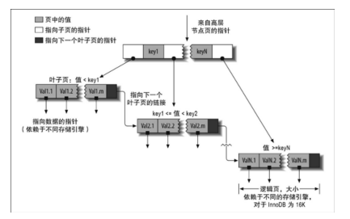

## 高性能索引

索引(MySQL中也叫键key)是存储引擎用于快速找到记录的一种数据结构。

索引优化应该是对查询性能优化最有效的手段。

### 语法

MySQL的**key**同时具有constraint和index的意义，也就是既有约束作用，也有索引作用。

- Primary Key：起到主键和索引的作用
- Unique Key：规范数据的唯一性，同时有索引作用
- Foreign Key：外键，规范数据的引用完整性，同时有索引作用

index则是纯粹的index。

直接创建索引：
```
CREATE [UNIQUE | FULLTEXT | SPATIAL] INDEX index_name
    [index_type]
    ON tbl_name (key_part,...)
    [index_option]
    [algorithm_option | lock_option] ...

key_part:
    col_name [(length)] [ASC | DESC]

index_option:
    KEY_BLOCK_SIZE [=] value
  | index_type
  | WITH PARSER parser_name
  | COMMENT 'string'

index_type:
    USING {BTREE | HASH}

algorithm_option:
    ALGORITHM [=] {DEFAULT | INPLACE | COPY}

lock_option:
    LOCK [=] {DEFAULT | NONE | SHARED | EXCLUSIVE}
```
创建table的时候指定索引：
```
CREATE TABLE tbl_name (
    col_name column_definition，
    {INDEX|KEY} [index_name] [index_type] (key_part,...)
)

key_part:
    col_name [(length)] [ASC | DESC]
```
创建时指定主键：
```
CREATE TABLE tbl_name (
    col_name column_definition，
    [CONSTRAINT [symbol]] PRIMARY KEY [index_name] [index_type] (key_part,...)
)
```
创建时指定唯一索引：
```
CREATE TABLE tbl_name (
    col_name column_definition，
    [CONSTRAINT [symbol]] UNIQUE [INDEX|KEY] [index_name] [index_type] (key_part,...)
)
```
创建时指定外键：
```
CREATE TABLE tbl_name (
    col_name column_definition，
    [CONSTRAINT [symbol]] FOREIGN KEY [index_name] (col_name,...)
    reference_definition
)
```
已存在表更新添加索引：
```
ALTER TABLE tbl_name
    | ADD {INDEX|KEY} [index_name] [index_type] (key_part,...) [index_option]
    | ADD [CONSTRAINT [symbol]] PRIMARY KEY [index_type] (key_part,...) [index_option] ...
    | ADD [CONSTRAINT [symbol]] UNIQUE [INDEX|KEY] [index_name] [index_type] (key_part,...) [index_option] ...
    | ADD [CONSTRAINT [symbol]] FOREIGN KEY [index_name] (col_name,...) reference_definition
```
撤销索引：
```
ALTER TABLE tbl_name
    | DROP {INDEX|KEY} index_name
    | DROP PRIMARY KEY
    | DROP FOREIGN KEY fk_symbol
```

### 索引基础

存储引擎现在索引中找到对应值，然后根据匹配的索引记录找到对应的数据行。

索引可以包含一个或多个列的值。多个列的顺序也十分重要，MySQL只能高效的使用索引的最左前缀列。

#### 索引类型

索引是在存储引擎层实现的。

**B-Tree**索引

使用B-Tree数据结构来存储数据：



B-Tree通常意味着所有值都是按照顺序存储的，每一个叶子页到根的距离相同。根节点的槽中存放了指向子节点的指针。叶子节点的指针指向的是被索引的数据，而不是其他的节点页。根节点和叶子节点之间可能有很多层节点页，树的深度和表的大小直接相关。

B-Tree是顺序存储的，所以很适合查找范围数据。

B-Tree适用于全键值、键值范围或键前缀查找：

- 全值匹配：和索引中的所有列进行匹配
- 匹配最左前缀：只匹配索引的第一列或前两列
- 匹配列前缀：匹配开头列的开头部分
- 匹配范围值
- 精确匹配某一列并范围匹配另外一列：第一列全匹配，第二列范围匹配

限制：

- 不是按照索引的最左列开始查找，则无法使用索引
- 不能跳过索引中的列
- 查询中如果有某个列的范围查找，则右边所有列都无法使用索引优化查找

可见，索引的**顺序**非常重要，这些限制都和顺序有关。

**哈希索引**

基于哈希表实现，只有精确匹配索引所有列的查询才会有效。只有Memory引擎显示支持哈希索引。
```
CREATE TABLE tbl_name (
    KEY USING HASH(colname)
);
```
哈希无法用于排序，不支持部分索引，只支持等值比较(`=`,`IN`,`<=>`)。速度非常快。

InnoDB引擎有个特殊功能叫自适应哈希。当某些索引值被使用的非常频繁时，会在内存中基于B-Tree的索引之上再创建一个哈希索引。

我们也可以自己在B-Tree基础上创建一个伪哈希索引。在B-Tree中使用哈希值而不是键本身。比如一个很长的url列，可以新增一个被索引的url_crc列，使用CRC32做哈希。
建表：
```
CREATE TABLE pseudohash ( 
  id int unsigned NOT NULL auto_increment, 
  url varchar(255) NOT NULL, 
  url_crc int unsigned NOT NULL DEFAULT 0, 
  PRIMARY KEY( id) 
);
```
创建触发器，自动生成crc：
```
DELIMITER // 
    CREATE TRIGGER pseudohash_crc_ins BEFORE INSERT 
    ON pseudohash FOR EACH ROW BEGIN SET NEW.url_crc= crc32(NEW.url);
END;
// 
    CREATE TRIGGER pseudohash_crc_upd BEFORE UPDATE  
    ON pseudohash FOR EACH ROW BEGIN SET NEW.url_crc= crc32(NEW.url); 
END; 
// 

DELIMITER ;
```
查询：
```
SELECT id FROM url 
WHERE url="http://www.mysql.com" 
AND url_crc=CRC32("http://www.mysql.com");
```
必须使用常量url，是为了避免哈希冲突。

### 索引优点

B-Tree索引，按照顺序存储数据，所以可以用来做ORDER BY和GROUP BY操作。索引中存储了实际的列值，某些查询只使用索引就能完成全部查询。

优点：

- 大大减少了服务器需要扫描的数据量
- 帮助服务器避免排序和临时表
- 将随机I/O变为顺序I/O

三星系统：将相关的记录放在一起获得一星，索引中的数据顺序和查找中的排列顺序一致则获得两星，索引中的列包含了查询中需要的全部列则获得三星。

对于非常小的表，大部分情况下全表扫描更高效。中大型的表，索引就非常有效。非常大的表，可以分区，如果表的数量特别多，可以建立一个元数据信息表。

### 高性能索引策略

有些是针对特殊案例的优化方法，有些则是针对特定行为的优化。

#### 独立的列

独立的列是指索引列不能是表达式的一部分，也不能是函数的参数，而是独立的。`WHERE actor_id + 1 = 5`是不行的。

#### 前缀索引和索引选择性

索引很长的列时，可以使用模拟哈希索引，也可以进行前缀索引。

前缀索引是索引开始的部分字符，可以大大节约索引空间，但降低了索引的选择性。

选择性是指不重复的索引值和数据表的记录总数的比值。索引的选择性越高则查询效率额越高。唯一索引的选择性是1，这是性能最好的。

对于BLOB、TEXT或者很长的VARCHAR类型的列，必须使用前缀索引。诀窍在于要选择足够长的前缀保证选择性，又不能太长。前缀的基数应该接近于完整列的基数。

计算完整列的选择性：
```
SELECT COUNT(DISTINCT colname)/COUNT(*) FROM table_name;
```
查询前缀的选择性：
```
SELECT COUNT(DISTINCT LEFT(colname, 3))/COUNT(*) FROM table_name;
```
可以从小到大查看前缀的选择性，查清到多少时选择性提升幅度变小。

只看平均选择性也是不够的，如果数据分布不均匀，可能会有陷阱。比如都以`San`开头的城市，可以查看平均性：
```
SELECT COUNT（*) AS cnt, LEFT(city, 4) AS pref 
FROM table_name 
GROUP BY pref
ORDER BY cnt DESC
LIMIT 5
```

创建前缀索引：
```
ALTER TABLE sakila.city_demo ADD KEY (city(7));
```
使用：
```
select * from city_demo where city like 'ShangH%';
```
前缀索引可以使索引更小更快，但无法用来做ORDER BY和GROUP BY，也无法用来做覆盖扫描。

一个很常见的场景是针对很长的十六进制唯一ID使用前缀索引。

有时候后缀索引也很有用，比如电子邮箱。可以将字符串反转后存储。

#### 多列索引

经常见的错误是为每个列单独建立索引或者使用错误的顺序建立多列索引。

新版本MySQL中查询能够同时使用两个单列做引进行扫描，并将结果进行合并。索引合并有时候是一种优化的结果，但实际上更多时候说明了表的索引建的很糟糕。

- 多个索引做相交操作时(多个AND条件)，意味着需要一个包含所有相关列的多列索引。
- 对多个索引做联合操作时(多个OR)，通常需要耗费大量CPU和内存资源在算法的缓存、排序和合并上。
- 优化器不会把这些成本算到查询成本中，使得成本被低估

在EXPLAIN中看到有索引合并，应该好好检查一下表的索引。

#### 合适的索引列顺序

有一个经验法则，在不考虑排序和分组的情况下，将选择性最高的列放在索引最前列。这时候索引的作用只是用于优化WHERE条件的查找，对于在WHERE子句中只是用了索引部分前缀列的查询来说选择性也更高。

有时候还要考虑值得分布。可能需要根据那些运行频率最高的查询来调整索引列的顺序。

#### 聚簇索引

聚簇索引并不是一种单独的索引类型，而是一种数据存储方式。InnoDB的聚簇索引实际上在同一个结构中保存了B-Tree索引和数据行，数据行实际保存在索引的叶子页中。聚簇表示数据行和相邻的键值紧凑的存储在一起。

一个表只能有一个聚簇索引。

聚簇索引中叶子页包含了行的全部数据，节点页只包含了索引列。

InnoDB通过主键聚集数据，如果没有定义主键，会选择一个唯一的非空索引代替，如果没有这样的索引，会隐式的定义一个主键。

优点：

- 相关数据保存在一起
- 数据访问更快，索引与数据在一起
- 覆盖索引的查询可以直接使用页节点的中的主键值。

缺点：

- 提高了I/O密集型应用的性能，如果数据全部放在内存中，就没什么优势了
- 按照主键的顺序插入最快，如果不按照主键顺序，加载完成后最后使用OPTIMIZE TABLE重新组织表
- 更新聚簇索引的代价很高，需要移动整个行
- 主键更新，可能引起页分裂
- 聚簇索引可能会使全表扫描变慢
- 二级索引可能会变大，因为要包含引用行的主键值
- 二级索引需要两次索引查找，先找到二级索引的叶子节点保存的主键值，然后根据这个值去聚簇索引查找相应的行

MyISAM中的主键索引和其它索引结构上没什么不同，只是一个叫Primary的唯一非空索引

对于InnoDB，聚簇索引就是表。没一个叶子节点包含了主键值,事务ID、用于事务和MVCC的回滚指针及所有的剩余列。二级索引的叶子节点存储的不是行指针，而是主键值。

最简单的方法是使用AUTO_INCREMENT自增列，可以保证数据行是顺序写入。最好避免随机的聚簇索引。

#### 覆盖索引

如果一个索引包含或者覆盖所有需要查询的字段的值，称为覆盖索引。查询只需要扫描索引而无须回表，会带来极大好处。

覆盖索引必须存储索引列的值，哈希索引、空间索引、全文索引都不存储索引列的值，只有B-Tree能用来做覆盖索引。

EXPLAIN的Extra显示Using index。

MySQL能在索引中做最左前缀匹配的LIKE操作，但如果是通配符开头的LIKE操作，无法匹配。

InnoDB的二级索引叶子节点包含了主键值，可以利用这些额外的主键列来覆盖查询。

假设索引覆盖了WHERE条件中的字段，但不是整个查询涉及的字段，条件为false，MySQL5.5及更老的版本也会回表获取数据行。解决办法是先查询索引的id，再进行二次查询：
```
SELECT *  FROM products 
    JOIN (  
          SELECT prod_id 
          FROM products 
          WHERE actor='SEAN CARREY' AND title LIKE '%APOLLO%' 
    ) AS t1 
    ON (t1.prod_id= products.prod_id)
```
这叫做延迟关联，使用了部分覆盖索引。


 