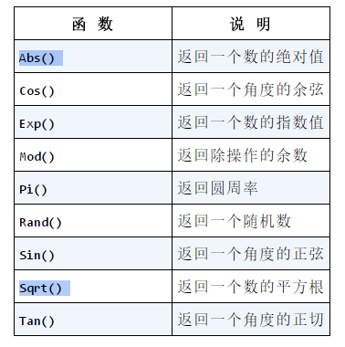

## MySQL简介及语法

### 基本概念

- **数据库**(database)： 保存有组织的数据的容器(通常是一个文件或一组文件)
- **表**(table)：某种特定类型数据的结构化清单，可以想象成一个网格
- **模式**(schema)：关于数据库和表的布局及特性
- **行**(row)：表中的一条记录
- **列**(column)：每一列存储着一条特定的信息
- **主键**(primary key)：每一行中唯一标识自己的一列(或者一组列)，任意两行都不能有相同的主键值，不能为空
- **SQL**：结构化查询语言

### MySQL

- 连接：`mysql -u username -pPassword -P 3306 -h host`
- 使用数据库：`USE database;`
- 查看数据库：`SHOW DATABASES;`
- 查看表：`SHOW TABLES;`
- 查看列：`SHOW COLUMNS FROM tablename;`或者`DESCRIBE tablename;`
- 查看服务器状态：`SHOW STATUS;`
- 查看创建数据库或者表语句：`SHOW CREATE DATABASE/TABLE;`
- 查看用户权限：`SHOW GRANTS;`

### 检索数据SELECT

- 检索单行：`SELECT prod_name FROM products;`
- 检索多行：`SELECT prod_name,title FROM products;`
- 去重：`SELECT DISTINCT prod_name FROM products;`
- 所有行：`SELECT * FROM products;`
- 限制行数：`SELECT prod_name FROM products LIMIT 5;`,`LIMIT 5,10`指从第5行开始的10行，行从0开始

### 排序 ORDER BY

- 多行排序：`SELECT prod_name FROM products ORDER BY title,name;`
- 降序： `SELECT prod_name FROM products ORDER BY title DESC,name;`，默认升序，DESC跟随列名，多列需要多个DESC

### 过滤数据WHERE

- 基本语法：`SELECT prod_name FROM products WHERE name = 'name';`
- 子句：`=,<>,!=,<,<=,>,>=,BETWEEN`，默认不区分大小写，单引号限定字符串
- 范围检查：`BETWEEN 5 AND 10`
- 空值：`WHERE name IS NULL`
- 组合：`AND OR`，`WHERE id = 10 OR WHERE id = 20`，用圆括号明确分组
- **IN**：`WHERE id IN (2001,2002)`，类似于OR，但更清楚直观，更快，还可以包含其它SELECT语句。
- **NOT**：否定后面的条件，`WHERE id NOT IN (2001,2002)`

### 通配符LIKE

- **%**：表示任意字符出现任意次数(0或更多)，`WHERE name LIKE 'jet%';`，不匹配NULL
- `_`：只匹配单个字符，`WHERE name LIKE '_ jet'`
- 技巧：不要过度使用通配符，能不用则不用，尽量不要把通配符放在搜索模式的开始处

### 正则表达式

- **REGEXP**：`WHERE name REGEXP 'jet';`，**LIKE**匹配整个列，而**REGEXP**在**列内值匹配**
- OR匹配：`WHERE name REGEXP '1000|2000';`
- 匹配几个之一： `[]`，`WHERE name REGEXP '[jet]';`匹配jet之一，排除，`[^123]`匹配非123之一，`[0-9]`，`[a-z]`
- 特殊字符：`\\.[]-`

`^`有双重意义，开始或者非。`$`代表结尾。

### 计算字段

- 拼接字段Concat：`SELECT Concat( vend_ name, ' (', vend_ country, ')') FROM vendors ORDER BY vend_name;`
- **AS**：将计算字段重命名
- 算数计算：`+-*/`

### 函数

**文本处理函数**

**日期和时间处理函数**

日期格式必须为`yyyy-mm-dd`，`WHERE order_date = '2005-09-01';`

比如，存储的order_date值为`2005-09-0111:30:05`，则`WHERE order_date = '2005-09-01'`失败。 即使给出具有该日期的一行，也不会把它 检索出来， 因为 WHERE 匹配失败。需要使用日期函数，`WHERE Date(order_date) = '2005-09-01';`

查询9月份的方法：`WHERE Date(order_date) BETWEEN '2005-09-01' AND '2005-09-30';`或者`WHERE Year(order_date) = 2005 AND Month(order_date) = 9;`

**数值处理函数**

### 汇总聚合函数

- **AVG**：对表中行数计数求和计算平均值，忽略NULL行
- 

