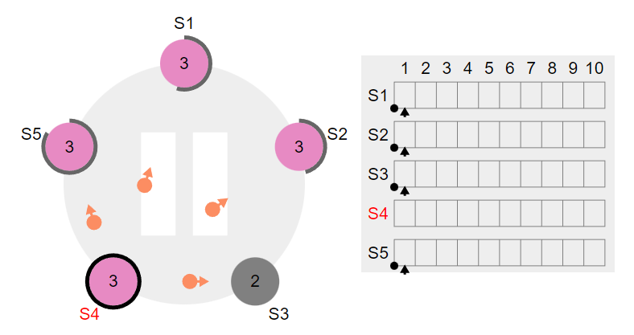
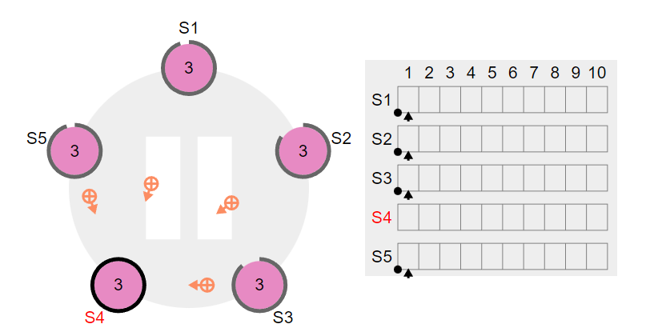
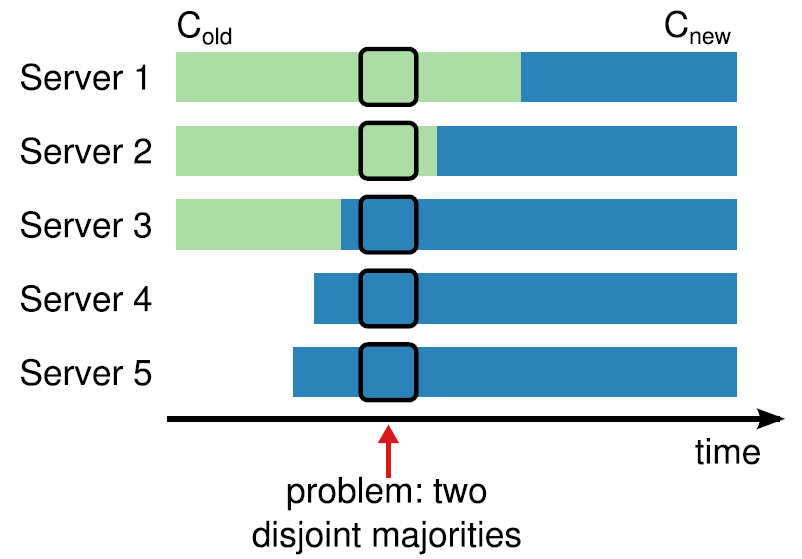

# 分布式共识算法RAFT

## CAP

CAP定理也叫布鲁尔定理（Brewe『＂sThcorem）,是2000年由加州大学伯克利分校（University of CaljfOmia’Berkeley）的计算机科学家埃里克.布鲁尔（ErjcBrewer）在分布式计算原理研讨会（PODC）上提出的一个猜想』。虽然当时就命名为“CAP定理”’但还未被证实。两年后’麻省理工学院的SethGllben和NanCyLynch教授证明了布鲁尔的猜想2, CAP定理正式诞生°

CAP定理指出在一个异步网络环境中,对于一个分布式读写存储（ReadˉW∏teStorage）系
统来说’只能满足以下三项中的两项’而不可能满足全部三项:
- 一致性（Consistency）
- 可用性（AVailability）
- 分区容错性（PartltionTblerance）

一致性可以这么理解,客户端访问所有节点,返回的都是同一份最新的数据.

可用性是指,每次请求都能获取非错误的响应,但不保证获取的数据是最新数据。

分区容错性是指,节点之间由于网络分区而导致消息丢失的情况下,系统仍能继续正常运行。

需要强调的是,这里的一致性是指线性—致性’至于什么是线性一致性’我们会在3。7节中详细解释°这里读者只需要理解为′对于单个对象’读操作会返回最近一次写操作的结果’这也叫线性一致性读

对于一个分布式系统来说,节点之间是通过网络通信的, 只要有网络,必然出现消息延迟

或丢失’网络分区故障是必然发生的’所以分区容忍性是一个基本的要求°CAP定理就是用来
探讨在这种情况下’在系统设计上必须做出的取舍°因此’开发者通常将他们的分布式系统分
为2类,即CP或AP’这取决于在保证分区容错性（P）的情况下选择一致性（C）还是可用性
（A）°

## 分布式共识算法

“共识（Consensus）”不等于“一致性（Consistency）”!

首先要阐明的是’受翻译的影响’很多讨论Paxos算法或RaR算法的中文资料都使用了“分
布式＿致性协议”或者“分布式—致性算法”这样的字眼’虽然在汉语中“达成共识”和“达
成＿致”是同-个意思’但在计算机领域“共识”和“一致性”并不是同一个概念,二者存在
一些细微的差别:共识侧重于研究分布式系统中的节点达成共识的过程和算法’一致性则侧重
于研究副本最终的稳定状态

在分布式系统中’共识就是在—个可能出现任意故障的分布式系统中的多个节点（进程）
对某个值达成共识°共识问题的有趣之处在于其充满了关于故障的讨论。

共识问题可以用数学语言来准确描述:—个分布式系统包含′!个进程,记为｛0,1’2’…’′′ˉl｝’
每个进程都有一个初始值’进程之间互相通信,设计—种共识算法使得尽管出现故障但进程
之间仍能协商出某个不可撤销的最终决定值’且每次执行都满足以下三个性质!:
- 终止性（T℃rmmation）:所有正确的进程最终都会认同某＿个值·
- 协定性（Agreement）:所有正确的进程认同的值都是同一个值。
- 完整性（Integrity）’也叫作有效性（Validity）:如果正确的进程都提议同一个值v’那
么任何正确进程的最终决定值＿定是γ。

在分布式系统领域,状态机复制（StateMachineReplication’SMR）是解决上述难题的一
种常规方法3°状态机复制也叫作复制状态机（ReplicatedStateMachmes）或多副本状态机。所谓状态机’包括＿组状态＼-组输入、-组输出、一个转换函数、—个输出函数和一个独特的
“初始”状态4。-个状态机从“初始”状态开始’每个输入都被传入转换函数和输出函数’以
生成＿个新的状态和输出。在收到新的输入前’状态机的状态保持不变。

状态机必须具备确定性:多个相同状态机的副本’从同样的“初始”状态开始,经历相同
的输入序列后,会达到相同的状态,并输出相同的结果°

’可以通过复制多个副本来提供高可用和高性能的服务’可是多副本又会带来-致性问题°状态机的确定性是实现容错和＿致性的理想特性,试想多个复制的状态机对于相同的输入’每个状态机的副本会产生-致的输出,并且达到-致的状态。同时,只要节点数量够多’系统就能够识别出哪些节点的状态机输出是有差异的。例如由三个节点组成的分布式系统,假如有-个状态机的输出和另外两个不同,系统就认为这个状态机输出了错误的结果。更重要的是系统并不需要直接停掉故障节点,只需要隔离故障节点』并通过通信来修复有故障的状态机即可

实现状态机复制常常需要＿个多副本日志（ReplicatedLog）系统’这个原理受到与日志相
关的经验启发』:如果日志的内容和顺序都相｜司,多个进程从同一状态开始’并且从相同的位置以相同的顺序读取日志内容’那么这些进程将生成相同的输出’并且结束在相同的状态·

共识算法常用来实现多副本日志’共识算法使得每个副本对日志的值和顺序达成共识’每
个节点都存储相同的日志副本’这样整个系统中的每个节点都能有一致的状态和输出°最终’
这些节点看起来就像＿个单独的、高可用的状态机·

在Rah算法的论文里提到’我们使用状态机复制就能克服上述分布式系统难题:
- 在网络延迟、分区、丢包、重复和重排序的情况下’确保不会返回错误的结果。
- 状态机不依赖于时钟。
- 高可用性°＿般来说,只要集群中超过半数的节点正常运行,能够互相通信并且可以同
客户端通信,那么这个集群就完全可用°例如,某些共识算法保证了由5个节点组成的
分布式系统可以容忍其中的2个节点故障’有时甚至不需要系统管理员修复它,稍后故
障节点会从持久化存储中恢复其状态并重新加入集群。

不仅如此’达成共识还可以解决分布式系统中的以下经典问题:

- 互斥（MumalExcluSion）:分布式系统中哪个进程先进入临界区访问资源?如何实现分
布式锁?
- 选主（LeaderEleCtion）:对于单主复制的数据库’想要正确处理故障切换’需要所有节
点就哪个节点是领导者达成共识°如果某个节点由于网络故障而无法与其他节点通信’
则可能导致系统中产生两个领导者,它们都会处理写请求,数据就可能产生分歧,从而
导致数据不-致或丢失·
- 原子提交（AtomicCommit）:对于跨多节点或跨多分区事务的数据库,-个事务可能在
某些节点上失败’但在其他节点上成功。如果我们想要维护这种事务的原子性’则必须
让所有节点对事务的结果都达成共识:要么全部提交’要么全部中止／回滚。

°Google分布式锁服务Chubby的作者MikeBu∏ows曾说过:“只有＿种
共识协议’那就是Paxos（Thereisonlyoneconsensusprotocol’andthat｀sPaxos）。”Paxos是最基础的共识算法 Paxos算法是LeslieLampo门于l989年提出的共识算法l

除了可理解性’Paxos算法另＿个让人头疼的问题是其非常难以实现 Google工程师在
P…s硒ααe／jγe2中抱怨道:“虽然Paxos可以用一页伪代码来描述’但我们的完整实现包含了几
千行C｛ˉ卜代码°这种爆炸性增长不是由于我们使用了C＋＋,也不是因为我们的代码风格冗长’
而是将PaXOS算法转为一个实用的＼可投入生产的系统需要实现许多特性和优化＿有些已
在文献中发表’有些则没有°”

 Paxos 算法依然十分难以理解。并且，Paxos 自身的算法结构需要进行大幅的修改才能够应用到实际的系统中。这些都导致了工业界和学术界都对 Paxos 算法感到十分头疼。

20l3年斯坦福大学的DiegoOngaro和JohnOusterhout以可理解性为目标,共同发表了论文
In Search of an Understandable Consensus Algorithm 正式提出Raft算法, 旨在优化Paxos系列算法’使其成为一个更容易理解并且同样满足安全性和活性的共识算法。

常见的分布式共识算法：
- Paxos
- Raft  现在最常见 etcd consul kafka废弃ZooKeeper 使用kraft  Redis使用RedisRaft
- ZAB  ZooKeeper使用

## RAFT

### Leader Follower Candidate

Raft将系统中的角色分为领导者（Leader）、跟从者（Follower）和候选人（Candidate）：

- Leader：接受客户端请求，并向Follower同步请求日志，当日志同步到大多数节点上后告诉Follower提交日志。
- Follower：接受并持久化Leader同步的日志，在Leader告之日志可以提交之后，提交日志。
- Candidate：Leader选举过程中的临时角色。

Raft要求系统在任意时刻最多只有一个Leader，正常工作期间只有Leader和Followers。

Raft算法角色状态转换如下：

Follower只响应其他服务器的请求。如果Follower超时没有收到Leader的消息，它会成为一个Candidate并且开始一次Leader选举。收到大多数服务器投票的Candidate会成为新的Leader。Leader在宕机之前会一直保持Leader的状态。

Raft算法将时间分为一个个的任期（term），每一个term的开始都是Leader选举。在成功选举Leader之后，Leader会在整个term内管理整个集群。如果Leader选举失败，该term就会因为没有Leader而结束。

###  Leader election

Raft 使用心跳（heartbeat）触发Leader选举。当服务器启动时，初始化为Follower。Leader向所有Followers周期性发送heartbeat。如果Follower在选举超时时间内没有收到Leader的heartbeat，就会等待一段随机的时间后发起一次Leader选举。

Follower将其当前term加一然后转换为Candidate。它首先给自己投票并且给集群中的其他服务器发送 RequestVote RPC
- Increment currentTerm
- Vote for self
- Reset election timer
- Send RequestVote RPCs to all other servers

候选人会继续保持着当前状态直到以下三件事情之一发生

- 赢得了多数的选票，成功选举为Leader；
- 收到了Leader的消息，表示有其它服务器已经抢先当选了Leader；如果这个领导人的任期号（包含在此次的 RPC中）不小于候选人当前的任期号，那么候选人会承认领导人合法并回到跟随者状态。 如果此次 RPC 中的任期号比自己小，那么候选人就会拒绝这次的 RPC 并且继续保持候选人状态。
- 没有服务器赢得多数的选票，Leader选举失败，等待选举时间超时后增加当前任期号 发起下一次选举。

Raft 算法使用随机选举超时时间的方法来确保很少会发生选票瓜分的情况

### 日志同步

日志由有序编号（log index）的日志条目组成。每个日志条目包含它被创建时的任期号（term），和用于状态机执行的命令。

Leader选出后，就开始接收客户端的请求。Leader把请求作为日志条目（Log entries）加入到它的日志中，然后并行的向其他服务器发起 AppendEntries RPC 复制日志条目。当这条日志被复制到大多数服务器上，Leader将这条日志应用到它的状态机并向客户端返回执行结果。

如果一个日志条目被复制到大多数服务器上，就被认为可以提交（commit）了。

一般情况下，Leader和Followers的日志保持一致，因此 AppendEntries 一致性检查通常不会失败。然而，Leader崩溃可能会导致日志不一致：旧的Leader可能没有完全复制完日志中的所有条目。

上图阐述了一些Followers可能和新的Leader日志不同的情况。一个Follower可能会丢失掉Leader上的一些条目，也有可能包含一些Leader没有的条目，也有可能两者都会发生。丢失的或者多出来的条目可能会持续多个任期。

Leader通过强制Followers复制它的日志来处理日志的不一致，Followers上的不一致的日志会被Leader的日志覆盖。

Leader会无限的重试 AppendEntries RPC直到所有的Followers最终存储了所有的日志条目。

Leader为了使Followers的日志同自己的一致，Leader需要找到Followers同它的日志一致的地方，然后覆盖Followers在该位置之后的条目。

Leader会从后往前试，每次AppendEntries失败后尝试前一个日志条目，直到成功找到每个Follower的日志一致位点，然后向后逐条覆盖Followers在该位置之后的条目。

Raft日志同步保证如下两点：

- 如果不同日志中的两个条目有着相同的索引和任期号，则它们所存储的命令是相同的。
- 如果不同日志中的两个条目有着相同的索引和任期号，则它们之前的所有条目都是完全一样的。

第一条特性源于Leader在一个term内在给定的一个log index最多创建一条日志条目，同时该条目在日志中的位置也从来不会改变。

第二条特性源于 AppendEntries 的一个简单的一致性检查。当发送一个 AppendEntries RPC 时，Leader会把新日志条目紧接着之前的条目的log index和term都包含在里面。如果Follower没有在它的日志中找到log index和term都相同的日志，它就会拒绝新的日志条目。

### 安全性

Raft增加了如下两条限制以保证安全性：

1. 拥有最新的已提交的log entry的Follower才有资格成为Leader。

这个保证是在RequestVote RPC中做的，Candidate在发送RequestVote RPC时，要带上自己的最后一条日志的term和log index，其他节点收到消息时，如果发现自己的日志比请求中携带的更新，则拒绝投票。日志比较的原则是，如果本地的最后一条log entry的term更大，则term大的更新，如果term一样大，则log index更大的更新。

2. Leader只能推进commit index来提交当前term的已经复制到大多数服务器上的日志，旧term日志的提交要等到提交当前term的日志来间接提交（log index 小于 commit index的日志被间接提交）。

之所以要这样，是因为可能会出现已提交的日志又被覆盖的情况：

### 日志压缩

在实际的系统中，不能让日志无限增长，否则系统重启时需要花很长的时间进行回放，从而影响可用性。Raft采用对整个系统进行snapshot来解决，snapshot之前的日志都可以丢弃。

每个副本独立的对自己的系统状态进行snapshot，并且只能对已经提交的日志记录进行snapshot。

Snapshot中包含以下内容：

日志元数据。最后一条已提交的 log entry的 log index和term。这两个值在snapshot之后的第一条log entry的AppendEntries RPC的完整性检查的时候会被用上。
系统当前状态。
当Leader要发给某个日志落后太多的Follower的log entry被丢弃，Leader会将snapshot发给Follower。或者当新加进一台机器时，也会发送snapshot给它。发送snapshot使用InstalledSnapshot RPC

### 成员变更

成员变更是在集群运行过程中副本发生变化，如增加/减少副本数、节点替换等。

成员变更也是一个分布式一致性问题，既所有服务器对新成员达成一致。但是成员变更又有其特殊性，因为在成员变更的一致性达成的过程中，参与投票的进程会发生变化。

如果将成员变更当成一般的一致性问题，直接向Leader发送成员变更请求，Leader复制成员变更日志，达成多数派之后提交，各服务器提交成员变更日志后从旧成员配置（Cold）切换到新成员配置（Cnew）。

因为各个服务器提交成员变更日志的时刻可能不同，造成各个服务器从旧成员配置（Cold）切换到新成员配置（Cnew）的时刻不同。

成员变更不能影响服务的可用性，但是成员变更过程的某一时刻，可能出现在Cold和Cnew中同时存在两个不相交的多数派，进而可能选出两个Leader，形成不同的决议，破坏安全性。

- 对于server2来说，它此时还在Cold配置中，可以通过获得1、2的选票成为leader
- 对于server3来说，它已经处在Cnew配置中，可以获得3、4、5的选票成为leader

简单的方法就是每次成员变更只允许增加或删除一个成员。

可从数学上严格证明，只要每次只允许增加或删除一个成员，Cold与Cnew不可能形成两个不相交的多数派。

复杂方法是两阶段的成员变更方法。集群先从旧成员配置Cold切换到一个过渡成员配置，称为共同一致（joint consensus），共同一致是旧成员配置Cold和新成员配置Cnew的组合Cold U Cnew，一旦共同一致Cold U Cnew被提交，系统再切换到新成员配置Cnew。

