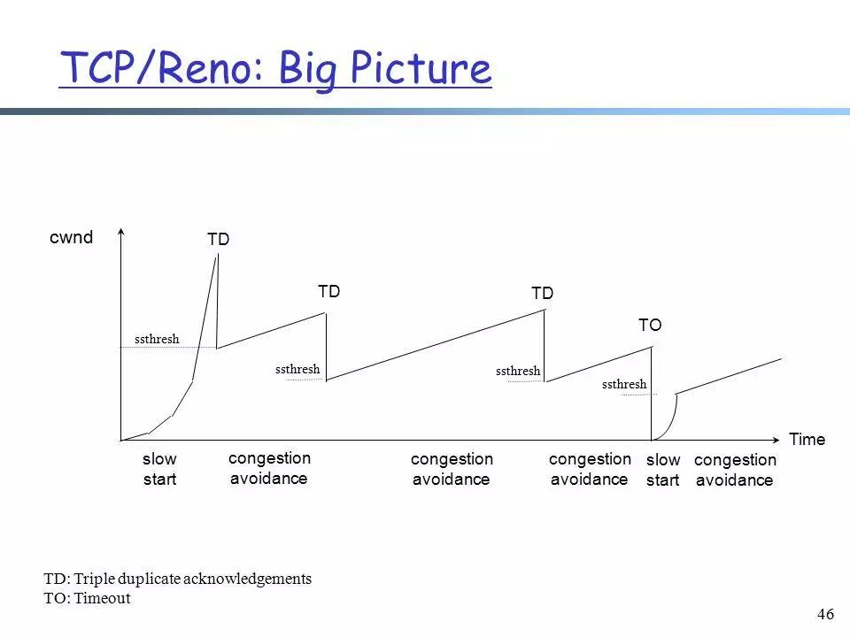

## TCP/IP面试题

### TCP三次握手的不安全性

1）SYN flood 泛洪攻击 , 伪装的IP向服务器发送一个SYN请求建立连接，然后服务器向该IP回复SYN和ACK，但是找不到该IP对应的主机，当超时时服务器收不到ACK会重复发送。当大量的攻击者请求建立连接时，服务器就会存在大量未完成三次握手的连接，服务器主机backlog被耗尽而不能响应其它连接。即SYN flood泛洪攻击 
　　防范措施： 
　　1、降低SYN timeout时间，使得主机尽快释放半连接的占用 
　　2、采用SYN cookie设置，如果短时间内连续收到某个IP的重复SYN请求，则认为受到了该IP的攻击，丢弃来自该IP的后续请求报文 
　　3、在网关处设置过滤，拒绝将一个源IP地址不属于其来源子网的包进行更远的路由 
2）Land 攻击 , 当一个主机向服务器发送SYN请求连接，服务器回复ACK和SYN后，攻击者截获ACK和SYN。然后伪装成原始主机继续与服务器进行通信 , 目标地址和源地址都是目标本身,自己联系自己。

### TCP拥塞控制算法

网络内尚未被确认收到的数据包数量 = 网络链路上能容纳的数据包数量 = 链路带宽 × 往返延迟

为了保证水管不会爆管，TCP 维护一个拥塞窗口cwnd（congestion window），用来估计在一段时间内这条链路（水管中）可以承载和运输的数据（水）的数量，拥塞窗口的大小取决于网络的拥塞程度，并且动态地在变化，但是为了达到最大的传输效率，我们该如何知道这条水管的运送效率是多少呢？

一个简单的方法就是不断增加传输的水量，直到水管破裂为止（对应到网络上就是发生丢包），用 TCP 的描述就是：

只要网络中没有出现拥塞，拥塞窗口的值就可以再增大一些，以便把更多的数据包发送出去，但只要网络出现拥塞，拥塞窗口的值就应该减小一些，以减少注入到网络中的数据包数。

常见的 TCP 拥塞控制算法

本文将例举目前 Linux 内核默认的 Reno 算法和 Google 的 BBR 算法进行说明，其中基于丢包的拥塞控制算法 Reno 由于非常著名，所以常常作为教材的重点说明对象。

#### Reno

Reno 被许多教材（例如：《计算机网络——自顶向下的方法》）所介绍，适用于低延时、低带宽的网络，它将拥塞控制的过程分为四个阶段：慢启动、拥塞避免、快重传和快恢复，对应的状态如下所示：

慢启动阶段思路是不要一开始就发送大量的数据，先探测一下网络的拥塞程度，也就是说由小到大逐渐增加拥塞窗口的大小，在没有出现丢包时每收到一个 ACK 就将拥塞窗口大小加一（单位是 MSS，最大单个报文段长度），每轮次发送窗口增加一倍，呈指数增长，若出现丢包，则将拥塞窗口减半，进入拥塞避免阶段；

当窗口达到慢启动阈值或出现丢包时，进入拥塞避免阶段，窗口每轮次加一，呈线性增长；当收到对一个报文的三个重复的 ACK 时，认为这个报文的下一个报文丢失了，进入快重传阶段，要求接收方在收到一个失序的报文段后就立即发出重复确认（为的是使发送方及早知道有报文段没有到达对方，可提高网络吞吐量约20%）而不要等到自己发送数据时捎带确认；

快重传完成后进入快恢复阶段，将慢启动阈值修改为当前拥塞窗口值的一半，同时拥塞窗口值等于慢启动阈值，然后进入拥塞避免阶段，重复上述过程。

#### BBR

BBR 是谷歌在 2016 年提出的一种新的拥塞控制算法，已经在 Youtube 服务器和谷歌跨数据中心广域网上部署，据 Youtube 官方数据称，部署 BBR 后，在全球范围内访问 Youtube 的延迟降低了 53%，在时延较高的发展中国家，延迟降低了 80%。

BBR 算法不将出现丢包或时延增加作为拥塞的信号，而是认为当网络上的数据包总量大于瓶颈链路带宽和时延的乘积时才出现了拥塞，所以 BBR 也称为基于拥塞的拥塞控制算法（Congestion-Based Congestion Control），其适用网络为高带宽、高时延、有一定丢包率的长肥网络，可以有效降低传输时延，并保证较高的吞吐量，与其他两个常见算法发包速率对比如下：

BBR 算法周期性地探测网络的容量，交替测量一段时间内的带宽极大值和时延极小值，将其乘积作为作为拥塞窗口大小，使得拥塞窗口始的值始终与网络的容量保持一致。

所以 BBR 算法解决了两个比较主要的问题：

在有一定丢包率的网络链路上充分利用带宽。

适合高延迟、高带宽的网络链路。

降低网络链路上的 buffer 占用率，从而降低延迟。

适合慢速接入网络的用户。