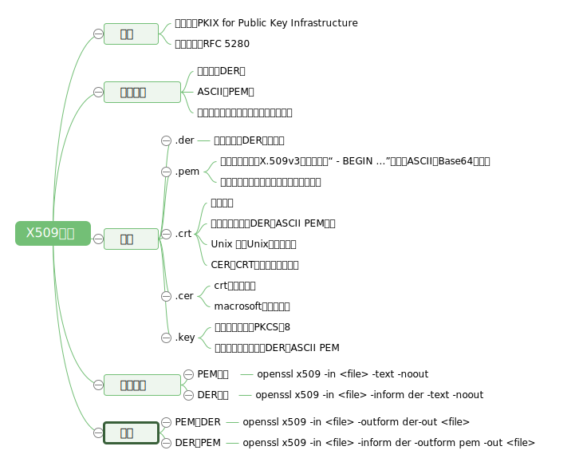

## SSL证书

SSL证书是数字证书的一种。因为配置在服务器上，也称为SSL服务器证书。SSL 证书就是遵守 SSL协议，由受信任的数字证书颁发机构**CA**，在验证服务器身份后颁发，具有服务器身份验证和数据传输加密功能。

一份 SSL 证书包括一个`公共密钥`和一个`私用密钥`。公共密钥用于加密信息，私用密钥用于解译加密的信息。浏览器指向一个安全域时，SSL 将同步确认服务器和客户端，并创建一种加密方式和一个唯一的会话密钥。一般而言，由 CA 业界发出的数字证书，有别于国内浏览器业者比对域名信息等方式，采取更为严格的企业及所有权验证。

服务器部署了 SSL 证书后可以确保用户在浏览器上输入的机密信息和从服务器上查询的机密信息从用户电脑到服务器之间的传输链路上是高强度加密传输的，是不可能被非法篡改和窃取的。同时向网站访问者证明了服务器的真实身份，此真实身份是通过第三方权威机构验证的。也就是说有两大作用：**数据加密**和**身份认证**。

在SSL会话产生时，服务器会传送它的证书，用户端浏览器会自动的分析服务器证书，并根据不同版本的浏览器，从而产生40位或128位的会话密钥，用于对交易的信息进行加密。所有的过程都会自动完成，对用户是透明的，因而，服务器证书可分为两种：最低40位和最低128位。

用户连接到你的Web站点，该Web站点受服务器证书所保护:
- 你的服务器进行响应，并自动传送你网站的数字证书给用户，用于鉴别你的网站。
- 用户的网页浏览器程序产生一把唯一的“会话钥匙码，用以跟网站之间所有的通讯过程进行加密。
- 使用者的浏览器以网站的公钥对交谈钥匙码进行加密，以便只有让你的网站得以阅读此交谈钥匙码。

### SSL证书生成步骤

申请SSL证书主要需要经过以下3个步骤：

#### 制作CSR文件
`CSR`就是`Certificate Signing Request`证书请求文件。这个文件是由申请人制作，在制作的同时，系统会产生2个密钥，一个是`公钥`就是这个CSR文件，另外一个是`私钥`，存放在服务器上。

生成私钥`server.key`:
```
openssl genrsa -des3 -out server.key 2048
```
这样是生成rsa私钥，des3算法，openssl格式，2048位强度。server.key是密钥文件名。为了生成这样的密钥，需要一个至少四位的密码。可以通过以下方法生成没有密码的key:
```
openssl rsa -in server.key -out server.key
```
直接生成无密码的私钥:
```bash
openssl genrsa -out server.key 2048
```
生成CSR `server.csr`:
```bash
openssl req -new -out server.csr -key server.key -config openssl.cnf
```
查看CSR内容:
```bash
openssl req -text -noout -in server.csr 
```
如下:
```
Certificate Request:
Data:
Version: 0 (0x0)
Subject: C=US, ST=Texas, L=Fort Worth, O=My Company, OU=My Department, CN=server.example
Subject Public Key Info: Public Key Algorithm: rsaEncryption RSA Public Key: (2048 bit)
Modulus (2048 bit): blahblahblah
Exponent: 65537 (0x10001)
Attributes:
Requested Extensions: X509v3
Basic Constraints: CA:FALSE
X509v3 Key Usage: Digital Signature, Non Repudiation, Key Encipherment
X509v3 Subject Alternative Name: DNS:kb.example.com, DNS:helpdesk.example.com
Signature Algorithm: sha1WithRSAEncryption
blahblahblah 
```
### CA认证 生成CRT
将CSR提交给CA，CA一般有2种认证方式：
- 域名认证，一般通过对管理员邮箱认证的方式，这种方式认证速度快，但是签发的证书中没有企业的名称；
- 企业文档认证，需要提供企业的营业执照。一般需要3-5个工作日。 也有需要同时认证以上2种方式的证书，叫EV证书，这种证书可以使IE7以上的浏览器地址栏变成绿色，所以认证也最严格。

生成CA:
```bash
openssl req -new -x509 -keyout ca.key -out ca.crt -config openssl.cfg
```
使用CA签名 生成CRT：
```bash
openssl ca -in server.csr -out server.crt -cert ca.crt -keyfile ca.key -config openssl.cfg
```
也可以自签名Self-sign and create the certificat: `server.crt`
```bash
openssl x509 -req -days 3650 -in server.csr -signkey server.key
 -out server.crt-extensions v3_req -extfile openssl.cnf
```
生成pem格式证书： 
有时需要用到pem格式的证书，可以用以下方式合并证书文件（crt）和私钥文件（key）来生成 
```BASH
cat server.crt server.key > server.pem 
```
Package the key and cert in a PKCS12 file: `server.p12`

```bash
openssl pkcs12 -export -in server.crt -inkey server.key
 -out server.p12
```
将pkcs12证书导入keystore
```bash
keytool -importkeystore -srckeystore server.p12 -srcstoretype PKCS12 -destkeystore tomcat.keystore -deststoretype JKS
```
查看证书
```bash
keytool -list -keystore tomcat.keystore -v
```

### 证书的安装。
在收到CA的证书后，可以将证书部署上服务器，一般APACHE文件直接将KEY+CER复制到文件上，然后修改HTTPD.CONF文件；TOMCAT等，需要将CA签发的证书CER文件导入JKS文件后，复制上服务器，然后修改SERVER.XML；IIS需要处理挂起的请求，将CER文件导入。

### 什么是x509证书链


通常称为PKIX for Public Key Infrastructure 标准文件为RFC 5280

x509证书一般会用到三类文件，key，csr，crt。
- Key是私用密钥，openssl格式，通常是rsa算法。
- csr是证书请求文件，用于申请证书。在制作csr文件的时候，必须使用自己的私钥来签署申请，还可以设定一个密钥。
- crt是CA认证后的证书文件，签署人用自己的key给你签署的凭证。

#### 编码方式
- DER: 二进制
- PEM(Privacy-enhanced Electronic Mail) 是明文格式的  以 -----BEGIN CERTIFICATE-----开头，以-----END CERTIFICATE-----结尾，中间是经过base64编码的内容,
其实PEM就是把DER的内容进行了一次base64编码
同一后缀的文件可能有不同的编码方式

### openssl中有如下后缀名的文件
- .key格式：私有的密钥
- .csr格式：证书签名请求（证书请求文件），含有公钥信息，certificate signing request的缩写
- .crt格式：证书文件，certificate的缩写
- .crl格式：证书吊销列表，Certificate Revocation List的缩写
- .pem格式：用于导出，导入证书时候的证书的格式，有证书开头，结尾的格式
- .p12 证书  包含一个X509证书和一个被密码保护的私钥

### CA根证书的生成步骤
生成CA私钥（.key）-->生成CA证书请求（.csr）-->自签名得到根证书（.crt）（CA给自已颁发的证书）。

### 扩展
- .der
用于二进制DER编码证书
- .pem
用于不同类型的X.509v3文件，是以“ - BEGIN ...”前缀的ASCII(**Base64**)数据
不止用于证书，还可用于单独的私钥文件
- .crt
用于证书
可以采用二进制DER或ASCII PEM编码
Unix 或类Unix系统中常见
CER和CRT扩展几乎是同义词
- .cer
crt的替代形式
macrosoft的转换形式
- .key
用于公钥和私钥PKCS＃8
可以被编码为二进制DER或ASCII PEM
#### 查看证书
PEM编码
```
openssl x509 -in -text -noout
```
DER编码
```
openssl x509 -in -inform der -text -noout
```
PEM转DER
```
openssl x509 -in -outform der-out
```
DER转PEM
```
openssl x509 -in -inform der -outform pem -out
```

### PKCS
PKCS 全称是 Public-Key Cryptography Standards ，是由 RSA 实验室与其它安全系统开发商为促进公钥密码的发展而制订的一系列标准，PKCS 目前共发布过 15 个标准。 常用的有：

- **PKCS#7** Cryptographic Message Syntax Standard  常用的后缀是： .P7B .P7C .SPC

- **PKCS#10** Certification Request Standard p10是证书请求

- **PKCS#12** Personal Information Exchange Syntax Standard 常用的后缀有： .P12 .PFX 用于存放个人证书/私钥，他通常包含保护密码，2进制方式

- **X.509**是常见通用的证书格式。所有的证书都符合为Public Key Infrastructure (PKI) 制定的 ITU-T X509 国际标准。X.509 DER 编码(ASCII)的后缀是： .DER .CER .CRT，X.509 PEM 编码(Base64)的后缀是： .PEM .CER .CRT

p7r是CA对证书请求的回复，只用于导入

p7b以树状展示证书链(certificate chain)，同时也支持单个证书，不含私钥。

der,cer文件一般是二进制格式的，只放证书，不含私钥

crt文件可能是二进制的，也可能是文本格式的，应该以文本格式居多，功能同der/cer

pem文件一般是文本格式的，可以放证书或者私钥，或者两者都有

pem如果只含私钥的话，一般用.key扩展名，而且可以有密码保护

pfx,p12文件是二进制格式，同时含私钥和证书，通常有保护密码

怎么判断是文本格式还是二进制？用记事本打开，如果是规则的数字字母，如
```
—–BEGIN CERTIFICATE—–

MIIE9jCCA96gAwIBAgIQVXD9d9wgivhJM//a3VIcDjANBgkqhkiG9w0BAQUFADBy

—–END CERTIFICATE—–
```

就是文本的，上面的BEGIN CERTIFICATE，说明这是一个证书

如果是`—–BEGIN RSA PRIVATE KEY—–`，说明这是一个私钥

文本格式的私钥，也可能有密码保护

文本格式怎么变成二进制？ 从程序角度来说，去掉前后的—-行，剩下的去掉回车，用base64解码，就得到二进制了

不过一般都用命令行openssl完成这个工作

### 各种转换
用openssl创建CA证书(PEM格式,假如有效期为一年)：
```
openssl req -new -x509 -days 365 -key ca.key -out ca.crt -config openssl.cnf
```
openssl是可以生成DER格式的CA证书的，最好用IE将PEM格式的CA证书转换成DER格式的CA证书。

x509到pfx
```
pkcs12 -export –in keys/client1.crt -inkey keys/client1.key -out keys/client1.pfx
```
PEM格式的ca.key转换为Microsoft可以识别的pvk格式。
```
pvk -in ca.key -out ca.pvk -nocrypt -topvk
```
PKCS#12 到 PEM 的转换
```
openssl pkcs12 -nocerts -nodes -in cert.p12 -out private.pem
```
验证 openssl pkcs12 -clcerts -nokeys -in cert.p12 -out cert.pem

从 PFX 格式文件中提取私钥格式文件 (.key)
```
openssl pkcs12 -in mycert.pfx -nocerts -nodes -out mycert.key
```
转换 pem 到到 spc
```
openssl crl2pkcs7 -nocrl -certfile venus.pem -outform DER -out venus.spc
```
用 -outform -inform 指定 DER 还是 PAM 格式。例如：
```
openssl x509 -in Cert.pem -inform PEM -out cert.der -outform DER
```
八 PEM 到 PKCS#12 的转换，
```
openssl pkcs12 -export -in Cert.pem -out Cert.p12 -inkey key.pem
```
