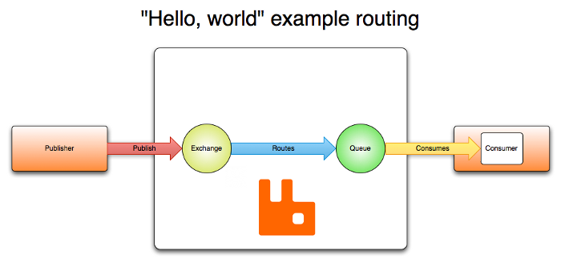

# AMQP 0-9-1 Model Explained

## Overview

本文提供了AMQP 0-9-1协议的一个概述，它是RabbitMQ所支持的协议之一。

## High-level Overview of AMQP 0-9-1 and the AMQP Model

### What is AMQP 0-9-1?

AMQP 0-9-1 (Advanced Message Queuing Protocol) is a messaging
protocol that enables conforming client applications to
communicate with conforming messaging middleware brokers.

AMQP 0-9-1（Advanced Message Queuing Protocol）是一个消息协议，它支持符合标准的客户端请求程序与符合标准的消息中间件代理进行通信。

### Brokers and Their Role

Messaging brokers receive messages from publishers
(applications that publish them, also known as producers) and route them to consumers(applications that process them).

Since it is a network protocol, the publishers,
consumers and the broker can all reside on
different machines.

消息代理接收来自publishers（发布消息的应用程序，同时也可以称之为producers）的消息并且将消息路由至consumers（处理消息的应用程序）。

因为它是一个网络协议，publishers，consumers与broker可以存在于不同的机器上。

### AMQP 0-9-1 Model in Brief

The AMQP 0-9-1 Model has the following view of the world:
messages are published to _exchanges_,
which are often compared to post offices or mailboxes. Exchanges then
distribute message copies to _queues_ using rules called
_bindings_. Then the broker either deliver messages to
consumers subscribed to queues, or consumers
fetch/pull messages from queues on demand.

AMQP 0-9-1 Model的整体视图如下：

消息被发布到exchanges，通常可将exchanges比作邮局或者邮箱

exchanges将消息副本分发到queues，按照bindings中的规则

AMQP brokers传递消息给与queues关联的consumers，或者consumers按照需求从queues拉取信息

When publishing a message, publishers may specify various
_message attributes_ (message meta-data). Some of this
meta-data may be used by the broker, however, the rest of it
is completely opaque to the broker and is only used by
applications that receive the message.

当发布一条消息时，publishers可以指定多个消息属性（message meta-data）。部分的meta-data可能会被broker使用，但是剩下消息对broker是完全不透明的，仅仅会被接收消息的应用程序使用。

Networks are unreliable and applications may fail to process
messages therefore the AMQP 0-9-1 model has a notion of
_message acknowledgements_: when a message is delivered
to a consumer the consumer _notifies the broker_,
either automatically or as soon as the application
developer chooses to do so. When message acknowledgements
are in use, a broker will only completely remove a message
from a queue when it receives a notification for that message
(or group of messages).

网络不稳定，应用程序可能会无法处理消息，因此AMQP model有一个消息确认的概念：当一条消息被传输到consumer，consumer自动通知broker或者应用程序开发人员选择这么做。当消息确认被使用时，broker只在接收到该消息（群消息）的通知时才会从queue中完全移除该消息。

In certain situations, for example, when a message cannot
be routed, messages may be _returned_ to publishers,
dropped, or, if the broker implements an extension,
placed into a so-called "dead letter queue". Publishers choose
how to handle situations like this by publishing messages
using certain parameters.

在某些场合中，比如当一条消息不能被路由时，消息可能会被返回给publishers，或者被丢弃，或者如果broker实现了一个扩展将消息放在“dead letter queue”中。publishers通过使用某些参数发布消息选择如何处理这些情况

Queues, exchanges and bindings are collectively referred to as _AMQP entities_.

queues，exchanges与bindings统称为AMQP实体

### AMQP 0-9-1 is a Programmable Protocol

AMQP 0-9-1 is a programmable protocol in the sense that AMQP 0-9-1
entities and routing schemes are primarily defined by applications
themselves, not a broker administrator. Accordingly,
provision is made for protocol operations that declare
queues and exchanges, define bindings between them,
subscribe to [queues](/queues.html) and so on.

This gives application developers a lot of freedom but
also requires them to be aware of potential definition
conflicts. In practice, definition conflicts are rare and
often indicate a misconfiguration.

Applications declare the AMQP 0-9-1 entities that they need,
define necessary routing schemes and may choose to delete
AMQP 0-9-1 entities when they are no longer used.

AMQP 0-9-1是一个可编程的协议，AMQP实体与路由方案都在自身应用程序中被定义，而不是被broker管理员定义。因此，为申明queues，exchanges，定义它们之间的bindings，订阅queues等协议操作进行了规定。

这给应用程序开发者很多自由空间但是也要求他们小心潜在的定义冲突。实际上定义冲突是很少见的并且通常表明是配置错误。

应用程序申明他们需要的AMQP实体，定义需要的路由方案，并且可能选择删除AMQP实体在他们不再需要使用时。

## Exchanges and Exchange Types

_Exchanges_ are AMQP 0-9-1 entities where messages are
sent. Exchanges take a message and route it into zero or
more queues. The routing algorithm used depends on the
_exchange type_ and rules called _bindings_.
AMQP 0-9-1 brokers provide four exchange types:

当消息被发送时exchanges是AMQP实体。exchanges会传递信息并且将它路由到0个或者多个queue中，路由算法是取决于exchange类型与bingding规则。AMQP 0-9-1 broker提供4个exchange类型:

<table>
  <thead>
    <th>Name</th>
    <th>Default pre-declared names</th>
  </thead>
  <tr>
    <td>Direct exchange</td>
    <td>(Empty string) and amq.direct</td>
  </tr>
  <tr>
    <td>Fanout exchange</td>
    <td>amq.fanout</td>
  </tr>
  <tr>
    <td>Topic exchange</td>
    <td>amq.topic</td>
  </tr>
  <tr>
    <td>Headers exchange</td>
    <td>amq.match (and amq.headers in RabbitMQ)</td>
  </tr>
</table>

Besides the exchange type, exchanges are declared with a number of
attributes, the most important of which are:

 * Name
 * Durability (exchanges survive broker restart)
 * Auto-delete (exchange is deleted when last queue is unbound from it)
 * Arguments (optional, used by plugins and broker-specific features)

Exchanges can be durable or transient. Durable
exchanges survive broker restart whereas transient
exchanges do not (they have to be redeclared
when broker comes back online). Not all scenarios
and use cases require exchanges to be durable.

除exchange类型之外，exchange声明了一系列的属性，最重要的如下：

 * Name
 * Durability（broker重启时exchanges是否survive）
 * Auto-delete（当所有queue完成使用后exchange被删除）
 * Arguments（这些都是broker相关的）

Exchanges可以是持久的也可以是短暂的。持久的exchanges可以在broker重启时存活而暂时性的exchanges则不可以（当broker重新在线时必须重新申明它们），并非所有的场景与使用情况都需要持久的exchanges。

### Default Exchange

The default exchange is a direct exchange with no name
(empty string) pre-declared by the broker. It has one special
property that makes it very useful for simple applications:
every queue that is created is automatically bound to it with
a routing key which is the same as the queue name.

For example, when you declare a queue with the name of
"search-indexing-online", the AMQP 0-9-1 broker will bind it
to the default exchange using "search-indexing-online" as
the routing key (in this context sometimes referred to as the binding key).
Therefore, a message published to the default
exchange with the routing key "search-indexing-online"
will be routed to the queue "search-indexing-online". In
other words, the default exchange makes it seem like it
is possible to deliver messages directly to queues, even
though that is not technically what is happening.

default exchange是一个没有名称的（空字符串）被broker预先申明的direct exchange。它所拥有的一个特殊属性使它对于简单的应用程序很有作用：每个创建的queue会与它自动绑定，使用queue名称作为routing key。

举例说，当你申明一个名称为“search-indexing-online”的queue时，AMQP broker使用“search-indexing-online”作为routing key将它绑定到default exchange。因此，一条被发布到default exchange并且routing key为"search-indexing-online"将被路由到名称为"search-indexing-online"的queue。换句话说，default exchange使直接传送消息到queue成为可能，即使从技术角度上而言，事实并不是这样。

### Direct Exchange

A direct exchange delivers messages to queues based on the
message routing key. A direct exchange is ideal for the unicast
routing of messages (although they can be used for multicast
routing as well). Here is how it works:

 * A queue binds to the exchange with a routing key K
 * When a new message with routing key R arrives at the
   direct exchange, the exchange routes it to the queue if K = R

Direct exchanges are often used to distribute tasks between
multiple workers (instances of the same application) in
a round robin manner. When doing so, it is important to
understand that, in AMQP 0-9-1, messages are load balanced
between consumers and not between queues.

A direct exchange can be represented graphically as follows:

direct exchange根据消息的routing key来传送消息。direct exchange是单一传播路由消息的最佳选择（尽管他们也可以用于多路传播路由），以下是它们的工作原理：

 * 一个routing key为K的queue与exchange进行绑定
 * 当一条新的routing key为R的消息到达direct exchange时，exchange 将它路由至该queue如果K=R

direct exchange经常用于在多个工作者（同一应用程序的多个实例）之间分配任务。当做这些的时候，重要的是明白在AMQP 0-9-1中，消息是在consumer间负载均衡，而不是在queue。direct exchange可以用图形方式表示如下：

### Fanout Exchange

A fanout exchange routes messages to all of the queues
that are bound to it and the routing key is ignored. If N
queues are bound to a fanout exchange, when a new message
is published to that exchange a copy of the message is
delivered to all N queues. Fanout exchanges are ideal for
the broadcast routing of messages.

Because a fanout exchange delivers a copy of a message to
every queue bound to it, its use cases are quite similar:

 * Massively multi-player online (MMO) games can use it
   for leaderboard updates or other global events
 * Sport news sites can use fanout exchanges for
   distributing score updates to mobile clients in near
   real-time
 * Distributed systems can broadcast various state and
   configuration updates
 * Group chats can distribute messages between participants
   using a fanout exchange (although AMQP does not have a
   built-in concept of presence, so XMPP may be a better choice)

A fanout exchange can be represented graphically as follows:

fanout exchange路由消息到所有的与其绑定的queue中，忽略routing key。如果N个queue被绑定到一个fanout exchange，当一条新消息被发布到exchange时，消息会被复制并且传送到这N个queue。fanout exchange是广播路由的最佳选择。

因为一个fanout exchange传送消息的副本到每一个与其绑定的queue，它的使用情况很相似：

- 大量的多用户在线（multi-player online MMO）游戏使用它更新排行榜或者其他的全体事件
- 体育新闻网站使用fanout exchange向手机客户端实时发送比分更新
- 分布式系统可以广播各种状态与配置更新
- 群聊可以使用fanout exchange让消息在参与者之间传输（即使AMQP没有内在的概念，所以XMPP也许是一个更好地选择）

一个fanout exchange图形化的表述如下：

### Topic Exchange

Topic exchanges route messages to one or many queues
based on matching between a message routing key and the
pattern that was used to bind a queue to an exchange. The
topic exchange type is often used to implement various
publish/subscribe pattern variations. Topic exchanges are
commonly used for the multicast routing of messages.

Topic exchanges have a very broad set of use cases. Whenever
a problem involves multiple consumers/applications that
selectively choose which type of messages they want to
receive, the use of topic exchanges should be considered.

Example uses:

* Distributing data relevant to specific geographic
  location, for example, points of sale
* Background task processing done by multiple workers,
  each capable of handling specific set of tasks
* Stocks price updates (and updates on other kinds of financial data)
* News updates that involve categorization or tagging
  (for example, only for a particular sport or team)
* Orchestration of services of different kinds in the cloud
* Distributed architecture/OS-specific software builds or
  packaging where each builder can handle only one architecture or OS

Topic exchange路由消息到一个或者多个queue，基于消息的routing key和queue与exchange之间的绑定模式的匹配。Topic exchange经常被用于实现各种发布/订阅模式的变化。Topic exchanges通常被用于多路广播路由消息。

topic exchange有非常多的应用场景。当一个问题牵涉到多个consumer/应用程序，他们有选择的选择他们接收何种何种类型的消息。可以考虑使用topic exchange。

使用示例：

- 销售与特定地理位置相关的数据，比如销售点
- 由多个工作者完成的后台任务处理，每个都能够负责处理指定的任务
- 库存价格更新（更新其他的财务数据）
- 包含分类与标签的新闻更新（例如只针对某一个特定的运动或团队）
- 不同种类的云服务编制
- 分布式结构/特定操作系统软件的构建与包装，每个处理者只能处理一个结构或者系统

### Headers Exchange

A headers exchange is designed for routing on multiple
attributes that are more easily expressed as message
headers than a routing key. Headers exchanges ignore the
routing key attribute. Instead, the attributes used for
routing are taken from the headers attribute. A message is
considered matching if the value of the header equals the
value specified upon binding.

It is possible to bind a queue to a headers exchange using
more than one header for matching. In this case, the broker
needs one more piece of information from the application
developer, namely, should it consider messages with any
of the headers matching, or all of them? This is what the
"x-match" binding argument is for. When the "x-match"
argument is set to "any", just one matching header value
is sufficient. Alternatively, setting "x-match" to "all"
mandates that all the values must match.

Headers exchanges can be looked upon as "direct exchanges
on steroids". Because they route based on header values,
they can be used as direct exchanges where the routing key
does not have to be a string; it could be an integer or a
hash (dictionary) for example.

Note that headers beginning with the string `x-`
will not be used to evaluate matches.

header exchange为在多个属性进行路由而设计的，这些属性更容易描述为消息头，而不是routing key。headers exchanges忽略routing key属性，相反用于路由的属性是从headers属性中获取的。如果消息头的值等于指定的绑定值，则认为消息是匹配的。

可以使用多个header匹配将一个queue绑定到header exchange。在这种情况下，broker需要从应用程序开发者那边获取多条信息，也就是说，是否应该考虑任何headers匹配的消息，还是所有headers都匹配的消息？这就是所谓的“x-match”绑定参数。当“x-match”参数的值被设为“any”，只要一个匹配的header值就足够了。相反的，设置“x-match”的值为“all”需要所有的headers值匹配。

Headers exchanges被视为“direct exchanges on steroids”。因为他们依据headers值路由消息，他们可以被当做direct exchanges使用，routing key不必是一个字符串；举例来说它可以是一个整数或者一个hash（dictionary）

## Queues

[Queues](/queues.html) in the AMQP 0-9-1 model are very similar to queues in
other message- and task-queueing systems: they store
messages that are consumed by applications. Queues share
some properties with exchanges, but also have some additional
properties:

 * Name
 * Durable (the queue will survive a broker restart)
 * Exclusive (used by only one connection and the queue will be deleted when that connection closes)
 * Auto-delete (queue that has had at least one consumer is deleted when last consumer unsubscribes)
 * Arguments (optional; used by plugins and broker-specific features such as message TTL, queue length limit, etc)

Before a queue can be used it has to be declared. Declaring
a queue will cause it to be created if it does not already
exist. The declaration will have no effect if the queue does
already exist and its attributes are the same as those in the
declaration. When the existing queue attributes are not the
same as those in the declaration a channel-level exception
with code 406 (`PRECONDITION_FAILED`) will be  raised.

AMQP模型中的Queues相似余其他massage-和task-queueing系统中的queues：它们存储被应用程序消耗的消息。Queues与exchanges分享一些数据，但是也有一些其他的附加属性：

- Name
- Durable（当broker重启时，queue是否存在）
- Exclusive（只被一个connection使用并且在connection关闭时queue被删除）
- Auto-delete（当最后一个consumer取消订阅时queue被删除）
- Arguments（一些broker使用它去实现message TTL之类的附加功能）

queue必须在使用前被申明。如果它不存在的话申明一个queue将会创建一个queue。如果queue已经存在并且属性与申明的属性相同的情况下，申明无效。当现有的queue属性与什么的属性不相同时，一个错误码为406（先决条件失败）的channel-level异常被抛出。

### Queue Names

Applications may pick queue names or ask the broker to generate
a name for them.  Queue names may be up to 255 bytes of UTF-8
characters. An AMQP 0-9-1 broker can generate a unique queue
name on behalf of an app. To use this feature, pass an empty
string as the queue name argument. The generated name will be returned
to the client with queue declaration response.

Queue names starting with "amq." are reserved for internal
use by the broker. Attempts to declare a queue with a name that
violates this rule will result in a channel-level exception
with reply code 403 (`ACCESS_REFUSED`).

应用程序可以选择queue名称或者请求broker重新为其生成一个名称。Queueu名称最多可达255字节。为了让AMQP broker为你生成一个唯一的queue名称，传递一个空字符串作为queue的名称参数。在相同的通道中，通过使用queue名称预期的空字符串，可以在随后的方法中获取相同的名称。这是有效的，因为channel记得最后的服务器生成的queue名称。

以“amq.”开头的queue是broker为内部使用而保留的。尝试使用违反此规则的queue名称将会导致错误码403的channel-level异常。

### Queue Durability

Durable queues are persisted to disk and thus survive broker
restarts. Queues that are not durable are called transient.
Not all scenarios and use cases mandate queues to be durable.

Durability of a queue does not make _messages_ that
are routed to that queue durable. If broker is taken down
and then brought back up, durable queue will be re-declared
during broker startup, however, only _persistent_
messages will be recovered.

持久的queue被持久化于磁盘中因此broker重启后仍存在。非持久的queue是暂时的。并非所有的场景与使用情况都要求queue是持久的。

queue的持久性不能让路由到queue中的消息持久化。如果broker被关闭然后重新启动，持久的queue将会在broker启动期间被重新申明，但是仅仅持久的消息会恢复。

## Bindings

Bindings are rules that exchanges use (among other things)
to route messages to queues. To instruct an exchange E to
route messages to a queue Q,
Q has to be _bound_ to E. Bindings may have an optional
_routing key_ attribute used by some exchange types. The
purpose of the routing key is to select certain messages published
to an exchange to be routed to the bound queue. In other words,
the routing key acts like a filter.

To draw an analogy:

 * Queue is like your destination in New York city
 * Exchange is like JFK airport
 * Bindings are routes from JFK to your destination. There
can be zero or many ways to reach it

Having this layer of indirection enables routing scenarios
that are impossible or very hard to implement using publishing
directly to queues and also eliminates certain amount of
duplicated work application developers have to do.

If a message cannot be routed to any queue (for example,
because there are no bindings for the exchange it was published
to) it is either [dropped or returned to the publisher](/publishers.html#unroutable),
depending on message attributes the publisher has set.

bindings是exchanges用来路由消息到queues的规则。为了命令exchange E路由消息到 queue Q，Q必须绑定到E。Bindings可能有一个选择性的routing key属性，被某些类型的exchanges使用。routing key是为了选择被发布到exchange的消息，路由到绑定的queue中。换句话说，routing key的功能就像一个过滤器。

画一个类比：

- queue就像是你在纽约的目的地
- Exchanges就像是JFK机场
- Bindings是JFK到你目的地的路线。有0或者多条路线到达目的地

有了间接层，就可以通过直接发布到queue来实现不可能或者很难实现的场景，并且减少应用程序开发者必须要做的某些重复工作。

如果AMQP消息不能路由到任何queue（例如，因为没有绑定到它被发布的exchange），它会被丢弃还是返回给publisher，取决于publisher设置的消息属性。

## Consumers

Storing messages in queues is useless unless applications
can _[consume](/consumers.html)_ them. In the AMQP 0-9-1 Model, there
are two ways for applications to do this:

 * Have messages delivered to them ("push API")
 * Fetch messages as needed ("pull API")

With the "push API", applications have to indicate interest in
consuming messages from a particular queue. When they do so,
we say that they _register a consumer_
or, simply put, _subscribe to a queue_. It is possible
to have more than one consumer per queue or to register an
_exclusive consumer_ (excludes all other consumers from
the queue while it is consuming).

Each consumer (subscription) has an identifier called a
_consumer tag_. It can be used to unsubscribe from
messages. Consumer tags are just strings.

存储消息到queue中是无用的，除非应用程序可以消耗它们。在AMQP模型中，应用程序有两种方法这么做：

- 将消息传送给它们（push API）
- 按照需要拉取消息（pull API）

使用“push API”，应用程序必须表现出对从特定queue中消耗消息的兴趣，当它们这么做时，我们说它们注册了一个消费者或者简单的订阅了一个queue。一个queue可能同时有多个consumer或者注册一个独占的消费者（当它在消耗消息时排除队列中所有其他的consumer）

### Message Acknowledgements

[Consumer applications](/consumers.html) – that is, applications that receive and process
messages – may occasionally fail to process individual
messages or will sometimes just crash. There is also the possibility
of network issues causing problems. This raises a question:
when should the broker remove messages from queues? The
AMQP 0-9-1 specification gives consumers control over this. There are
two [acknowledgement modes](/confirms.html):

 * After broker sends a message to an application (using either `basic.deliver` or `basic.get-ok` method).
 * After the application sends back an acknowledgement (using the `basic.ack` method).

The former choice is called the automatic acknowledgement
model, while the latter is called the explicit acknowledgement
model. With the explicit model the application chooses when
it is time to send an acknowledgement. It can be right after
receiving a message, or after persisting it to a data store
before processing, or after fully processing the message
(for example, successfully fetching a Web page, processing
and storing it into some persistent data store).

If a consumer dies without sending an acknowledgement,
the broker will redeliver it to another consumer or,
if none are available at the time, the broker will wait until
at least one consumer is registered for the same queue before
attempting redelivery.

消费者应用程序，接收处理消息的应用程序可能偶尔在处理消息时失败或者崩溃。这也可能是网络问题所导致的。这引发了一个问题：AMQP何时从queue中移除消息？AMQP 0-9-1提供了两个选择：

- broker发送消息给应用程序之后（使用basic.deliver或者basic.get-ok AMQP方法）
- 应用程序发送确认之后（使用basci.ack AMQP方法）

前一种选择被称作自动确认模型，而后者被称为显示确认模型。使用显示确认模型，应用程序可以选择何时发送确认，可以在接收消息后，或者在处理之前将其持久化到数据存储之后，或者在完全处理完成消息之后（例如成功拉取一个web页面，处理并且将其存储到持久化的数据存储中）。

如果一个consumer没有发送确认就死亡，AMQP broker将其重新发送到另外一个consumer，或者如果此时没有任何consumer，broker在尝试重新发送之前，会等待到至少有一个consumer注册到相同的queue

### Rejecting Messages

When a consumer application receives a message, processing
of that message may or may not succeed. An application can
indicate to the broker that message processing has failed
(or cannot be accomplished at the time) by rejecting a
message. When rejecting a message, an application can ask
the broker to discard or requeue it. When there is only one
consumer on a queue, make sure you do not create infinite
message delivery loops by rejecting and requeueing a message
from the same consumer over and over again.

当一个consumer接收到一条消息，处理消息可能成功也可能失败。一个应用程序通过拒绝消息可以向broker表明消息处理失败（或者不能在那时候完成）。当拒绝一条消息时，应用程序可以请求broker丢弃或者重新将其加入queue中。当queue中仅有一个consumer时，确保你没有重复的通过拒绝并且将消息重新加入queue中来创建无限的消息传递循环。

### Negative Acknowledgements

Messages are rejected with the `basic.reject` method.
There is one limitation that `basic.reject` has:
there is no way to reject multiple messages as you can do
with acknowledgements. However, if you are using RabbitMQ,
then there is a solution. RabbitMQ provides an AMQP 0-9-1
extension known as _negative acknowledgements_ or _nacks_. For
more information, please refer to the [Confirmations](/confirms.html)
and <a href="">basic.nack extension</a> guides.

使用AMQP的basic.reject方法拒绝消息。basci.reject方法有一个限制：就像你执行确认操作一样不可能同时拒绝多条消息。然而，如果你使用RabbitMQ，有一个解决方法。RabbitMQ提供了被称为是否定确认或者nacks的AMQP 0-9-1扩展。获取更多信息，请参照the help page. 

### Prefetching Messages

For cases when multiple consumers share a queue, it is useful
to be able to specify how many messages each consumer can be
sent at once before sending the next acknowledgement. This can
be used as a simple load balancing technique or to improve
throughput if messages tend to be published in batches. For
example, if a producing application sends messages every
minute because of the nature of the work it is doing.

Note that RabbitMQ only supports channel-level prefetch-count,
not connection or size based prefetching.

对于多个consumer共享一个queue的情况，在发送确认之前能指定多少条消息可以同时发送给每个消费者是非常有用的。这可以被当做一个简单的负载均衡技术使用或者提高生产量如果消息是批量发布的。例如，如果生产的应用程序每分钟发送消息是因为它的工作性质

注意RabbitMQ仅支持channel-level的预取数值，而不是链接或者预取的次数。

## Message Attributes and Payload

Messages in the AMQP 0-9-1 model have _attributes_. Some
attributes are so common that the AMQP 0-9-1 specification
defines them and application developers do not have to think
about the exact attribute name. Some examples are

 * Content type
 * Content encoding
 * Routing key
 * Delivery mode (persistent or not)
 * Message priority
 * Message publishing timestamp
 * Expiration period
 * Publisher application id

Some attributes are used by AMQP brokers, but most are open
to interpretation by applications that receive them. Some
attributes are optional and known
as _headers_. They are similar to X-Headers in
HTTP. Message attributes are set when a message is published.

Messages also have a _payload_ (the data that
they carry), which AMQP brokers treat as an opaque byte array.
The broker will not inspect or modify the payload. It is possible
for messages to contain only attributes and no payload. It
is common to use serialisation formats like JSON, Thrift,
Protocol Buffers and MessagePack to serialize structured data
in order to publish it as the message payload. Protocol peers
typically use the "content-type" and "content-encoding" fields to
communicate this information,  but this is by convention only.

Messages may be published as persistent, which makes the broker persist them to disk.
If the server is restarted the system ensures that received persistent messages are not
lost. Simply publishing a message to a durable exchange or the
fact that the queue(s) it is routed to are durable doesn't make
a message persistent: it all depends on persistence mode of the
message itself. Publishing messages as persistent affects
performance (just like with data stores, durability comes at a
certain cost in performance).

Learn more in the [Publishers guide](/publishers.html).

AMQP模型中的消息拥有属性，AMQP定义的一些属性是很常见的，应用程序开发者不需要考虑准确的属性名称，一些示例如下：

- Content type
- Content encoding
- Routing key
- Delivery mode（持久或非持久）
- Message priority
- Message publishing timestamp
- Expiration period
- Publisher application id

一些属性被AMQP broker使用，但是大多数被接收它们的应用程序所解译。有些属性是可选的被称为headers。它们与HTTP中的X-Headers相似。当消息被发布时它们的属性被设置。

AMQP消息也有有效负荷（它们所携带的数据），被AMQP brokers视为不透明字节数组。broker不会检查有效负荷。消息只包含属性没有效负荷是可能的。使用序列化格式比如JSON是很常见的。缓冲协议与数据包序列化结构数据，以便于将数据作为有效负荷发布。AMQP通常使用“content-type”与“content-encoding”字段来传达这些信息，但是仅按照规定进行。

消息可能以持久化的形式发布，这使得AMQP broker将它们持久化到磁盘中。如果服务被重启系统确保它们所接收的持久化的消息不会丢失。简单的将消息发布到一个持久的exchange或者它们被路由到的queue是持久的并不能使消息持久。消息的持久性完全取决于它本身。发布持久化的消息会影响性能（就像数据存储，持久性在性能上有一定的成本）。

## Message Acknowledgements

Since networks are unreliable and applications fail,
it is often necessary to have some kind of processing
acknowledgement. Sometimes it is only necessary to
acknowledge the fact that a message has been received. Sometimes
acknowledgements mean that a message was validated and processed
by a consumer, for example, verified as having mandatory data
and persisted to a data store or indexed.

This situation is very common, so AMQP 0-9-1 has a built-in
feature called _message acknowledgements_ (sometimes
referred to as _acks_) that consumers use to confirm
message delivery and/or processing. If an application crashes
(the AMQP broker notices this when the connection is closed), if
an acknowledgement for a message was expected but not received
by the AMQP broker, the message is re-queued (and possibly
immediately delivered to another consumer, if any exists).

Having acknowledgements built into the protocol helps
developers to build more robust software.

因为网络是不可靠的，应用程序也会失败，所以需要某种类型的处理确认。有时仅仅需要确认消息已被接收的事实，有时确认表示消息被确认有效并且被consumer所处理，例如被确认为是强制性的数据且被持久化到数据存储或索引中。

这种情况是非常常见的，所以AMQP 0-9-1有一个内置的被称为消息确认的功能（有时被称为acks），consumers用来确认消息传送或者处理。如果应用程序崩溃（当连接关闭时AMQP broker发出通知）。如果对于消息的确认是预期的但是没有被AMQP broker接收到，消息会被重新加入queue（可能理解被传送到另外一个consumer，如果有其他consumer存在）。

协议中的消息确认帮助开发者开发出更强壮的软件。

## AMQP 0-9-1 Methods

AMQP 0-9-1 is structured as a number of
_methods_. Methods are operations (like HTTP methods)
and have nothing in common with methods in object-oriented
programming languages. Protocol methods in AMQP 0-9-1 are grouped into
_classes_. Classes are just logical groupings of AMQP
methods. The [AMQP 0-9-1 reference](/amqp-0-9-1-reference.html) has full details of all the AMQP methods.

Let us take a look at the _exchange_ class, a group
of methods related to operations on exchanges. It includes
the following operations:

 * `exchange.declare`
 * `exchange.declare-ok`
 * `exchange.delete`
 * `exchange.delete-ok`

(note that the RabbitMQ site reference also includes
RabbitMQ-specific extensions to the exchange class that we
will not discuss in this guide).

The operations above form logical pairs:
`exchange.declare` and
`exchange.declare-ok`,
`exchange.delete` and
`exchange.delete-ok`. These operations are
"requests" (sent by clients) and "responses" (sent by
brokers in response to the aforementioned "requests").

As an example, the client asks the broker to declare a new
exchange using the `exchange.declare` method:

AMQP 0-9-1被构造成一系列的方法。方法即操作（像HTTP方法），而且与面向对象开发语言的方法不相同。AMQP方法被分组为类。类仅仅是AMQP方法的逻辑分组。AMQP 0-9-1 reference提供了所有关于AMQP方法的完整介绍。

让我们看一下exchange类，一系列有关exchange操作的方法。它包含了一下的操作。

- exchange.declare
- exchange.declare-ok
- exchange.delete
- exchange.delete-ok

（请注意，RabbitMQ网站参考资料也包含了对exchange类特属于RabbitMQ的扩展，这些我们不在这篇文章中讨论）

以上的操作行成了逻辑队：exchange.declare和exchange.declare-ok，exchange.delete和exchange.delete-ok。这些操作是“请求”（被客户端发送）和“响应”（brokers在响应前面提到的“请求”时发送）。

例如，客户端请求broker使用exchange.declare方法申明一个新的exchange：

As shown on the diagram above,
`exchange.declare` carries several
_parameters_. They enable the client to specify
exchange name, type, durability flag and so on.

If the operation succeeds, the broker responds with the `exchange.declare-ok` method:

如上图所示，exchange.declare携带了几个参数。它们使客户端能够指定exchange名称，类型，持久性等待。

如果操作成功，broker使用exchange.declare-ok方法响应。

`exchange.declare-ok` does not carry any
parameters except for the channel number (channels will be
described later in this guide).

The sequence of events is very similar for another
method pair on the AMQP 0-9-1 _queue_ method class: `queue.declare` and
`queue.declare-ok`:

除了channel号码exchange.declare-ok不携带任何参数（稍后将在这篇文章后面描述channel）

事件的顺序与另外一组AMQP queue类中的方法很相似：queue.declare和queue.declare-ok：

Not all AMQP 0-9-1 methods have counterparts. Some
(`basic.publish` being the most widely used one)
do not have corresponding "response" methods
and some others (`basic.get`, for example)
have more than one possible "response".

并不是所有的AMQP方法都有与之相对应的方法。一些（basic.publish是使用最广发的一个）没有相对于的“响应”方法和其他一些（例如basic.get）有多个可能的“响应”。

## Connections

AMQP 0-9-1 connections are typically long-lived. AMQP 0-9-1 is an
application level protocol that uses TCP for reliable
delivery. Connections use authentication and can be
protected using TLS. When an application no longer needs
to be connected to the server, it should gracefully close
its AMQP 0-9-1 connection instead of abruptly closing the underlying TCP connection.

AMQP连接通常是长期存活的。AMQP是一个应用级协议，它使用TCP保持稳定传输。AMQP连接使用身份认证并且可以使用TLS（SSL）来保护连接。当应用程序不再需要连接到AMQP broker时，它应该优雅的关闭AMQP连接而不是突然关闭底层的TCP连接。

## Channels

Some applications need multiple connections to the
broker. However, it is undesirable to keep many TCP
connections open at the same time because doing so consumes
system resources and makes it more difficult to configure
firewalls. AMQP 0-9-1 connections are multiplexed with
_[channels](/channels.html)_ that can be thought of as "lightweight
connections that share a single TCP connection".

Every protocol operation performed by a client happens on a channel.
Communication on a particular channel is completely separate
from communication on another channel, therefore every protocol
method also carries a channel ID (a.k.a. channel number), an integer
that both the broker and clients use to figure out which channel the method is for.

A channel only exists in the context of a connection and never on its own.
When a connection is closed, so are all channels on it.

For applications that use multiple threads/processes for
processing, it is very common to open a new channel per thread/process
and not share channels between them.

一些应用程序需要多余AMQP broker进行多连接。然而在同一时间保持多个TCP连接是不可取的，因为这么做消耗系统资源并且让配置防火墙变得更加困难。AMQP 0-9-1连接是与channel多路复用的，channel被认为是“共享单个TCP连接的轻量级连接”。

对于使用多线程或者多进程进行处理的应用程序，在每一个线程或者进程中打开一个新的channel而不是彼此间共享一个channel是非常常见的。

一个特定channel上的通信与另一个channel上的通信是完全分开的，所以每个AMQP方法也包含channel号码，客户端用该channel号码来计算方法用于哪个通道（比如哪个事件处理程序需要被激活）

## Virtual Hosts

To make it possible for a single broker to host multiple
isolated "environments" (groups of users, exchanges,
queues and so on), AMQP 0-9-1 includes the concept of _[virtual hosts](/vhosts.html)_ (vhosts).
They are similar to virtual hosts used by many popular Web servers and provide completely isolated
environments in which AMQP entities live. Protocol clients
specify what vhosts they want to use during connection negotiation.

为了让单个broker能够托管多个隔离的“环境”（成群的用户，exchanges，queues等等），AMQP加入了virtual host的概念（vhosts）。它们与许多流行的web服务器使用的virtual hosts相似，并且为AMQP实体提供完全的隔离环境。AMQP客户端指定了在AMQP连接回话期间需要用的vhosts。

## AMQP is Extensible

AMQP 0-9-1 has several extension points:

 * [Custom exchange types](/devtools.html#miscellaneous) let developers
   implement routing schemes that exchange types provided out-of-the-box do
   not cover well, for example, geodata-based routing.
 * Declaration of exchanges and queues can include additional attributes that the broker
   can use. For example, [per-queue message TTL](/ttl.html) in RabbitMQ is implemented this way.
 * Broker-specific extensions to the protocol. See, for example,
   [extensions that RabbitMQ implements](/extensions.html).
 * [New AMQP 0-9-1 method classes](/amqp-0-9-1-quickref.html#class.confirm) can be introduced.
 * Brokers can be extended with [additional plugins](/plugins.html),
   for example, the [RabbitMQ management](/management.html)
   frontend and HTTP API are implemented as a plugin.

These features make the AMQP 0-9-1 Model even more flexible
and applicable to a very broad range of problems.

AMQP 0-9-1有几个扩展点：

- Custom exchange types允许开发者实现路由选择策略，而exchange类型提供的开箱即用方式不能完全的覆盖，例如geodata-based路由。
- 申明exchanges与queues可以包含broker可使用的附加属性。例如在RabbitMQ中，per-queue message TTL就是按这种方式实现的。
- 对于协议中特定于broker的扩展，例如，extensions that RabbitMQ implements. 
- New AMQP 0-9-1 method classes可以被引入。
- Broker可以使用additional plugins扩展代理，例如，RabbitMQ management前端和HTTP API是以插件的形式实现的。

这些特性让AMQP 0-9-1模型更加灵活，适用于非常广泛的问题。

## AMQP 0-9-1 Clients Ecosystem

There are [many AMQP 0-9-1 clients](/devtools.html) for many
popular programming languages and platforms. Some of them follow AMQP terminology
closely and only provide implementation of AMQP methods. Some
others have additional features, convenience methods
and abstractions. Some of the clients are asynchronous
(non-blocking), some are synchronous (blocking), some support
both models. Some clients support vendor-specific extensions
(for example, RabbitMQ-specific extensions).

Because one of the main AMQP goals is interoperability, it is
a good idea for developers to understand protocol operations
and not limit themselves to terminology of a particular client
library. This way communicating with developers using different
libraries will be significantly easier.

许多流行的开发语言与平台都有很多RabbitMQ management。它们中的某些严格的遵循了AMQP术语并且仅仅提供AMQP方法的实现。其他的有附加的功能，方便的方法与抽象。一些客户端是异步的（非阻塞的）。一些是同步的（阻塞的），一些支持两种模型的。一些客户端支持特定于供应商的扩展（比如特定于RabbitMQ的扩展）。

因为AMQP的主要目标之一是可互操作性，对于开发者而言，理解协议操作是一个非常好的主意，而不不是受特定客户端术语的限制。用这种方式与使用不同的库的开发者沟通将会很简单。