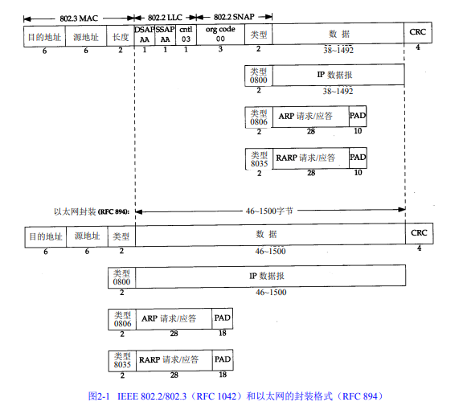

## 数据链路层概述

### 目的

链路层主要有三个目的：

- 为IP模块发送和接收IP数据报
- 为ARP模块发送ARP请求和接收ARP应答
- 为RARP发送RARP请求和接收RARP应答

### 封装

数据链路层主要有两个封装格式，**以太网**封装与**IEEE 802**封装，以太网是当今TCP/IP采用的主要的局域网技术，由**RFC 894**定义，802由**RFC 1042**定义：

以太网是最常见的封装格式，包括48 bit（6字节）的目的地址和源地址(硬件地址MAC)，2字节的类型，数据部分以及4字节的CRC(循环冗余码检验)。

802.3标准定义的帧和以太网的帧都有最小长度要求。 802.3规定数据部分必须至少为38字节，而对于以太网，则要求最少要有46字节。

### 环回接口

大多数的产品都支持环回接口`Loopback Interface`，以允许运行在同一台主机上的客户程序和服务器程序通过TCP/IP进行通信。A类网络号127就是为环回接口预留的。根据惯例，大多数系统把IP地址127.0.0.1分配给这个接口，并命名为`localhost`。一个传给环回接口的IP数据报不能在任何网络上出现。

### 最大传输单元MTU

以太网和802.3对数据帧的长度都有一个限制，其最大值分别是**1500**和**1492**字节。链路层的这个特性称作**MTU，最大传输单元**。

不同类型的网络大多数都有一个上限。如果IP层有一个数据报要传，而且数据的长度比链路层的MTU还大，那么IP层就需要进行`分片fragmentation`。

### 路径MTU

两台通信主机路径中的最小MTU，它被称作路径MTU。
