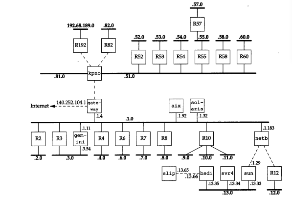
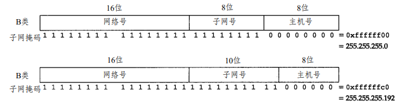
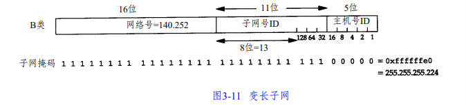

## IP网际协议概述

IP是TCP/IP协议族中最为核心的协议。所有的TCP、UDP、ICMP及IGMP数据都以IP数据报格式传输。IP提供不可靠、无连接的数据报传送服务。

不可靠的意思是它不能保证IP数据报能成功地到达目的地。IP仅提供最好的传输服务。如果发生某种错误时，如某个路由器暂时用完了缓冲区，IP有一个简单的错误处理算法：丢弃该数据报，然后发送ICMP消息报给信源端。任何要求的可靠性必须由上层来提供（如TCP）。

无连接这个术语的意思是IP并不维护任何关于后续数据报的状态信息。每个数据报的处理是相互独立的。这也说明，IP数据报可以不按发送顺序接收。如果一信源向相同的信宿发送两个连续的数据报（先是 A，然后是B），每个数据报都是独立地进行路由选择，可能选择不同的路线，因此B可能在A到达之前先到达。

### IP首部

普通的IP首部长为20个字节，除非含有选项字段：


版本号指IPv4或者IPv6。

首部长度指首部占32 bit(4字节)的数目，4 bit最大为15， 首部长度最大为15*4=60字节。

服务类型`TOS`字段包括一个3bit的优先权子字段（现在已被忽略），4bit的TOS子字段和1bit未用位但必须置0。4bit的TOS分别代表：最小时延、最大吞吐量、最高可靠性和最小费用。4bit中只能置其中1bit。如果所有4bit均为0，那么就意味着是一般服务。

总长度字段是指整个IP数据报的长度，以字节为单位。利用首部长度字段和总长度字段，就可以知道IP数据报中数据内容的起始位置和长度。由于该字段长16比特，所以IP数据报最长可达**65535**字节（回忆，超级通道的MTU为65535。它的意思其实不是一个真正的MTU—它使用了最长的IP数据报）。

当数据报被分片时，该字段的值也随着变化。尽管可以传送一个长达65535字节的IP数据报，但是大多数的链路层都会对它进行**分片**。而且，主机也要求不能接收超过**576字节**的数据报。由于TCP把用户数据分成若干片，因此一般来说这个限制不会影响TCP。在后面的章节中将遇到大量使用UDP的应用（RIP，TFTP，BOOTP，DNS，以及SNMP），它们都限制用户数据报长度为512字节，小于576字节。但是，事实上现在大多数的实现（特别是那些支持网络文件系统NFS的实现）允许超过8192字节的IP数据报。

总长度字段是IP首部中**必要**的内容，因为一些数据链路（如以太网）需要填充一些数据以达到最小长度。以太网的最小帧长为46字节，但是IP数据可能会更短。如果没有总长度字段，那么IP层就不知道46字节中有多少是IP数据报的内容。

标识字段唯一地标识主机发送的每一份数据报。通常每发送一份报文它的值就会加1。

标识字段、标志字段和片偏移字段用于分片。

`TTL（time-to-live）`生存时间字段设置了数据报可以经过的最多路由器数。它指定了数据报的生存时间。TTL的初始值由源主机设置，一旦经过一个处理它的路由器，它的值就减去1。当该字段的值为0时，数据报就被丢弃，并发送ICMP报文通知源主机。

协议字段，被IP用来对数据报进行分用。根据它可以识别是哪个协议向IP传送数据。

首部检验和字段是根据IP首部计算的检验和码。它不对首部后面的数据进行计算。ICMP、IGMP、UDP和TCP在它们各自的首部中均含有同时覆盖首部和数据检验和码。

为了计算一份数据报的IP检验和，首先把检验和字段置为0。然后，对首部中每个16bit行二进制反码求和（整个首部看成是由一串16bit的字组成），结果存在检验和字段中。当收到一份IP数据报后，同样对首部中每个16bit进行二进制反码的求和。由于接收方在计算过程中包含了发送方存在首部中的检验和，因此，如果首部在传输过程中没有发生任何差错，那么接收方计算的结果应该为全1(10101010+01010101)。如果结果不是全1（即检验和错误），那么IP就丢弃收到的数据报。但是不生成差错报文，由上层去发现丢失的数据报并进行重传。ICMP、IGMP、UDP和TCP都采用相同的检验和算法。

每一份IP数据报都包含源IP地址和目的IP地址。

选项字段一直都是以32 bit作为界限，在必要的时候插入值为0的填充字节。这样就保证IP首部始终是32 bit的整数倍。

### IP路由选择

从概念上说，IP路由选择是简单的，特别对于主机来说。如果目的主机与源主机直接相连（如点对点链路）或都在一个共享网络上（以太网或令牌环网），那么IP数据报就**直接送到**目的主机上。否则，主机把数据报发往一**默认的路由器**上，由路由器来转发该数据报。

IP层既可以配置成路由器的功能，也可以配置成主机的功能。当今的大多数多用户系统，包括几乎所有的Unix系统，都可以配置成一个路由器。我们可以为它指定主机和路由器都可以使用的简单路由算法。本质上的区别在于主机从不把数据报从一个接口转发到另一个接口，而路由器则要转发数据报。

在一般的体制中，IP可以从TCP、UDP、ICMP和IGMP接收数据报（即在本地生成的数据报）并进行发送，或者从一个网络接口接收数据报（待转发的数据报）并进行发送。IP层在内存中有一个**路由表**。当收到一份数据报并进行发送时，它都要对该表搜索一次。当数据报来自某个网络接口时，IP首先检查目的IP地址是否为**本机的IP地址之一或者IP广播地址。**如果确实是这样，数据报就被送到由IP首部协议字段所指定的**协议模块**进行处理。如果数据报的目的不是这些地址，那么（1）如果IP层被设置为路由器的功能，那么就对数据报进行**转发**；否则（2）数据报被**丢弃**。

```
ination         Gateway         Genmask         Flags Metric Ref      Use Iface
0.0.0.0         192.168.206.2   0.0.0.0         UG    100    0        0   ens33
169.254.0.0     0.0.0.0         255.255.0.0     U     1000   0        0   ens33
192.168.206.0   0.0.0.0         255.255.255.0   U     100    0        0   ens33
```

路由表中的每一项都包含下面这些信息：

- **目的IP地址**。它既可以是一个完整的主机地址，也可以是一个网络地址。主机地址有一个非0的主机号，以指定某一特定的主机，而网络地址中的主机号为0，以指定网络中的所有主机（如以太网，令牌环网）。
- **下一跳路由器**（next-hoprouter）的IP地址，或者有直接连接的网络IP地址。下一站路由器是指一个在直接相连网络上的路由器，通过它可以转发数据报。下一站路由器不是最终的目的，但是它可以把传送给它的数据报转发到最终目的。
- **标志**。其中一个标志指明目的IP地址是网络地址还是主机地址，另一个标志指明下一站路由器是否为真正的下一站路由器，还是一个直接相连的接口
- 为数据报的传输指定一个**网络接口**。

IP路由选择是**逐跳**地（hop-by-hop）进行的。从这个路由表信息可以看出，IP并不知道到达任何目的的完整路径（当然，除了那些与主机直接相连的目的）。所有的IP路由选择只为数据报传输提供下一站路由器的IP地址。它假定下一站路由器比发送数据报的主机更接近目的，而且下一站路由器与该主机是直接相连的。

IP路由选择主要完成以下这些功能：

1)搜索路由表，寻找能与目的IP地址**完全匹配**的表目（网络号和主机号都要匹配）。如果找到，则把报文发送给该表目指定的下一站路由器或直接连接的网络接口（取决于标志字段的值）。

2)搜索路由表，寻找能与目的**网络号相匹配**的表目。如果找到，则把报文发送给该表目指定的下一站路由器或直接连接的网络接口（取决于标志字段的值）。目的网络上的所有主机都可以通过这个表目来处置。这种搜索网络的匹配方法必须考虑可能的**子网掩码**。

3)搜索路由表，寻找标为`默认（default）`的表目。如果找到，则把报文发送给该表目指定的下一站路由器。

如果上面这些步骤都没有成功，那么该数据报就不能被传送。如果不能传送的数据报来自本机，那么一般会向生成数据报的应用程序返回一个“主机不可达”或“网络不可达”的错误。

完整主机地址匹配在网络号匹配之前执行。只有当它们都失败后才选择默认路由

为一个网络指定一个路由器，而不必为每个主机指定一个路由器，这是IP路由选择机制的另一个基本特性。这样做可以极大地缩小路由表的规模，比如Internet上的路由器有只有几千个表目，而不会是超过100万个表目。

1) 该事实上，大多数主机和一些路由器可以用**默认路由**来处理任何目的，除非它在本地局域网上。

2) 数据报中的**目的IP地址始终不发生任何变化**（只有使用源路由选项时，目的IP地址才有可能被修改，但这种情况很少出现）。所有的路由选择决策都是基于这个目的I P地址。

3) 每个**链路层**可能具有**不同的数据帧首部**，而且链路层的**目的地址**（如果有的话）始终指的是下一站的链路层地址。

### 子网寻址与子网掩码

现在所有的主机都要求支持子网编址。不是把IP地址看成由单纯的一个网络号和一个主机号组成，而是把主机号再分成一个子网号和一个主机号。

这样做的原因是因为 A类和B类地址为主机号分配了太多的空间，事实上，在一个网络中人们并不安排这么多的主机。

全0或全1的主机号都是无效的。

许多管理员采用自然的划分方法，即把B类地址中留给主机的16 bit中的前8 bit作为子网地址，后8 b i t作为主机号。这样用点分十进制方法表示的IP地址就可以比较容易确定子网号。但是，并不要求A类或B类地址的子网划分都要以字节为划分界限。

大多数的子网例子都是B类地址。其实，子网还可用于C类地址，只是它可用的比特数较少而已。很少出现 A类地址的子网例子是因为A类地址本身就很少。



子网对外部路由器来说隐藏了内部网络组织的细节。在我们的网络例子中，所有的IP地址都有一个B类网络号**140.252**。但是其中有超过30个子网，多于400台主机分布在这些子网中。由一台路由器提供了Internet的接入。在这个图中，我们把大多数的路由器编号为 Rn，n是子网号。我们给出了连接这些子网的路由器，同时还包括了扉页前图中的九个系统。

与30个C类地址相比，用一个包含30个子网的B类地址的好处是，它可以缩小Internet路由表的规模。B类地址140.252被划分为若干子网的事实对于所有子网以外的路由器都是透明的。为了到达IP地址开始部分为140.252的主机，外部路由器只需要知道通往IP地址140.252.104.1的路径。这就是说，对于网络140.252只需一个路由表目，而如果采用30个C类地址，则需要30个路由表目。因此，子网划分缩减了路由表的规模。

子网对于子网内部的路由器是不透明的。一份数据报到达gateway，它的目的地址是140.252.57.1。路由器gateway需要知道子网号是57，然后把它
送到kpno。同样，kpno必须把数据报送到R55，最后由R55把它送到R57。

### 子网掩码 subnet mask

除了IP地址以外，主机还需要知道有多少比特用于子网号及多少比特用于主机号。这是在引导过程中通过**子网掩码**来确定的。这个掩码是一个32 bit的值，其中值为1的比特留给网络号和子网号，为0的比特留给主机号。

子网掩码可以是**非连续的**，比如255.255.0.255可以作为A类地址的子网掩码，但RFC建议反对使用**非连续的子网掩码**。



如果知道本机的IP地址，那么就知道它是否为A类、B类或C类地址，也就知道网络号和子网号之间的分界线。而根据子网掩码就可知道子网号与主机号之间的分界线。

### 变长子网

子网号也可以变换长度：



把子网号从8 bit扩充到11 bit，把主机号从8 bit减为5 bit。

### 广播地址 Broadcast Address

主机标识段host ID为全1的IP地址为广播地址，广播的分组传送给host ID段所涉及的所有计算机。

### ifconfig与netstat

ifconfig命令列出各接口的信息。

netstat：- i参数将打印出接口信息， - n参数则打印出IP地址，而不是主机名字，- r参数列出路由信息。

### 数据报网络层提供的三个优点

第一，数据报降低了路由器中对于连接状态的需求。

第二，数据报提供了基本的构件，在它的上面可以构造不可靠的（UDP）和可靠的（TCP）的运输层。

第三，数据报代表了最小的网络层假定，使得可以使用很大范围的数据链路层服务。