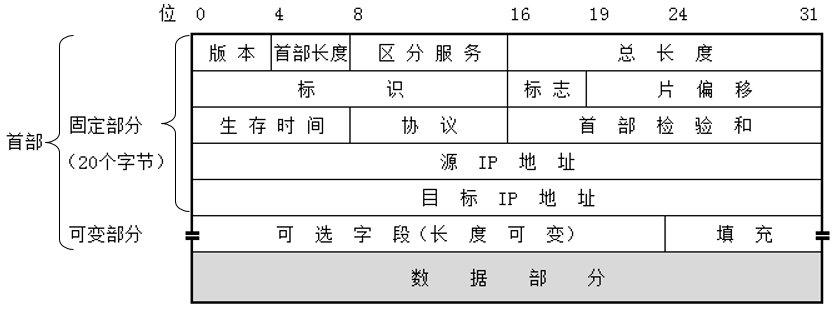

## IP网际协议概述

IP是TCP/IP协议族中最为核心的协议。所有的TCP、UDP、ICMP及IGMP数据都以IP数据报格式传输。IP提供不可靠、无连接的数据报传送服务。

不可靠的意思是它不能保证IP数据报能成功地到达目的地。IP仅提供最好的传输服务。如果发生某种错误时，如某个路由器暂时用完了缓冲区，IP有一个简单的错误处理算法：丢弃该数据报，然后发送ICMP消息报给信源端。任何要求的可靠性必须由上层来提供（如TCP）。

无连接这个术语的意思是IP并不维护任何关于后续数据报的状态信息。每个数据报的处理是相互独立的。这也说明，IP数据报可以不按发送顺序接收。如果一信源向相同的信宿发送两个连续的数据报（先是 A，然后是B），每个数据报都是独立地进行路由选择，可能选择不同的路线，因此B可能在A到达之前先到达。

### IP首部

普通的IP首部长为20个字节，除非含有选项字段：

版本号指IPv4或者IPv6。

首部长度指首部占32 bit(4字节)的数目，4 bit最大为15， 首部长度最大为15*4=60字节。

服务类型`TOS`字段包括一个3bit的优先权子字段（现在已被忽略），4bit的TOS子字段和1bit未用位但必须置0。4bit的TOS分别代表：最小时延、最大吞吐量、最高可靠性和最小费用。4bit中只能置其中1bit。如果所有4bit均为0，那么就意味着是一般服务。

总长度字段是指整个IP数据报的长度，以字节为单位。利用首部长度字段和总长度字段，就可以知道IP数据报中数据内容的起始位置和长度。由于该字段长16比特，所以IP数据报最长可达**65535**字节（回忆，超级通道的MTU为65535。它的意思其实不是一个真正的MTU—它使用了最长的IP数据报）。

当数据报被分片时，该字段的值也随着变化。尽管可以传送一个长达65535字节的IP数据报，但是大多数的链路层都会对它进行**分片**。而且，主机也要求不能接收超过**576字节**的数据报。由于TCP把用户数据分成若干片，因此一般来说这个限制不会影响TCP。在后面的章节中将遇到大量使用UDP的应用（RIP，TFTP，BOOTP，DNS，以及SNMP），它们都限制用户数据报长度为512字节，小于576字节。但是，事实上现在大多数的实现（特别是那些支持网络文件系统NFS的实现）允许超过8192字节的IP数据报。

总长度字段是IP首部中**必要**的内容，因为一些数据链路（如以太网）需要填充一些数据以达到最小长度。以太网的最小帧长为46字节，但是IP数据可能会更短。如果没有总长度字段，那么IP层就不知道46字节中有多少是IP数据报的内容。

标识字段唯一地标识主机发送的每一份数据报。通常每发送一份报文它的值就会加1。

标识字段、标志字段和片偏移字段用于分片。

`TTL（time-to-live）`生存时间字段设置了数据报可以经过的最多路由器数。它指定了数据报的生存时间。TTL的初始值由源主机设置，一旦经过一个处理它的路由器，它的值就减去1。当该字段的值为0时，数据报就被丢弃，并发送ICMP报文通知源主机。

协议字段，被IP用来对数据报进行分用。根据它可以识别是哪个协议向IP传送数据。

首部检验和字段是根据IP首部计算的检验和码。它不对首部后面的数据进行计算。ICMP、IGMP、UDP和TCP在它们各自的首部中均含有同时覆盖首部和数据检验和码。

为了计算一份数据报的IP检验和，首先把检验和字段置为0。然后，对首部中每个16bit行二进制反码求和（整个首部看成是由一串16bit的字组成），结果存在检验和字段中。当收到一份IP数据报后，同样对首部中每个16bit进行二进制反码的求和。由于接收方在计算过程中包含了发送方存在首部中的检验和，因此，如果首部在传输过程中没有发生任何差错，那么接收方计算的结果应该为全1(10101010+01010101)。如果结果不是全1（即检验和错误），那么IP就丢弃收到的数据报。但是不生成差错报文，由上层去发现丢失的数据报并进行重传。ICMP、IGMP、UDP和TCP都采用相同的检验和算法。

每一份IP数据报都包含源IP地址和目的IP地址。

