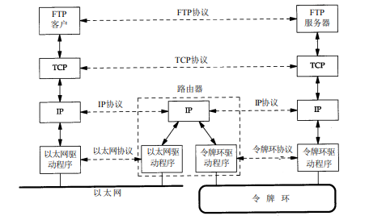
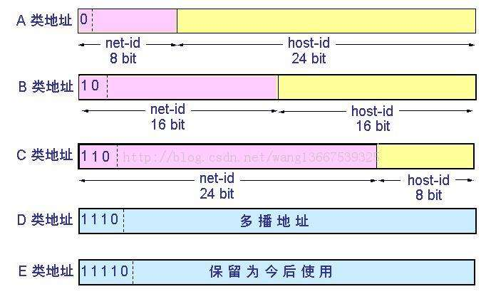
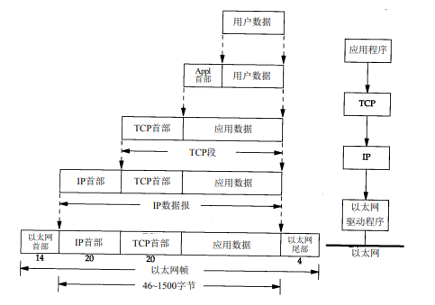

## TCP/IP协议族概述

### 分层

网络协议通常分不同层次进行开发，每一层分别负责不同的通信功能。**OSI**参考模型定义了七层，**TCP/IP**协议族通则简化为四层协议系统：

应用层通常是一个用户进程，而下三层则一般在内核中执行。

应用层关心的是应用程序的细节，而不是数据在网络中的传输活动。下三层对应用程序一无所知，但它们要处理所有的通信细节。

网络接口层和应用层的目的是很显然的—前者处理有关通信媒介的细节（以太网、令牌环网等），而后者处理某个特定的用户应用程序。但是，从表面上看，网络层和运输层之间的区别不那么明显。为什么要把它们划分成两个不同的层次呢？

应用层和运输层使用`端到端（End-to-end）`协议。在图中，只有端系统需要这两层协议。但是，网络层提供的却是`逐跳（Hop-by-hop）`协议，两个端系统和每个中间系统都要使用它：

在TCP/IP协议族中，网络层**IP**提供的是一种不可靠的服务。也就是说，它只是尽可能快地把分组从源结点送到目的结点，但是并不提供任何可靠性保证。而另一方面，**TCP**在不可靠的**IP**层上提供了一个可靠的运输层。为了提供这种可靠的服务，**TCP**采用了超时重传、发送和接收端到端的确认分组等机制。由此可见，运输层和网络层分别负责不同的功能。

**TCP**和**UDP**是两种最为著名的运输层协议，二者都使用IP作为网络层协议。

虽然**TCP**使用不可靠的IP服务，但它却提供一种可靠的运输层服务。

**UDP**为应用程序发送和接收数据报。一个数据报是指从发送方传输到接收方的一个信息
单元。但是与TCP不同的是，**UDP**是不可靠的，它不能保证数据报能安全无误地到达最终目的。

**IP**是网络层上的主要协议，同时被TCP和UDP使用。TCP和UDP的每组数据都通过端系统
和每个中间路由器中的IP层在互联网中进行传输。

**ICMP**是IP协议的附属协议。IP层用它来与其他主机或路由器交换错误报文和其他重要信息。**Ping**和**Traceroute**，它们都使用了ICMP。

**IGMP**是Internet组管理协议。它用来把一个UDP数据报多播到多个主机。

**ARP**（地址解析协议）和**RARP**（逆地址解析协议）是某些网络接口（如以太网和令牌环网）使用的特殊协议，用来转换IP层和网络接口层使用的地址。

### IP地址

互联网上的每个接口必须有一个唯一的Internet地址（也称作IP地址）。IP地址长32bit。这些32位的地址通常写成4个十进制的数，其中每个整数对应一个字节。这种表示方法称作`点分十进制表示法（Dotted decimalnotation）`。

区分各类地址的最简单方法是看它的第一个十进制整数：

需要再次指出的是，多接口主机具有多个IP地址，其中每个接口都对应一个IP地址。

### 端口号

TCP和UDP采用16 bit的端口号来识别应用程序。

服务器一般都是通过知名端口号来识别的。例如，对于每个TCP/IP实现来说，FTP服务器的TCP端口号都是21，每个Telnet服务器的TCP端口号都是23，每个TFTP(简单文件传送协议)服务器的UDP端口号都是69。任何TCP/IP实现所提供的服务都用知名的1～1023之间的端口号。这些知名端口号由Internet号分配机构（Internet Assigned Numbers Authority, **IANA**)来管理。

### 域名系统

尽管通过IP地址可以识别主机上的网络接口，进而访问主机，但是人们最喜欢使用的还是主机名。在TCP/IP领域中`域名系统(DNS)`是一个分布的数据库，由它来提供IP地址和主机名之间的映射信息。

### 封装

当应用程序用TCP传送数据时，数据被送入协议栈中，然后逐个通过每一层直到被当作一串比特流送入网络。其中每一层对收到的数据都要增加一些首部信息（有时还要增加尾部信息），该过程如图1-7所示。TCP传给IP的数据单元称作**TCP报文段**或简称为TCP段（**TCP segment**）。IP传给网络接口层的数据单元称作**IP数据报(IP datagram)**。通过以太网传输的比特流称作**帧(Frame)**:

### RFC

所有关于Internet的正式标准都以**RFC**（Request for Comment）文档出版。