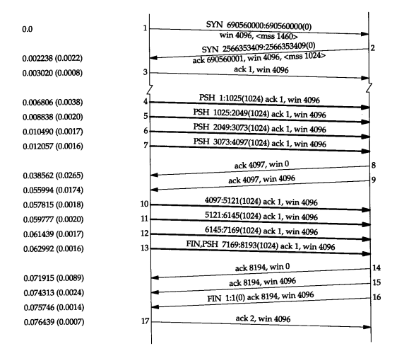

# TCP的交互数据流与成块数据流

如果按照分组数量计算，约有一半的TCP报文段包含成块数据（如 FTP、电子邮件），另一半则包含交互数据（如Telnet和Rlogin）。如果按字节计算，则成块数据与交互数据的比例约为90%和10%。这是因为成块数据的报文段基本上都是满长度（full-sized）的（通常为512字节的用户据），而交互数据则小得多（Telnet和Rlogin分组中通常约90%左右的用户数据小于10个字节）。很明显，TCP需要同时处理这两类数据，但使用的处理算法则有所不同。

## 交互数据流

交互数据总是以小于最大报文段长度的分组发送。

对于这些小的报文段，接收方使用经受时延的确认方法来判断确认是否可被推迟发送，以便与回送数据一起发送。这样通常会减少报文段的数目。

在较慢的广域网环境中，通常使用Nagle算法来减少这些小报文段的数目。

### 经受时延的确认

通常TCP在接收到数据时并不立即发送ACK；相反，它推迟发送，以便将ACK与需要沿该方向发送的数据一起发送（有时称这种现象为数据捎带ACK）。绝大多数实现采用的时延为200ms，也就是说，TCP将以最大200ms的时延等待是否有数据一起发送。

### Nagle算法

在一个Rlogin连接上客户一般每次发送一个字节到服务器，这就产生了一些41字节长的分组：20字节的IP首部、20字节的TCP首部和1个字节的数据。在局域网上，这些小分组（被称为微小分组（ tinygram））通常不会引起麻烦，因为局域网一般不会出现拥塞。但在广域网上，这些小分组则会增加拥塞出现的可能。一种简单和好的方法就是采用RFC 896 [Nagle 1984]中所建议的**Nagle**算法。

该算法要求一个TCP连接上最多只能有**1个未被确认的未完成的小分组**，在该分组的确认到达之前不能发送其他的小分组。相反，TCP**收集**这些少量的分组，并在确认到来时以一个分组的方式发出去。该算法的优越之处在于它是自适应的：确认到达得越快，数据也就发送得越快。而在希望减少微小分组数目的低速广域网上，则会发送更少的分组（小的含义是小于报文段的大小）。

### 关闭Nagle算法

有时我们也需要关闭Nagle算法。一个典型的例子是X窗口系统服务器。跨广域网运行一个交互应用的环境下，当进行多字节的按键输入时，默认使用 Nagle算法会引起额外的时延。当服务器接收到字符后，它并不发送确认，而是继续等待接收序列中的其他字符。

## 成块数据流

TCP使用被称为**滑动窗口协议**的另一种形式的流量控制方法。该协议允许发送方在停止并等待确认前可以连续发送多个分组。由于发送方不必每发一个分组就停下来等待确认，因此该协议可以加速数据的传输。

使用TCP的滑动窗口协议时，接收方不必确认每一个收到的分组。在TCP中，ACK是累积的—它们表示接收方已经正确收到了一直到确认序号减1的所有字节。

接收方发送ACK（报文段8），但通告其窗口大小为 0，这说明接收方已收到所有数据，但这些数据都在接收方的TCP缓冲区，因为应用程序还没有机会读取这些数据。另一个ACK（称为窗口更新）在17.4 ms后发送，表明接收方现在可以接收另外的4096个字节的数据。虽然这看起来像一个ACK，但由于它并不确认任何新数据，只是用来增加窗口的右边沿，因此被称为**窗口更新**。

### 滑动窗口

在 TCP 中，两端都维护着窗口：分别为发送端窗口和接收端窗口。

发送端窗口包含已发送但未收到应答的数据和可以发送但是未发送的数据。

在这个图中，我们将字节从1至11进行标号。接收方通告的窗口称为提出的窗口（offered window），它覆盖了从第4字节到第9字节的区域，表明接收方已经确认了包括第 3字节在内的数据，且通告窗口大小为6。

- 窗口左边沿向右边沿靠近为**窗口合拢**。这种现象发生在数据被发送和确认时。
- 当窗口右边沿向右移动时将允许发送更多的数据，我们称之为**窗口张开**。这种现象发生在另一端的接收进程读取已经确认的数据并释放了TCP的接收缓存时。
- 当右边沿向左移动时，我们称之为窗口收缩。强烈建议不要使用这种方式。

### 窗口大小

4.2BSD默认设置发送和接受缓冲区的大小为2048个字节。在4.3BSD中双方被增加为4096个字节。正如我们在本书中迄今为止所看到的例子一样， SunOS 4.1.3、BSD/386和SVR4仍然使用4096字节的默认大小。其他的系统，如Solaris 2.2、4.4 BSD和AIX3.2则使用更大的默认缓存大小，如8192或16384等。

### Zero 窗口

在发送报文的过程中，可能会遇到对端出现零窗口的情况。在该情况下，发送端会停止发送数据。

### 坚持定时器

如果一个确认丢失了，则双方就有可能因为等待对方而使连接终止：接收方等待接收数据（因为它已经向发送方通告了一个非0的窗口），而发送方在等待允许它继续发送数据的窗口更新。为防止这种死锁情况的发生，发送方使用一个坚持定时器 (persist timer)来周期性地向接收方查询，以便发现窗口是否已增大。这些从发送方发出的报文段称为**窗口探查** (window probe)。

当通告窗口为 0，客户停止发送任何其他的数据，设置其坚持定时器。如果在该定时器时间到时客户还没有接收到一个**窗口更新**，它就探查这个空的窗口以决定窗口更新是否丢失。

计算坚持定时器时使用了普通的TCP指数退避。

### PUSH标志

发送方使用该标志通知接收方将所收到的数据全部提交给接收进程。这里的数据包括与PUSH一起传送的数据以及接收方TCP已经为接收进程收到的其他数据。

### 慢启动算法

如果在发送方和接收方之间存在多个路由器和速率较慢的链路时，就有可能出现一些问题。TCP支持一种被称为“慢启动 (slow start)”的算法。该算法通过观察到新分组进入网络的速率应该与另一端返回确认的速率相同而进行工作。

慢启动为发送方的TCP增加了另一个窗口：拥塞窗口 (congestion window)，记为**cwnd**。当与另一个网络的主机建立TCP连接时，拥塞窗口被初始化为1个报文段（即另一端通告的报文段大小）。每收到一个ACK，拥塞窗口就增加一个报文段（ cwnd以字节为单位，但是慢启动以报文段大小为单位进行增加）。发送方取**拥塞窗口与通告窗口中的最小值**作为发送上限。拥塞窗口是发送方使用的流量控制，而通告窗口则是接收方使用的流量控制。

发送方开始时发送一个报文段，然后等待ACK。当收到该ACK时，拥塞窗口从1增加为2，即可以发送两个报文段。当收到这两个报文段的ACK时，拥塞窗口就增加为4。这是一种指数增加的关系。

### 带宽时延乘积

作为最大的吞吐量，发送方在任何时候有n个已发送的报文段未被确认。接收方的通告窗口必须不小于这个数目，因为通告窗口限制了发送方能够发送的段的数目。

可以计算通道的容量为：

capacity(bit) = bandwidth(b/s) * round-trip time(s)

这个值依赖于网络速度和两端的RTT。

