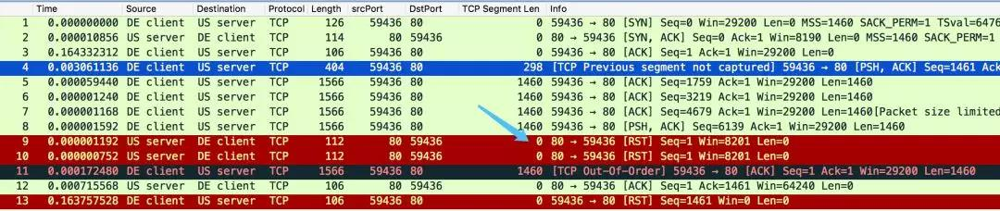

## TCP-连接建立终止及状态机

TCP是一个面向连接的协议。无论哪一方向另一方发送数据之前，都必须先在双方之间建立一条连接。这种两端间连接的建立与无连接协议如UDP不同。一端使用UDP向另一端发送数据报时，无需任何预先的握手。

### 连接建立：三次握手


1) 请求端（通常称为客户）发送一个SYN段指明客户打算连接的服务器的端口，以及初始序号（ISN）。这个SYN段为报文段1。客户端便进入 SYN_SENT 状态

2) 服务器发回包含服务器的初始序号的SYN报文段（报文段2）作为应答。同时，将确认序号设置为客户的ISN加1以对客户的SYN报文段进行确认。一个SYN将占用一个序号。服务器发送完成后便进入 SYN_RECEIVED 状态

3) 客户必须将确认序号设置为服务器的ISN加1以对服务器的SYN报文段进行确认（报文段3）。客户端发完这个报文段后便进入ESTABLISHED 状态，服务端收到这个应答后也进入 ESTABLISHED 状态，此时连接建立成功

这三个报文段完成连接的建立。这个过程也称为三次握手（three-way handshake）。

每行显示的字段win 4096表示发端通告的窗口大小。

### 初始序号ISN

当一端为建立连接而发送它的SYN时，它为连接选择一个初始序号。 ISN随时间而变化，因此每个连接都将具有不同的ISN。RFC 793 [Postel 1981c]指出ISN可看作是一个32比特的计数器，每4ms加1。这样选择序号的目的在于防止在网络中被延迟的分组在以后又被传送，而导致某个连接的一方对它作错误的解释。 

### 终止连接

建立一个连接需要三次握手，而终止一个连接要经过 4次握手。这由TCP的半关闭（half-close）造成的。既然一个TCP连接是全双工（即数据在两个方向上能同时传递），因此每个方向必须单独地进行关闭。这原则就是当一方完成它的数据发送任务后就能发送一个FIN来终止
这个方向连接。当一端收到一个FIN，它必须通知应用层另一端几经终止了那个方向的数据传送。发送FIN通常是应用层进行关闭的结果。


收到一个FIN只意味着在这一方向上没有数据流动。一个TCP连接在收到一个FIN后仍能发送数据。而这对利用半关闭的应用来说是可能的，尽管在实际应用中只有很少的 T C P应用程序这样做。

**第一次握手**

若客户端 A 认为数据发送完成，则它需要向服务端 B 发送连接释放请求，客户端A进入`FIN_WAIT_1`状态。

**第二次握手**

B 收到连接释放请求后，会告诉应用层要释放 TCP 链接。然后会发送 ACK 包，并进入 CLOSE_WAIT 状态，表示 A 到 B 的连接已经释放，不接收 A 发的数据了。但是因为 TCP 连接时双向的，所以 B 仍旧可以发送数据给 A。

**第三次握手**

B 如果此时还有没发完的数据会继续发送，完毕后会向 A 发送连接释放请求，然后 B 便进入 LAST_ACK 状态。

PS：通过延迟确认的技术（通常有时间限制，否则对方会误认为需要重传），可以将第二次和第三次握手合并，延迟 ACK 包的发送。

**第四次握手**

A 收到释放请求后，向 B 发送确认应答，此时 A 进入 TIME_WAIT 状态。该状态会持续 2MSL（最大段生存期，指报文段在网络中生存的时间，超时会被抛弃） 时间，若该时间段内没有 B 的重发请求的话，就进入 CLOSED 状态。当 B 收到确认应答后，也便进入 CLOSED 状态。

### 最大报文段长度MSS

最大报文段长度（MSS）表示TCP传往另一端的最大块数据的长度。当一个连接建立时，连接的双方都要通告各自的 MSS。

当建立一个连接时，每一方都有用于通告它期望接收的 MSS选项（MSS选项只能出现在**SYN**报文段中）。如果一方不接收来自另一方的 MSS值，则MSS就定为默认值**536**字节（这个默认值允许20字节的IP首部和20字节的TCP首部以适合576字节IP数据报)。

一般说来，如果没有分段发生， MSS还是越大越好。当 TCP发送一个SYN时，或者是因为一个本地应用进程想发起一个连接，或者是因为另一端的主机收到了一个连接请求，它能将MSS值设置为外出接口上的`MTU`长度减去固定的IP首部和TCP首部长度。对于一个以太网， MSS值可达**1460**字节。

### 半关闭half-close

TCP提供了连接的一端在结束它的发送后还能接收来自另一端数据的能力。这就是所谓的半关闭。

在一个半关闭的连接上，一个端点已经发送了一个 FIN，正等待另一端的数据或者一个FIN。一个半打开的连接是当一个端点崩溃了，而另一端还不知道的情况。

#### 半连接half-oepn
如果一方已经关闭或异常终止连接而另一方却还不知道，我们将这样的TCP连接称为半打开（Half-Op en）的。任何一端的主机异常都可能导致发生这种情况。只要不打算在半打开连接上传输数据，仍处于连接状态的一方就不会检测另一方已经出现异常。

因为客户端的多样性已经网络的复杂，服务器端很容易就产生很多半打开的连接，半打开链接的检测，有很多方法，

1. 通过应用层，对每一个连接添加定时器监听，超时无数据就进行关闭操作。
2. 通过TCP协议层的keepalive选项来开始TCP的保活定时器，但保活不是TCP标准规范的(但很多tcp的实现中实现了此功能)，TCP RFC中给出了3个不使用保活定时器的理由：
     1. 在出现一个短暂的差错情况下，可能会是一个非常好的连接被释放掉；
     2. 保活功能会耗费不必要的带宽；
     3. 在按流量计费的情况下，会花掉更多的money；

分两种情况:

关闭的一方向打开的一方发送SYN:

>  Assume that two user processes A and B are communicating with one
>  another when a crash occurs causing loss of memory to A's TCP.
>  Depending on the operating system supporting A's TCP, it is likely
>  that some error recovery mechanism exists.  When the TCP is up again,
>  A is likely to start again from the beginning or from a recovery
>  point.  As a result, A will probably try to OPEN the connection again
>  or try to SEND on the connection it believes open.  In the latter
>  case, it receives the error message "connection not open" from the
>  local (A's) TCP.  In an attempt to establish the connection, A's TCP
>  will send a segment containing SYN.  This scenario leads to the
>  example shown in figure 10.  After TCP A crashes, the user attempts to
>  re-open the connection.  TCP B, in the meantime, thinks the connection
>  is open.
```
       TCP A                                           TCP B

  1.  (CRASH)                               (send 300,receive 100)

  2.  CLOSED                                           ESTABLISHED

  3.  SYN-SENT --> <SEQ=400><CTL=SYN>              --> (??)

  4.  (!!)     <-- <SEQ=300><ACK=100><CTL=ACK>     <-- ESTABLISHED

  5.  SYN-SENT --> <SEQ=100><CTL=RST>              --> (Abort!!)

  6.  SYN-SENT                                         CLOSED

  7.  SYN-SENT --> <SEQ=400><CTL=SYN>              -->

```
>  When the SYN arrives at line 3, TCP B, being in a synchronized state,
>  and the incoming segment outside the window, responds with an
>  acknowledgment indicating what sequence it next expects to hear (ACK
>  100).  TCP A sees that this segment does not acknowledge anything it
>  sent and, being unsynchronized, sends a reset (RST) because it has
>  detected a half-open connection.  TCP B aborts at line 5.  TCP A will
>  continue to try to establish the connection; the problem is now
>  reduced to the basic 3-way handshake of figure 7.

打开的一方向关闭的另一方发送数据(RFC793-34)：
>  An interesting alternative case occurs when TCP A crashes and TCP B
>  tries to send data on what it thinks is a synchronized connection.
>  This is illustrated in figure 11.  In this case, the data arriving at
>  TCP A from TCP B (line 2) is unacceptable because no such connection
>  exists, so TCP A sends a RST.  The RST is acceptable so TCP B
>  processes it and aborts the connection.
>
```
       TCP A                                              TCP B

  1.  (CRASH)                                   (send 300,receive 100)

  2.  (??)    <-- <SEQ=300><ACK=100><DATA=10><CTL=ACK> <-- ESTABLISHED

  3.          --> <SEQ=100><CTL=RST>                   --> (ABORT!!)

           Active Side Causes Half-Open Connection Discovery
```

### TCP状态机


### 2MSL等待状态

TIME_WAIT状态也称为2 MSL等待状态。每个具体 TCP实现必须选择一个报文段最大生存时间MSL（Maximum Segment Lifetime）。它是任何报文段被丢弃前在网络内的最长时间。我们知道这个时间是有限的，因为 TCP报文段以I P数据报在网络内传输，而IP数据报则有限制其生存时间的TTL字段。

RFC 793 [Postel 1981c] 指出MSL为2分钟。然而，实现中的常用值是30秒，1分钟，或2分钟。

从
对一个具体实现所给定的 MSL值，处理的原则是：当 TCP执行一个主动关闭，并发回最后一个ACK，该连接必须在TIME_WAIT状态停留的时间为 2倍的MSL。这样可让TCP再次发送最后的ACK以防这个ACK丢失。

这种2MSL等待的另一个结果是这个 TCP连接在2MSL等待期间，定义这个连接的插口不能再被使用。这个连接只能在2MSL结束后才能再被使用。

一个连接只有经过了已建立状态才能进入2MSL等待状态。

处于TIME_WAIT状态的主机收到使其进入此状态的重复的FIN时，会再次发送ACK，2MSL定时器重新开始

处于TIME_WAIT状态的主机收到一个RST时，会过早终止，叫做TIME_WAIT断开(assassination)

### `FIN_WAIT_2`状态

在FIN_WAIT_2状态我们已经发出了FIN，并且另一端也已对它进行确认。除非我们在实行半关闭，否则将等待另一端的应用层意识到它已收到一个文件结束符说明，并向我们发一个FIN来关闭另一方向的连接。只有当另一端的进程完成这个关闭，我们这端才会从FIN_WAIT_2状态进入TIME_WAIT状态。

可能永远保持这个状态。另一端也将处于 CLOSE_WAIT 状态，并一直保持这个状态直到应用层决定进行关闭。


### 同时打开与同时关闭

两个应用程序同时彼此执行主动打开的情况是可能的。

每一方必须发送一个 SYN，且这些SYN必须传递给对方。这需要每一方使用一个对方熟知的端口作为本地端口。这又称为同时打开。


一个同时打开的连接需要交换4个报文段，比正常的三次握手多一个。此外，要注意的是我们没有将任何一端称为客户或服务器，因为每一端既是客户又是服务器。尽管很难，但仍有可能产生一个同时打开的连接。两端必须几乎在同时启动，以便收到彼此的SYN。只要两端有较长的往返时间就能保证这一点。

双方都执行主动关闭也是可能的，TCP协议也允许这样的同时关闭。


### 复位报文段RST

我们已经介绍了TCP首部中的RST比特是用于**复位**的。一般说来，无论何时一个报文段发往`基准的连接（referenced connection）`出现错误，TCP都会发出一个复位报文段。`基准的连接`是指由目的IP地址和目的端口号以及源IP地址和源端口号指明的连接。

RST表示复位，用来异常的关闭连接，在TCP的设计中它是不可或缺的。发送RST包关闭连接时，不必等缓冲区的包都发出去（不像上面的FIN包），直接就丢弃缓存区的包发送RST包。而接收端收到RST包后，也不必发送ACK包来确认。

1. 通过FIN包进行关闭，又称：有序释放(orderly release)，因为close()/shutdown()都会将缓冲区中的数据全部发送出去之后，才会发送FIN。
2. 通过RST复位包进行关闭，又称：异常释放(abortive release)。异常释放的特点：
     1. 丢弃掉发送缓冲区中的全部数据，立刻发送RST报文；
     2. RST接收方会区分另一端执行的是正常关闭，还是异常关闭

如果一个产生RST的到达报文有一个ACK字段，那么RST的序号就是就是到达的ACK字段。

#### 到不存在的端口的连接请求
产生复位的一种常见情况是当连接请求到达时，目的端口没有进程正在听。对于UDP，当一个数据报到达目的端口时，该端口没在使用，它将产生一个ICMP端口不可达的信息。而TCP则使用复位。

复位报文段中的SEQ序号被置为0，ACK序号被置为进入的ISN加上数据字节数

####  异常终止一个连接

终止一个连接的正常方式是一方发送 FIN， 但也有可能发送一个复位报文段而不是 FIN 来中途释放一个连接。有时称这为异常释放。

为终止客户程序而键入的文件结束符（Control_D）。由于我们指明使用异常关闭而不是正常关闭，因此主机bsdi端的TCP发送一个RST而不是通常的FIN。RST报文段中包含一个序号和确认序号。

需要注意的是 RST 报文段不会导致另一端产生任何响应，另一端根本不进行确认。收到RST的一方将终止该连接，并通知应用层连接复位。

#### 检测半打开连接
一个连接的另一端已经关闭，此时发送数据到对端，就会触发RST回包

#### tcp报文失序
比如，客户端向服务器发送6个报文段，先发送了2,3,4,5,6，此时已接近服务器接收端的接收窗口大小，服务端认为剩余的窗口大小不足以接收报文段1(离接收窗口还有一个MSS)，于是向客户端发送RST请求。



[链接](https://mp.weixin.qq.com/s/8w36DZN1oc-HyvpabRNhdw)

### RST攻击
A和服务器B之间建立了TCP连接，此时C伪造了一个TCP包发给B，使B异常的断开了与A之间的TCP连接，就是RST攻击了

一个TCP连接都是四元组，由源IP、源端口、目标IP、目标端口唯一确定一个连接。所以，如果C要伪造A发给B的包，要在上面提到的IP头和TCP头，把源IP、源端口、目标IP、目标端口都填对

序列号问题是与滑动窗口对应的，伪造的TCP包里需要填序列号，如果序列号的值不在A之前向B发送时B的滑动窗口内，B是会主动丢弃的。

### TCP服务器的设计

大多数的TCP服务器进程是并发的。当一个新的连接请求到达服务器时，服务器接受这个请求，并调用一个新进程来处理这个新的客户请求。