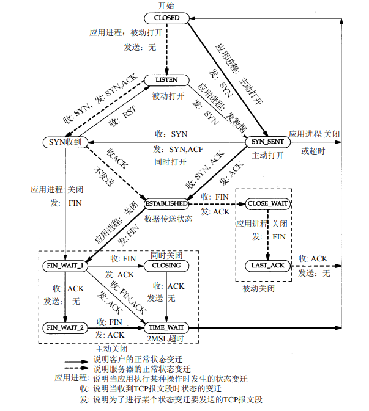
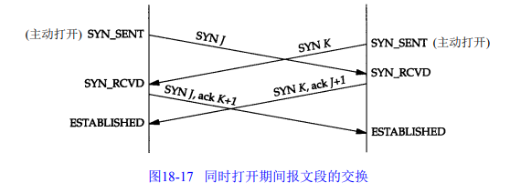
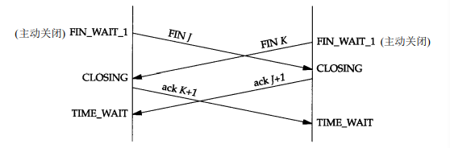

## TCP-连接建立终止及状态机

TCP是一个面向连接的协议。无论哪一方向另一方发送数据之前，都必须先在双方之间建立一条连接。这种两端间连接的建立与无连接协议如UDP不同。一端使用UDP向另一端发送数据报时，无需任何预先的握手。

### 连接建立：三次握手

1) 请求端（通常称为客户）发送一个SYN段指明客户打算连接的服务器的端口，以及初始序号（ISN）。这个SYN段为报文段1。客户端便进入 SYN_SENT 状态

2) 服务器发回包含服务器的初始序号的SYN报文段（报文段2）作为应答。同时，将确认序号设置为客户的ISN加1以对客户的SYN报文段进行确认。一个SYN将占用一个序号。服务器发送完成后便进入 SYN_RECEIVED 状态

3) 客户必须将确认序号设置为服务器的ISN加1以对服务器的SYN报文段进行确认（报文段3）。客户端发完这个报文段后便进入ESTABLISHED 状态，服务端收到这个应答后也进入 ESTABLISHED 状态，此时连接建立成功

这三个报文段完成连接的建立。这个过程也称为三次握手（three-way handshake）。

### 初始序号ISN

当一端为建立连接而发送它的SYN时，它为连接选择一个初始序号。 ISN随时间而变化，因此每个连接都将具有不同的ISN。RFC 793 [Postel 1981c]指出ISN可看作是一个32比特的计数器，每4ms加1。这样选择序号的目的在于防止在网络中被延迟的分组在以后又被传送，而导致某个连接的一方对它作错误的解释。 

### 终止连接

建立一个连接需要三次握手，而终止一个连接要经过 4次握手。这由TCP的半关闭（half-close）造成的。既然一个TCP连接是全双工（即数据在两个方向上能同时传递），因此每个方向必须单独地进行关闭。这原则就是当一方完成它的数据发送任务后就能发送一个FIN来终止
这个方向连接。当一端收到一个FIN，它必须通知应用层另一端几经终止了那个方向的数据传送。发送FIN通常是应用层进行关闭的结果。

收到一个FIN只意味着在这一方向上没有数据流动。一个TCP连接在收到一个FIN后仍能发送数据。而这对利用半关闭的应用来说是可能的，尽管在实际应用中只有很少的 T C P应用程序这样做。

**第一次握手**

若客户端 A 认为数据发送完成，则它需要向服务端 B 发送连接释放请求，客户端A进入`FIN_WAIT_1`状态。

**第二次握手**

B 收到连接释放请求后，会告诉应用层要释放 TCP 链接。然后会发送 ACK 包，并进入 CLOSE_WAIT 状态，表示 A 到 B 的连接已经释放，不接收 A 发的数据了。但是因为 TCP 连接时双向的，所以 B 仍旧可以发送数据给 A。

**第三次握手**

B 如果此时还有没发完的数据会继续发送，完毕后会向 A 发送连接释放请求，然后 B 便进入 LAST_ACK 状态。

PS：通过延迟确认的技术（通常有时间限制，否则对方会误认为需要重传），可以将第二次和第三次握手合并，延迟 ACK 包的发送。

**第四次握手**

A 收到释放请求后，向 B 发送确认应答，此时 A 进入 TIME_WAIT 状态。该状态会持续 2MSL（最大段生存期，指报文段在网络中生存的时间，超时会被抛弃） 时间，若该时间段内没有 B 的重发请求的话，就进入 CLOSED 状态。当 B 收到确认应答后，也便进入 CLOSED 状态。

### 最大报文段长度MSS

最大报文段长度（MSS）表示TCP传往另一端的最大块数据的长度。当一个连接建立时，连接的双方都要通告各自的 MSS。

当建立一个连接时，每一方都有用于通告它期望接收的 MSS选项（MSS选项只能出现在**SYN**报文段中）。如果一方不接收来自另一方的 MSS值，则MSS就定为默认值536字节（这个默认值允许20字节的IP首部和20字节的TCP首部以适合576字节IP数据报)。

一般说来，如果没有分段发生， MSS还是越大越好。

### 半关闭

TCP提供了连接的一端在结束它的发送后还能接收来自另一端数据的能力。这就是所谓的半关闭。

在一个半关闭的连接上，一个端点已经发送了一个 FIN，正等待另一端的数据或者一个FIN。一个半打开的连接是当一个端点崩溃了，而另一端还不知道的情况。

### TCP状态机

### 2MSL等待状态

TIME_WAIT状态也称为2 MSL等待状态。每个具体 TCP实现必须选择一个报文段最大生存时间MSL（Maximum Segment Lifetime）。它是任何报文段被丢弃前在网络内的最长时间。我们知道这个时间是有限的，因为 TCP报文段以I P数据报在网络内传输，而IP数据报则有限制其生存时间的TTL字段。

RFC 793 [Postel 1981c] 指出MSL为2分钟。然而，实现中的常用值是30秒，1分钟，或2分钟。

从
对一个具体实现所给定的 MSL值，处理的原则是：当 TCP执行一个主动关闭，并发回最后一个ACK，该连接必须在TIME_WAIT状态停留的时间为 2倍的MSL。这样可让TCP再次发送最后的ACK以防这个ACK丢失。

这种2MSL等待的另一个结果是这个 TCP连接在2MSL等待期间，定义这个连接的插口不能再被使用。这个连接只能在2MSL结束后才能再被使用。

一个连接只有经过了已建立状态才能进入2MSL等待状态。

### `FIN_WAIT_2`状态

可能永远保持这个状态。另一端也将处于 CLOSE_WAIT 状态，并一直保持这个状态直到应用层决定进行关闭。

### 复位报文段RST

我们已经介绍了TCP首部中的RST比特是用于“复位”的。一般说来，无论何时一个报文段发往基准的连接（referenced connection）出现错误，TCP都会发出一个复位报文段。

产生复位的一种常见情况是当连接请求到达时，目的端口没有进程正在听。

终止一个连接的正常方式是一方发送 FIN， 但也有可能发送一个复位报文段而不是 FIN 来中途释放一个连接。有时称这为异常释放。

需要注意的是 RST 报文段不会导致另一端产生任何响应，另一端根本不进行确认。收到RST的一方将终止该连接，并通知应用层连接复位。

### 同时打开与同时关闭

两个应用程序同时彼此执行主动打开的情况是可能的。

每一方必须发送一个 SYN，且这些SYN必须传递给对方。这需要每一方使用一个对方熟知的端口作为本地端口。这又称为同时打开。

一个同时打开的连接需要交换4个报文段，比正常的三次握手多一个。此外，要注意的是我们没有将任何一端称为客户或服务器，因为每一端既是客户又是服务器。尽管很难，但仍有可能产生一个同时打开的连接。两端必须几乎在同时启动，以便收到彼此的SYN。只要两端有较长的往返时间就能保证这一点。

双方都执行主动关闭也是可能的，TCP协议也允许这样的同时关闭。

### TCP服务器的设计

大多数的TCP服务器进程是并发的。当一个新的连接请求到达服务器时，服务器接受这个请求，并调用一个新进程来处理这个新的客户请求。