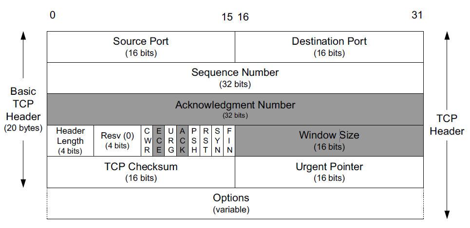

## TCP-传输控制协议

尽管TCP和UDP都使用相同的网络层（IP），TCP却向应用层提供与UDP完全不同的服务。TCP提供一种面向连接的、可靠的字节流服务。

### 面向连接

面向连接意味着两个使用TCP的应用（通常是一个客户和一个服务器）在彼此交换数据之前必须先建立一个TCP连接。在一个TCP连接中，仅有两方进行彼此通信。广播和多播不能用于TCP。

### 可靠性

TCP通过下列方式来提供可靠性：

- 应用数据被**分割**成TCP认为最适合发送的**数据块**，称为报文段或段（ segment）。这和UDP完全不同，应用程序产生的
数据报长度将保持不变。
- 超时重传：当TCP发出一个段后，它启动一个定时器，等待目的端确认收到这个报文段。如果不能及时收到一个确认，将重发这个报文段
- 确认接收：当TCP收到发自TCP连接另一端的数据，它将发送一个确认。这个确认不是立即发送，通常将推迟几分之一秒
- TCP将保持它首部和数据的**检验和**。这是一个端到端的检验和，目的是检测数据在传输过程中的任何变化。如果收到段的检验和有差错， TCP将丢弃这个报文段和不确认收到此报文段（希望发端超时并重发）。
- IP数据报的到达可能会失序，因此 TCP报文段的到达也可能会失序。如果必要，TCP将对收到的数据进行**重新排序**，将收到的数据以正确的顺序交给应用层。
- 既然IP数据报会发生重复，TCP的接收端必须**丢弃重复的数据**。
- TCP还能提供**流量控制**。TCP连接的每一方都有固定大小的**缓冲空间**。 TCP的接收端只允许另一端发送接收端缓冲区所能接纳的数据。这将防止较快主机致使较慢主机的缓冲区溢出。

### 字节流服务

两个应用程序通过TCP连接交换8 bit字节构成的字节流。TCP不在字节流中插入记录标识符。我们将这称为**字节流**服务（ byte stream service）。如果一方的应用程序先传10字节，又传20字节，再传50字节，连接的另一方将无法了解发方每次发送了多少字节。收方可以分 4次接
收这80个字节，每次接收20字节。一端将字节流放到 TCP连接上，同样的字节流将出现在TCP连接的另一端。

另外，TCP对字节流的内容不作任何解释。 TCP不知道传输的数据字节流是二进制数据，还是ASCII字符、EBCDIC字符或者其他类型数据。对字节流的解释由TCP连接双方的应用层解释。

### 首部

TCP数据被封装在一个IP数据报中，TCP首部如果不计任选字段，它通常是20个字节：

每个TCP段都包含源端和目的端的端口号，用于寻找发端和收端应用进程。这两个值加上IP首部中的源端IP地址和目的端IP地址唯一确定一个TCP连接。一个IP地址和一个端口号也称为一个插口（ socket）。

**序号**用来标识从TCP发端向TCP收端发送的数据字节流，它表示在这个报文段中的的第一个数据字节。如果将字节流看作在两个应用程序间的单向流动，则 TCP用序号对每个字节进行计数。序号是32 bit的无符号数，序号到达最大后又从0开始。

当建立一个新的连接时， SYN标志变1。序号字段包含由这个主机选择的该连接的初始序号**ISN**（Initial Sequence Number）。该主机要发送数据的第一个字节序号为这个ISN加1，因为SYN标志消耗了一个序号（终止连接， FIN标志也要占用一个序号）。

**确认序号**应当是上次已成功收到数据字节序号加1。只有ACK标志（下面介绍）为1时确认序号字段才有效。发送ACK无需任何代价。

TCP可以表述为一个没有选择确认或否认的**滑动窗口协议**。我们说TCP缺少选择确认是因为TCP首部中的确认序号表示发方已成功收到字节，但还不包含确认序号所指的字节。当前还无法对数据流中选定的部分进行确认。例如，如果1～1024字节已经成功收到，下一报文段中包含序号从2049～3 072的字节，收端并不能确认这个新的报文段。它所能做的就是发回一个确认序号为 1025的ACK。它也无法对一个报文段进行**否认**。例如，如果收到包含 1025～2048字节的报文段，但它的检验和错，TCP接收端所能做的就是发回一个确认序号为 1025的ACK。

首部长度给出首部中 32 bit字的数目。需要这个值是因为任选字段的长度是可变的。这个字段占4 bit，因此TCP最多有60字节的首部。然而，没有任选字段，正常的长度是20字节。

在TCP首部中有6个标志比特。它们中的多个可同时被设置为1：

- URG=1：该字段为一表示本数据报的数据部分包含紧急信息，是一个高优先级数据报文，此时紧急指针有效。紧急数据一定位于当前数据包数据部分的最前面，紧急指针标明了紧急数据的尾部。
- ACK=1：该字段为一表示确认号字段有效。此外，TCP 还规定在连接建立后传送的所有报文段都必须把 ACK 置为一。
- PSH=1：该字段为一表示接收端应该立即将数据 push 给应用层，而不是等到缓冲区满后再提交。
- RST=1：该字段为一表示当前 TCP 连接出现严重问题，可能需要重新建立 TCP 连接，也可以用于拒绝非法的报文段和拒绝连接请求。
- SYN=1：当SYN=1，ACK=0时，表示当前报文段是一个连接请求报文。当SYN=1，ACK=1时，表示当前报文段是一个同意建立连接的应答报文。
- FIN=1：该字段为一表示此报文段是一个释放连接的请求报文。

TCP的流量控制由连接的每一端通过声明的窗口大小来提供。窗口大小为字节数，起始于确认序号字段指明的值，这个值是接收端正期望接收的字节。窗口大小是一个 16 bit字段，因而窗口大小最大为 6 5 5 3 5字节。我们将看到新的窗口刻度选项，它允许这个值按比例变化以提供更大的窗口。

检验和覆盖了整个的TCP报文段：TCP首部和TCP数据。这是一个强制性的字段，一定是由发端计算和存储，并由收端进行验证。 TCP检验和的计算和 UDP检验和的计算相似，使用一个伪首部。

只有当URG标志置1时紧急指针才有效。紧急指针是一个正的偏移量，和序号字段中的值相加表示紧急数据最后一个字节的序号。TCP的紧急方式是发送端向另一端发送紧急数据的

最常见的可选字段是最长报文大小，又称为 MSS (Maximum Segment Size)。每个连接方通常都在通信的第一个报文段（为建立连接而设置SYN标志的那个段）中指明这个选项。它指明本端所能接收的最大长度的报文段。