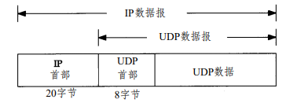
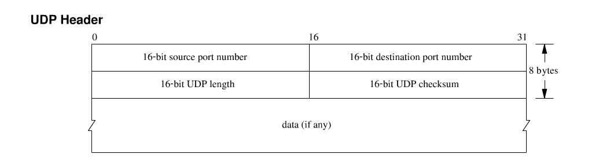
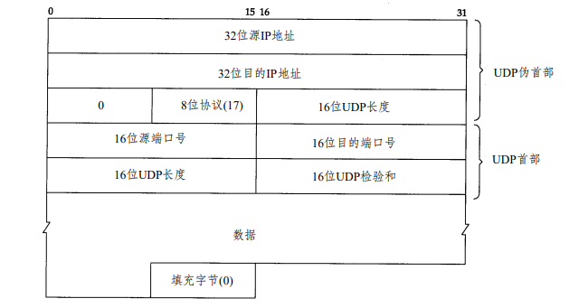
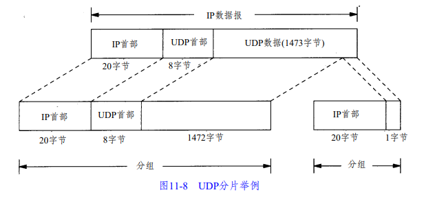

## UDP-用户数据报协议

UDP是一个简单的面向数据报的运输层协议：进程的每个输出操作都正好产生一个UDP数据报，并组装成一份待发送的IP数据报。这与**面向流字符**的协议不同，如TCP，应用程序产生的全体数据与真正发送的单个IP数据报可能没有什么联系。

UDP 不止支持一对一的传输方式，同样支持一对多，多对多，多对一的方式，也就是说 UDP 提供了单播，多播，广播的功能。

UDP数据报封装成一份IP数据报的格式：****

UDP**不提供可靠性**：它把应用程序传给IP层的数据发送出去，但是并不保证它们能到达目的地。

UDP 是无连接的，也就是说通信不需要建立和断开连接。

UDP 没有拥塞控制，一直会以恒定的速度发送数据。即使网络条件不好，也不会对发送速率进行调整。这样实现的弊端就是在网络条件不好的情况下可能会导致丢包，但是优点也很明显，在某些实时性要求高的场景（比如电话会议）就需要使用 UDP 而不是 TCP。

应用程序必须关心IP数据报的长度。如果它超过网络的**MTU**，那么就要对IP数据报进行**分片**。如果需要，源端到目的端之间的每个网络都要进行分片，并不只是发送端主机连接第一个网络才这样做。

### UDP首部

UDP首部的各字段如下：

UDP的头部开销小，只有**8**字节，相比 TCP 的至少**20**字节要少得多，在传输数据报文时是很**高效**的。

端口号表示发送进程和接收进程。

UDP数据报是根据目的UDP端口号进行分配的说法是错误的。我们看到很多实现可以根据目的IP地址、源IP地址和源端口号来过滤送往一个给定UDP端口号的输入数据报。

UDP长度字段指的是UDP首部和UDP数据的字节长度。该字段的最小值为8字节（发送一份0字节的UDP数据报是OK）。这个UDP长度是有冗余的。IP数据报长度指的是数据报全长，因此UDP数据报长度是全长减去IP首部的长度。

### UDP检验和

UDP检验和覆盖UDP首部和UDP数据。回想IP首部的检验和，它只覆盖IP的首部—并不覆盖IP数据报中的任何数据。UDP和TCP在首部中都有覆盖它们首部和数据的检验和。UDP的检验和是可选的，而TCP的检验和是必需的。

尽管UDP检验和的基本计算方法与IP首部检验和计算方法相类似（16bit字的二进制反码和），但是它们之间存在不同的地方。

首先，UDP数据报的长度可以为奇数字节，但是检验和算法是把若干个16bit字相加。解决方法是必要时在最后增加**填充字节0**，这只是为了检验和的计算（也就是说，可能增加的填充字节不被传送）。

其次，UDP数据报和TCP段都包含一个**12字节长的伪首部**，它是为了计算检验和而设置的。伪首部包含IP首部一些字段。其目的是让UDP两次检查数据是否已经正确到达目的地。UDP数据报中的伪首部格式:

如果发送端没有计算检验和而接收端检测到检验和有差错，那么UDP数据报就要被悄悄地**丢弃**。不产生任何差错报文（当IP层检测到IP首部检验和有差错时也这样做）。

UDP检验和是一个端到端的检验和。它由发送端计算，然后由接收端验证。其目的是为了发现UDP首部和数据在发送端到接收端之间发生的任何改动。

### IP分片

物理网络层一般要限制每次发送数据帧的最大长度。任何时候IP层接收到一份要发送的数据报时，它要判断向本地哪个接口发送数据（**选路**），并查询该接口获得其**MTU**。IP把MTU与数据报长度进行比较，如果需要则进行分片。分片可以发生在原始发送端主机上，也可以发生在中间路由器上。

把一份IP数据报分片以后，只有**到达目的地才进行重新组装**（这里的重新组装与其他网络协议不同，它们要求在下一站就进行进行重新组装，而不是在最终的目的地）。重新组装由目的端的IP层来完成，其目的是使分片和重新组装过程对运输层（ TCP和UDP）是透明的，除了某些可能的越级操作外。

已经分片过的数据报有可能会再次进行分片。

IP首部中包含的数据为分片和重新组装提供了足够的信息。对于发送端发送的每份IP数据报来说，其**标识**字段都包含一个唯一值。该值在数据报分片时被复制到每个片中。

**标志**字段用其中一个比特来表示“更多的片”。除了最后一片外，其他每个组成数据报的片都要把该比特置 1。

**片偏移字段**指的是该片偏移原始数据报开始处的位置。

当数据报被分片后，每个片的总长度值要改为**该片的长度值**。

最后，标志字段中有一个比特称作“不分片”位。如果将这一比特置1，IP将不对数据报进行分片。相反把数据报丢弃并发送一个ICMP差错报文（“需要进行分片但设置了不分片比特”）给起始端。

当IP数据报被分片后，每一片都成为一个**分组**，具有**自己的IP首部**，并在选择路由时与其他分组独立。这样，当数据报的这些片到达目的端时有可能会**失序**，但是在IP首部中有足够的信息让接收端能正确组装这些数据报片。

尽管IP分片过程看起来是透明的，但有一点让人不想使用它：即使只丢失一片数据也要重传整个数据报。为什么会发生这种情况呢？因为IP层本身没有超时重传的机制。当来自TCP报文段的某一片丢失后，TCP在超时后会重发整个TCP报文段，该报文段对应于一份IP数据报。没有办法只重传数据报中的一个数据报片。就这个原因，经常要避免分片。

使用UDP很容易导致IP分片。

任何运输层首部只出现在第1片数据中。

**IP数据报**是指IP层端到端的传输单元（在分片之前和重新组装之后），**分组**是指在IP层和链路层之间传送的数据单元。一个分组可以是一个完整的IP数据报，也可以是IP数据报的一个分片。

### 最大UDP数据报长度

理论上，IP数据报的最大长度是65535字节，这是由IP首部16比特总长度字段所限制的。去除20字节的IP首部和8个字节的UDP首部，UDP数据报中用户数据的最长长度为65507字节。但是，大多数实现所提供的长度比这个最大值小。

我们提过，要求主机必须能够接收最短为576字节的IP数据报。在许多UDP应用程序的设计中，其应用程序数据被限制成512字节或更小，因此比这个限制值小。

### UDP服务器的设计

大多数UDP服务器是交互服务器。这意味着，单个服务器进程对单个UDP端口上的所有客户请求进行处理。

通常程序所使用的每个UDP端口都与一个有限大小的**输入队列**相联系。这意味着，来自不同客户的差不多同时到达的请求将由UDP自动排队。接收到的UDP数据报以其接收顺序交给应用程序。

当UDP数据报到达的目的IP地址为广播地址或多播地址，而且在目的IP地址和端口号处有多个端点时，就向每个端点传送一份数据报的复制（端点的本地IP地址可以含有星号，它可匹配任何目的I P地址）。但是，如果UDP数据报到达的是一个单播地址，那么只向其中一个端点传送一份数据报的复制。