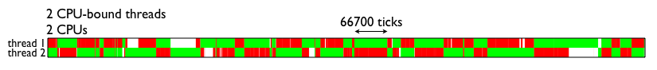
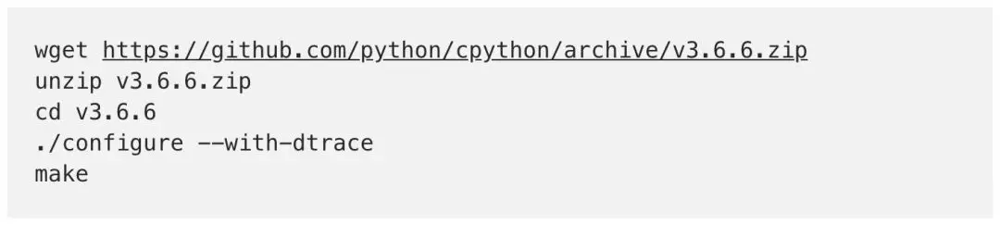
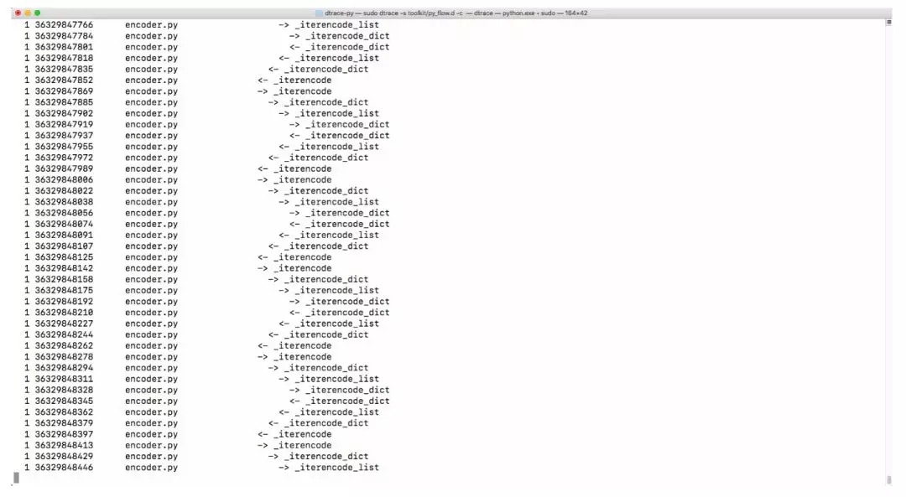

# 为啥 Python 运行速度这么慢？

**作者：Anthony Shaw** 是 Python 软件基金会成员和 Apache 基金会成员

近来Python可谓人气骤升。这门编程语言用于开发运维（DevOps）、数据科学、网站开发和安全。

然而，它没有因速度而赢得任何奖牌。

Java在速度方面与C、C++、C#或Python相比如何？答案很大程度上取决于你运行的应用程序的类型。没有哪个基准测试程序尽善尽美，不过The Computer Language Benchmarks Game（计算机语言基准测试游戏）是个不错的起点。

十多年来，我一直提到计算机语言基准测试游戏；与Java、C#、Go、JavaScript和C++等其他语言相比，Python是速度最慢的语言之一。除了JavaScript等解释语言外，这还包括JIT（C#和Java）以及AOT（C和C++）编译器。

注意：我说“Python”时，其实指这种语言的参考实现：CPython。我会在本文中提到其他运行时环境。

我想回答这个问题：Python运行完成类似的应用程序比另一种语言慢2倍至10倍时，为什么它这么慢，我们能不能让它更快些？

下面是几种常见的说法：

- “它是GIL（全局解释器锁）”
- “这是由于它是解释的，而非编译”
- “这是由于它是一种动态类型语言”

那么，到底上述哪个原因对性能带来的影响最大？

### “它是GIL”
现代计算机搭载拥有多个内核的CPU，有时搭载多个处理器。为了利用所有这些额外的处理能力，操作系统定义了一种名为线程的低级结构：一个进程（比如Chrome浏览器）可能生成多个线程，并拥有针对内部系统的指令。这样一来，如果某个进程特别耗费CPU资源，该负载可以在诸多核心之间分担，这实际上让大多数应用程序更快地完成任务。

我在写这篇文章时，我的Chrome浏览器有44个线程开着。请记住这点：线程的结构和API在基于POSIX的操作系统（比如Mac OS和Linux）与Windows OS之间是不同的。操作系统还处理线程的调度。

如果你之前没有从事过多线程编程，需要尽快熟悉的一个概念就是锁（lock）。与单线程进程不同，当你需要确保改变内存中的变量时，多个线程并不同时试图访问/改变同样的内存地址。

CPython创建变量时，它会分配内存，然后计算该变量的引用有多少，这个概念名为引用计数（reference counting）。如果引用数为0，那么它从系统释放这部分内存。这就是为什么在某个代码段（比如for循环的范围）内创建一个“临时”变量不会搞砸应用程序的内存消耗。

当变量在多个线程内共享时，就出现了这个难题：CPython如何锁定引用计数。有一个“全局解释器锁”，它小心地控制线程执行。解释器一次只能执行一个操作，无论它有多少线程。

**这对Python应用程序的性能来说意味着什么？**

如果你有单线程、单个解释器的应用程序，这对速度不会有影响。删除GIL根本不会影响你代码的性能。

如果你想通过使用线程机制在单个解释器（Python进程）内实现并发功能，而且线程是IO密集型（比如网络IO或磁盘IO），你会看到GIL争夺的后果。



上图来自大卫•比兹利（David Beazley）撰写的《GIL可视化》文章：[http://dabeaz.blogspot.com/2010/01/python-gil-visualized.html](http://dabeaz.blogspot.com/2010/01/python-gil-visualized.html)

如果你有Web应用程序（比如Django），又在使用WSGI，那么针对Web应用程序的每个请求都是一个单独的Python解释器，所以每个请求只有一个锁。由于Python解释器启动缓慢，一些WSGI实现拥有“守护进程模式”，这可以让一个或多个Python进程为你保持活跃状态。

其他Python运行时环境怎么样？

PyPy有一个GIL，它通常比CPython快3倍。

Jython之所以没有GIL，是由于Jython中的Python线程由Java线程表示，受益于JVM内存管理系统。

JavaScript如何执行此任务？

好吧，首先所有Javascript引擎都使用标记-清除（mark-and-sweep）垃圾收集机制。如上所述，GIL的主要需求是CPython的内存管理算法。

JavaScript没有GIL，但它也是单线程的，所以它不需要内存管理算法。JavaScript的事件循环和承诺回调（Promise/Callback）模式是实现异步编程以代替并发的方法。Python与asyncio事件循环有相似之处。

### “这是由于它一种解释语言”

我常听到这个观点，但觉得这过于简化了CPython的实际工作方式。如果你在终端上编写了python myscript.py，那么CPython会启动读取、分析、解析、编译、解释和执行代码的一长串操作。

如果你对这个过程的机理颇感兴趣，我之前写过一篇文章：[6分钟内修改Python语言](https://hackernoon.com/modifying-the-python-language-in-7-minutes-b94b0a99ce14)。

这个过程的一个重要节点是创建.pyc文件；在编译阶段，字节码序列写入到Python 3中__pycache__/里面的一个文件或Python 2中的同一个目录。这不仅适用于你的脚本，还适用于导入的所有代码，包括第三方模块。

所以在大部分时间（除非你编写的是只运行一次的代码？），Python解释字节码，并在本地执行。相比之下Java和C#.NET：

Java编译成一种“中间语言”，Java虚拟机读取字节码，并即时编译成机器码。.NET CIL也一样，.NET公共语言运行时环境（CLR）使用即时编译，将编译后代码编译成机器码。

那么，既然都使用虚拟机和某种字节码，为什么Python在基准测试中比Java和C#都要慢得多呢？首先，.NET和Java是JIT编译型的。

JIT或即时编译需要一种中间语言，以便将代码拆分成块（或帧）。提前（AOT）编译器旨在确保CPU在任何交互发生之前能理解每一行代码。

JIT本身不会使执行变得更快，因为它仍然执行相同的字节码序列。然而，JIT让代码在运行时能够加以优化。一个好的JIT优化器会看到应用程序的哪些部分在频繁执行，这些代码称之为“热点代码”（hot spot）。然后，它会对这些代码进行优化，其办法是把它们换成更高效的版本。

这就意味着当你的应用程序一次又一次地执行相同的操作时，运行速度可以显著加快。另外记住一点：Java和C#是强类型语言，因此优化器可以对代码做出多得多的假设。

PyPy有JIT，如上所述，其速度比CPython快得多。这篇性能基准测试文章作了更详细的介绍：[哪个Python版本的速度最快？](https://hackernoon.com/which-is-the-fastest-version-of-python-2ae7c61a6b2b)。

那么，CPython为什么不使用JIT呢？

JIT存在几个缺点：缺点之一是启动时间。CPython的启动时间已经比较慢了，PyPy的启动时间比CPython还要慢2倍至3倍。众所周知，Java虚拟机的启动速度很慢。.NET CLR通过系统开启时启动解决了这个问题，但CLR的开发人员还开发了操作系统，CLR在它上面运行。

如果你有一个Python进程长时间运行，代码因含有“热点代码”而可以优化，那么JIT大有意义。

然而，CPython是一种通用实现。所以，如果你在使用Python开发命令行应用程序，每次调用CLI都得等待JIT启动会慢得要命。

CPython不得不试图满足尽可能多的用例（use case）。之前有人试过将JIT插入到CPython中，但这个项目基本上搁浅了。

如果你想获得JIT的好处，又有适合它的工作负载，不妨使用PyPy。

### “这是由于它是一种动态类型语言”

在“静态类型”语言中，你在声明变量时必须指定变量的类型。这样的语言包括C、C++、Java、C#和Go。

在动态类型语言中，仍然存在类型这个概念，但变量的类型是动态的。

```python
a = 1
a = 'foo'
```

在这个示例中，Python创建了一个有相同名称、str类型的第二个变量，并释放为a的第一个实例创建的内存。

静态类型语言不是为了给你添堵而设计的，它们是兼顾CPU的运行方式设计的。如果一切最终需要等同于简单的二进制操作，你就得将对象和类型转换成低级数据结构。

Python为你这么做这项工作，你永远看不到，也不需要操心。

不必声明类型不是导致Python速度慢的原因，Python语言的设计使你能够让几乎一切都是动态的。你可以通过猴子补丁（monkey-patch），加入对运行时声明的值进行低级系统调用的代码。几乎一切都有可能。

正是这种设计使得优化Python异常困难。

为了说明我的观点，我将使用可在Mac OS中使用的一种名为Dtrace的系统调用跟踪工具。CPython发行版并未内置DTrace，所以你得重新编译CPython。我使用3.6.6进行演示。



现在python.exe将在整个代码中使用Dtrace跟踪器。保罗•罗斯（Paul Ross）写了一篇关于Dtrace的[杂谈](https://github.com/paulross/dtrace-py#the-lightning-talk)。你可以下载Python的DTrace启动[文件](https://github.com/paulross/dtrace-py/tree/master/toolkit)来测量函数调用、执行时间、CPU时间、系统调用和各种好玩的指标。比如


py_callflow跟踪器显示你应用程序中的所有函数调用。



**那么，Python的动态类型会让它变慢吗？**

比较和转换类型的开销很大，每次读取、写入或引用一个变量，都要检查类型。

很难优化一种极具动态性的语言。Python的许多替代语言之所以快得多，原因在于它们为了性能在灵活性方面作出了牺牲。

Cython 结合了C-Static类型和Python来优化类型已知的代码，可以将性能提升84倍。

### 结论

Python之所以速度慢，主要是由于动态性和多功能性。它可用作解决各种问题的工具，Python有更优化、速度更快的几个替代方案。

然而，有一些方法可以优化你的Python应用程序，比如通过充分利用异步、深入了解分析工具以及考虑使用多个解释器。

对于启动时间不重要、代码会受益于JIT的应用程序来说，不妨考虑PyPy。

对于性能至关重要，又有更多静态类型变量的部分代码而言，不妨考虑使用Cython。