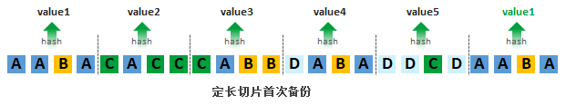
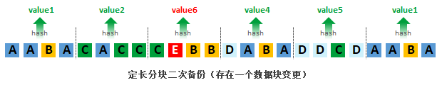
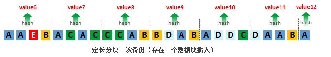
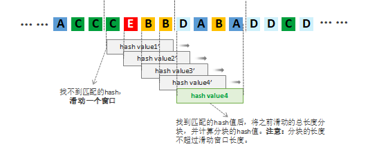
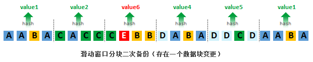
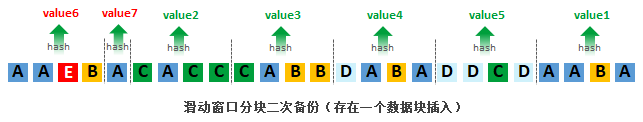
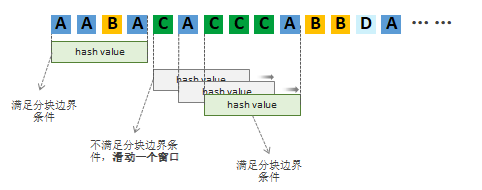
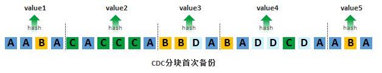

# 备份重删简介

## 基本原理

重删的基本原理是通过某种算法计算出数据集中的某部分数据的hash值，以此hash值作为此部分数据的唯一标识（因此也称作指纹）。当某两部分数据的hash值（指纹）相同时，我们就认为这两部分数据是一致的。注意：需要尽量确保hash值的唯一性，避免hash值碰撞（即2个不同数据的hash值一致）。一些厂商为了避免此种情况，可能会采用2种hash算法来确保数据的唯一性。

某些场景下，为了提升效率，还会同时使用强hash和弱hash。弱hash的计算速度快，但碰撞率高，用于快速找到不同的数据块；强hash的计算速度慢，但碰撞率低（约等于0）。当2个数据块的弱hash值相同时，会再进行一次强hash值的校验，以此确定数据块内容是否一致。

因为需要对数据进行指纹计算和存储，所以使用重删技术都会需要用到指纹库。除了指纹库之外，其实还需要记录原数据与实际存储数据之间的映射关系，此种关系一般称为索引信息，有的也叫做元数据信息。

## 分类

### 源端重删 & 目标端重删

从重删动作发生的位置来区分，可以分为源端重删和目标端重删。所谓源端，就是指数据的发送方；目标端指数据的接收方。就备份系统来讲，一般会存在代理服务和存储服务两种角色。代理服务部署在生产环境上，用于备份系统采集数据，存储服务用于存储备份数据。

### 在线重删 & 离线重删
从重删发生的时间来区分，可以分为在线重删和离线重删。在线重删是指在数据进行存储的过程中进行重删。由于重删需要进行运算，消耗计算资源和时间，因此一旦出现计算瓶颈，会导致存储的性能出现下降。离线重删是指将要存储的数据先存储下来，等到存储相对空闲的时候进行重删。离线重删相比在线重删需要更多的存储资源。

对于备份系统来讲，上文提到的“源端重删”一定是在线重删，“目标端重删”则可区分在线或者离线。

### 全局重删 & 局部重删

从重删的范围来区分，可以分为全局重删和局部重删。

### 文件级重删 & 块级重删

从重删的粒度来区分，可以分为文件级重删和块级重删。

文件级重删是指针对单个文件进行hash计算，通过删除相同的文件来达到重删效果。对于批量文件，使用文件级重删，第二次备份的时候实际存储的就只有第一次备份以来变化和新增的文件，如下图所示。在实际应用中，存在大量相同文件的场景比较少，因此使用文件级重删的重删效果并不太理想（针对首次备份）。更多的是使用块级重删。

## 块级重删技术

### 定长重删

将要备份的数据以固定长度进行分块，并计算每个分块的hash值。

当第3个数据分块中的数据产生了变化后（CABB->CEBB），整串数据中仅第3个数据分块的hash值发生了变化，不影响其他数据分块的hash值，整体重删效果较好。

但生产数据常常出现在中间位置进行新增和删除数据的情况，这种情况下，定长重删的效果就非常不理想。如下图所示，整个数据串中插入了数据“E”，这就导致整个数据串重新分块，且所有数据分块的hash值相比首次备份都无法匹配，重删率等于0。

解决定长重删的问题，就是使用变长分块。目前比较常见的变长分块方案有2种：滑动窗口分块和基于内容分块

### 变长重删：滑动窗口分块

基于滑动窗口分块方案的首次备份与定长重删方案一致，它选用固定的长度对整串数据进行分块，并计算各个分块的hash值。选用的这个固定的长度就是窗口的长度。

二次备份的时候，利用窗口的滑动来尝试寻找和匹配相同的数据。如下图所示，第3个数据分块中的数据发生了变化（CABB->CEBB）。首先计算CEBB的hash值，因为数据的变化会发现无法匹配到hash值（hash value1'）。这个时候不着急处理下一个数据分块，而是将窗口向前移动一个单位，继续计算这个窗口下的数据的hash值(hash value2')并尝试匹配，直到找到可以匹配的hash值为止。这个过程需要注意以下点：

如果在窗口内找到匹配的hash值，那么就可以认为这个窗口内的数据分块是重复且可以删除的，下一次的窗口可以直接从当前这个数据分块的末尾开始，以此提升计算效率。
如果窗口持续滑动（滑动长度 >= 窗口的长度）而找不到匹配的hash值，说明产生变化的数据量比较大，这种情况下同样以窗口的长度对数据进行分块。
如果窗口滑动后，很快找到了匹配的hash值（滑动长度 < 窗口长度），那么就将窗口滑过的部分进行单独分块。综合第2点可以得出：分块的长度<=窗口长度。

同样的，我们来看下数据变化和数据新增场景下重删的效果。如下图所示，当某个数据发生变化的时候，其效果与定长重删效果一样，可以获得一样的重删率。

当数据串中新增了数据时，根据上述滑动窗口的原理，会产生一个新的数据分块（仅包含一个"A"）；且仅2个数据块因为hash值不匹配而需要重新存储，大部分的数据分块得以重删。此种场景下，重删效果相比定长重删要好很多。

滑动窗口的方案不仅仅应用于重删，同样应用于rsync增量同步、文件查重等场景。此方案可以带来良好的查重效果，但是也引入了“数据碎片”的缺陷。上图中的数据分块“A”即是碎片。碎片如果过多最终会影响整体效率。

### 变长重删：CDC分块

在讲解CDC分块前，先简单介绍下Rabin指纹。Rabin指纹是一种高效的指纹计算函数，利用hash函数的随机性，它对任意数据的计算结果表现出均匀分布。其原理大致是这样子的：假设有一串固定长度的数据S，有一个hash计算函数h()，针对S进行hash计算并对固定值D取余，即hash(S) mod D = r。由于hash值的随机性，最终r会在一定的[0,D)的区间内均匀分布。基于文件内容的分快就是利用了这样的技术，设置一个固定长度的滑动窗口、一个固定值D和一个固定值R(R<D)，当滑动窗口内的数据S满足hash(S) mod D = R时，那么就认为这是一个分块的边界。

本文中假设滑动窗口的固定长度为4，当窗口内的数据串末位为数据“A”时，满足条件 hash(“窗口内的数据串”) mod D = R。如下图所示，窗口从第初始位置滑动。

初始位置为“AABA”，末位为A，满足 hash("AABA") mod D = R。因此可以认为产生了一个分块边界。
下一次滑动从边界后开始。"CACC"不满足条件，向前滑动一个单位；“ACCC”不满足条件，继续向前滑动一个单位；“CCCA”满足条件，产生新的分块边界。那么新的分块就是“CACCCA”。
以此类推，直到整个数据串滑动完为止。滑动结束，数据串的分块也就结束了。

根据上述的分块方式，最终可以得出首次备份的数据串分块如下图。共分为5个数据分块，针对这5个数据分块生成hash值，value1，value2，value3，value4，value5。

CDC方案实际在使用过程中容易出现问题，如果固定值D、R和窗口长度设置不当，容易出现一些极端情况。比如：滑动过程中始终找不到分块边界，导致数据分块过大。再比如：滑动过程每次都匹配上了，且窗口设置较小，导致分块过多。要解决这些问题，有以下几个方案可供参考：

消除过小分块：设置分块的最小长度，如果在最小长度内遇到分块边界，则忽略此边界。
消除过大分块：设置分块的最大长度，如果在最大长度内未找到分块边界，则直接使用最大长度分块。
双因子分块：设置2组固定值进行Rabin指纹计算，此种方式一般是配合分块最小长度和最大长度使用，在长度区间内选择可用的指纹。

